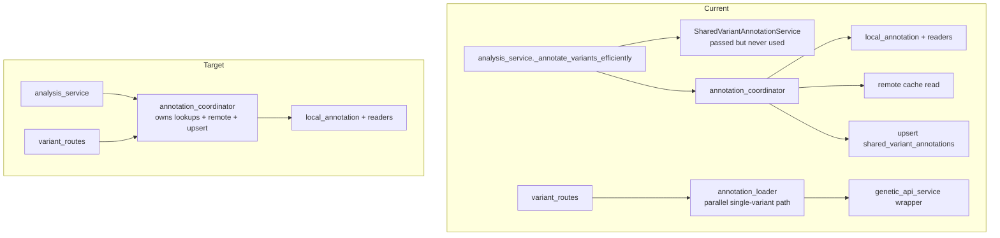
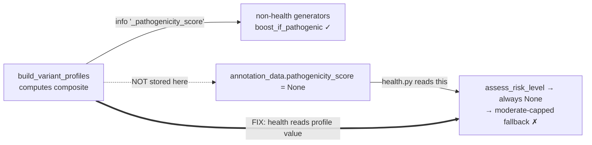
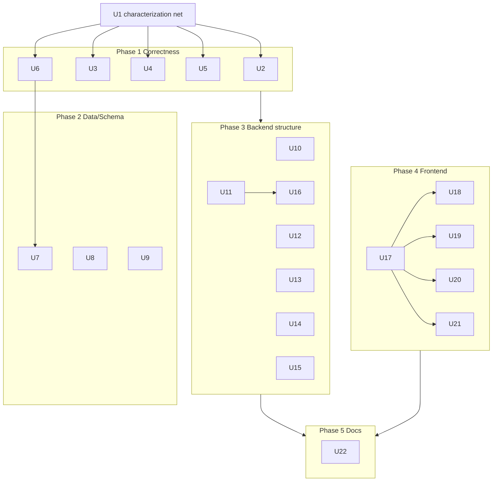

# Full-App Refactor - Plan

## Goal Capsule

- **Objective:** Refactor the genetic-health toolkit across four areas — analysis correctness, backend structure, data/schema, frontend — fixing wrong results, removing overengineered layers, and splitting god-files, without changing product scope.
- **Authority hierarchy:** This plan > the two audit docs (`docs/i.md`, `docs/architecture.md`), which are partly stale — every claim here was re-verified against current code. Repo conventions and the existing 1721-test suite override any instruction here that conflicts with them.
- **Execution profile:** Correctness-first. Phase 1 (correctness) lands before behavior-preserving structural work. The 1721-test suite plus a new characterization snapshot (U1) are the safety net for every structural unit.
- **Stop conditions:** Stop and surface if a correctness fix changes results for existing users in a way that needs a re-run decision, if a schema migration would run against production without a verified backup, or if the gnomAD genome-build fix (U7) proves larger than "collapse + document."
- **Tail ownership:** Each unit is an atomic commit/PR. Structural units must leave the test suite green; correctness units intentionally shift the characterization snapshot with documented deltas.

---

## Product Contract

**Product Contract preservation:** No brainstorm origin. Product behavior (13-category genetic analysis, upload, dashboard, admin, AI insights) is unchanged. This is a refactor: same features, corrected results, smaller/cleaner code.

### Summary

The app works end-to-end and has a strong test suite, but three classes of problem justify a full refactor. First, **analysis correctness**: the marquee bugs from the old audit are already fixed, but subtler live bugs remain — health risk silently ignores the composite pathogenicity score, and an unresolved reference allele produces both false risk escalations and false "poor metabolizer" calls. For a health product these are the highest-impact defects. Second, **overengineering**: a DI container that is dead ceremony (1 service registered, 0 resolved in production), a dead annotation layer passed between services but never used, a 6-module gnomAD stack whose primary allele-frequency path returns data for ~2 of 609K variants due to a genome-build mismatch. Third, **structure**: seven backend files and six frontend components exceed 900 lines (admin_routes 2482, gnomad_local 1827, base.py 1318; AdminPanel.tsx 3631, VariantDetailDialog.tsx 2346), plus 33 silent `except: pass` blocks (≈8 dangerous) and a frontend that ships a 16-line API-client stub used zero times against 53 raw `fetch()` calls.

### Problem Frame

The codebase grew feature-first under production pressure (a documented security incident, rapid category additions). That left correctness gaps that are invisible without tracing data flow, plus accreted layers and god-files that make every future change slower and riskier. The two existing audit docs catalog much of this but have drifted from the code (they claim `risk_score` is a String — it is already Float; they claim no API client — one exists; they claim Bearer-token auth — it is now HttpOnly cookies). A refactor needs findings re-grounded in current code, which this plan provides.

### Requirements

**Analysis correctness**
- R1. Health risk level must consume the composite pathogenicity score computed per variant, not a field the annotation layer never stores.
- R2. When a variant's reference allele is unresolved, zygosity-derived risk escalation, hom-ref de-escalation, and drug-metabolizer classification must follow one explicit, conservative policy applied in a single place.
- R3. Cognitive percentile adjustment must derive zygosity from the shared classifier, not a private hardcoded rule.
- R4. The dead `risk_allele` mapping fallback (0 rows ever populated) must be removed or genuinely populated — not left as silently-skipped dead code.
- R5. Annotation storage must not let one source silently overwrite another's column (`ensembl` vs `ensembl_vep` both target `ensembl_data`).
- R6. Changes to analysis logic must be provable against a captured baseline of insight output for known genotype fixtures.

**Data & schema**
- R7. The gnomAD allele-frequency path must either return correct data or be collapsed to the one live source and documented, with the genome-build mismatch resolved or explicitly scoped out.
- R8. `shared_variant_annotations` growth (4.5 GB, unbounded) must have a defined bloat strategy grounded in measured column sizes.
- R9. Hot columns relied on by generators (`alt_alleles`, `genotype`, `info`) must have safe non-null defaults; insight-table JSON writes should be validated.

**Backend structure & de-overengineering**
- R10. The DI container must be removed (it is bypassed in production) with service construction made explicit.
- R11. The annotation lookup path must be a single chain — the dead `SharedVariantAnnotationService` layer and dead backfill functions removed, the single-variant `annotation_loader` path merged with the coordinator.
- R12. Dangerous silent exception swallows must log and surface failures; best-effort swallows may remain but must be intentional.
- R13. Cross-module backwards dependencies (`variant_loader` importing `VariantLite`/`_MarkerLite` from `analysis_service`) and remaining DRY duplication must be consolidated.
- R14. Backend god-files must be split into cohesive modules with no behavior change.
- R15. The `insights_service` / `insight_dispatcher` / `insight_generators` naming collision must be resolved.

**Frontend**
- R16. A single API client (auth cookie, error handling, typed responses) must replace the 53 raw `fetch()` call sites.
- R17. Frontend god-components must be split into per-section components with extracted hooks.
- R18. Dead components (`GeneticAnnotation.tsx`, `ResearchLinks.tsx`) must be removed.
- R19. Repeated inline patterns (`credentials:'include'` ×52, `localStorage darkMode` ×5, per-tab feedback state) must be consolidated.
- R20. Theme application must go through one source instead of competing between `utils/theme.ts`, `shared.tsx` helpers, and 36 inline style blocks.
- R21. A FAQ page and a design-consistency pass must be added (existing product TODO).

**Docs & hygiene**
- R22. Stale docs (`.github/copilot-instructions.md` referencing the deleted `variant_registry.py`, `architecture.md`, `docs/i.md`) and the broken migration naming convention must be reconciled with post-refactor reality.

---

## Planning Contract

### Key Technical Decisions

- KTD1. **Correctness first, behavior-preserving refactors gated by tests.** Phase 1 fixes results; Phases 3–5 must not change behavior and are proven by the existing 1721 tests plus the U1 characterization snapshot. This ordering means correctness fixes land on the current structure (not blocked on splits), and the biggest-risk changes ship first while attention is highest.
- KTD2. **One source of truth for pathogenicity score.** All generators read the profile value (`info['_pathogenicity_score']`, computed in `build_variant_profiles`), never `annotation_data.get('pathogenicity_score')`. The annotation-data lookup is dead under the coordinator's current storage choice, which is exactly why health risk silently degrades to the moderate-capped fallback.
- KTD3. **Single conservative ref-allele-unknown policy.** When the reference allele cannot be resolved, apply no zygosity escalation and no metabolizer downgrade — treat as baseline rather than guessing hom-alt. One helper owns this; `zygosity_adjust`, `assess_drug_response`, and the hom-ref filter call it. Rationale: in a health product a fabricated escalation ("very high risk") from missing data is worse than a conservative baseline. (Exact policy confirmed in Open Questions.)
- KTD4. **Delete the DI container, don't wire it up.** It registers one service, resolves zero in production, and that service is already constructed inline in four places. Deleting it removes ceremony with no behavior change; keep an inline factory for `OptimizedGeneticAPIService`.
- KTD5. **Collapse annotation to one path.** The coordinator already owns per-source lookups plus the upsert. Remove `SharedVariantAnnotationService` (passed as a param, never referenced in the coordinator body) and the uncalled backfill helpers; fold the thin `analysis_service` wrapper into a direct coordinator call; merge the single-variant `annotation_loader` path so there is one annotation code path.
- KTD6. **gnomAD: one live reader + build fix.** Keep `gnomad_v2_local` (the only source returning real per-population AF) and the `gnomad_local` CADD/conservation reader; drop the creds-gated near-dead BigQuery fallback. Resolve the GRCh38-vs-GRCh37 mismatch that makes the CADD cache return 0, or explicitly document that path as conservation-only and stop presenting it as an AF source. Give `ensembl_vep` its own annotation column so it stops clobbering `ensembl_data`.
- KTD7. **God-file splits are mechanical and behavior-preserving.** One package per split file, re-export from the original module path where imports are wide, tests stay green throughout. No logic changes inside a split unit.
- KTD8. **Adopt `lib/api.ts` as the single fetch wrapper.** Extend the existing stub into a real client (cookie auth via `credentials:'include'`, centralized error handling, typed helpers) and migrate all raw `fetch()` sites, rather than introducing a new abstraction.
- KTD9. **Keep both insight systems; rename to end the collision.** The LLM layer consumes rule-based output — they are layered, not redundant. Rename `insights_service.py` → `ai_insights_service.py` so the structured-vs-narrative boundary is legible; do not remove either system.

### High-Level Technical Design

**Annotation path — current vs. target.** The refactor removes a dead layer and merges a duplicate single-variant path so one chain serves both bulk analysis and on-demand lookup.

**Pathogenicity score plumbing (R1/KTD2).** The composite score exists but the health path reads the wrong location.

**Phase / unit dependency graph.**

### Assumptions

- The 1721-test suite passes on the current `dev` branch before work starts (baseline established in U1).
- Schema migrations run against a backup or staging DB first; production (`204.168.200.44`) is not migrated blind.
- Only 2 users / 2 completed analyses exist, so re-running analyses after correctness fixes is cheap if chosen.
- gnomAD v2 exome data (`data_sources/gnomad_v2/`) is the accepted AF source going forward.

### Sequencing

Phase 1 (correctness) → Phase 2 (data/schema; U6 feeds U7) → Phase 3 (structure; depends on Phase 1 being settled so splits don't move correctness code mid-fix) → Phase 4 (frontend; U17 client first) → Phase 5 (docs last, reconciled to final state). Within Phase 3, dead-code deletion (U10, U11) precedes god-file splits (U14–U16) to shrink what must be split.

---

## Implementation Units

### Unit Index

| U-ID | Title | Key files | Depends on |
|------|-------|-----------|------------|
| U1 | Characterization snapshot of insight output | backend/tests/test_insight_snapshot.py (new), fixtures | — |
| U2 | Health risk consumes composite score | insight_generators/health.py, base.py | U1 |
| U3 | Unify ref-allele-unknown policy | insight_generators/base.py | U1 |
| U4 | Cognitive uses shared zygosity classifier | insight_generators/cognitive.py, base.py | U1 |
| U5 | Remove dead risk_allele fallback | insight_generators/base.py | U1 |
| U6 | Fix SOURCE_TO_COLUMN clobber | annotation_constants.py, db/models.py, alembic | U1 |
| U7 | Collapse gnomAD stack + build mismatch | services/gnomad_*.py, scoring_engine.py | U6 |
| U8 | shared_variant_annotations bloat strategy | db/models.py, shared_annotation_service.py, alembic | — |
| U9 | Tighten hot-column schema | db/models.py, alembic, service writes | U6 |
| U10 | Delete DI container | core/container.py, worker.py, api, analysis_service.py | — |
| U11 | Remove dead annotation layer + merge loader | annotation_coordinator.py, shared_annotation_service.py, annotation_loader.py, analysis_service.py | U7 |
| U12 | Fix dangerous silent exceptions | 8 sites (see unit) | — |
| U13 | Kill backwards-dep + consolidate DRY | variant_loader.py, analysis_service.py, insight_generators/* | — |
| U14 | Split base.py into base/ package | services/insight_generators/base/ | U2,U3,U4,U5 |
| U15 | Split admin_routes.py into admin/ package | api/admin/ | U10,U12 |
| U16 | Split remaining god-files + rename insights_service | gnomad_local, models, categorizer, scoring_engine, variant_routes, ai_insights_service | U7,U11 |
| U17 | Build real API client | frontend/src/lib/api.ts + call sites | — |
| U18 | Split AdminPanel.tsx | frontend/src/components/admin/ | U17 |
| U19 | Split VariantDetailDialog/VariantSearch/shared | frontend/src/components/categories/ | U17 |
| U20 | Split SettingsPanel/DashboardOverview + consolidate patterns | frontend/src/components/ | U17 |
| U21 | Delete dead components + LitVar fix + FAQ/design | frontend/src, annotation API | U17,U19 |
| U22 | Reconcile stale docs + migration naming | docs/, .github/, alembic/ | all |

---

### U1. Characterization snapshot of insight output

- **Goal:** Capture current insight-generation output for fixed genotype fixtures so every correctness change (U2–U7) is provable and every structural change is regression-checked.
- **Requirements:** R6
- **Dependencies:** none
- **Files:** `backend/tests/test_insight_snapshot.py` (new), `backend/tests/fixtures/` (new genotype + annotation fixtures)
- **Approach:** Build 2–3 synthetic analyses (a pathogenic hom-alt, a benign het, an unresolved-ref case, a pharmacogene case) with stubbed annotation results, run the full `insight_dispatcher` pass, and snapshot the resulting insight-table rows. Snapshot is the baseline; U2–U7 update it with documented deltas.
- **Execution note:** Build this first — it is the safety net for the whole plan. Characterization-first.
- **Patterns to follow:** existing `backend/tests/test_generator_runners.py`, `test_insight_generators*.py`, `conftest.py` fixtures.
- **Test scenarios:**
  - Happy path: dispatcher run over the fixture set produces a stable, serialized snapshot of all insight-table rows.
  - Edge: unresolved-ref fixture is included so U3's behavior change is visible in the snapshot diff.
  - Edge: pharmacogene fixture drives a drug-response row so U2/U3 effects are captured.
- **Verification:** Snapshot test passes on current code; re-running is deterministic.

### U2. Health risk consumes composite pathogenicity score

- **Goal:** Fix health risk level silently ignoring the composite score (currently always receives `None` → moderate-capped fallback).
- **Requirements:** R1
- **Dependencies:** U1
- **Files:** `backend/services/insight_generators/health.py`, `backend/services/insight_generators/base.py`
- **Approach:** In the health rsid path, read the composite score from the profile value threaded via `info['_pathogenicity_score']` (as non-health generators do), not `annotation_result.annotation_data.get('pathogenicity_score')` which the coordinator does not store. Ensure `assess_risk_level()` receives the real score so scoring-driven `high`/`very_high` levels can be reached.
- **Patterns to follow:** how `boost_if_pathogenic()` reads `info['_pathogenicity_score']` in wellness/sports/nutrition.
- **Test scenarios:**
  - Happy path: variant with composite ≥ 0.80 yields `high`/`very_high` health risk (previously capped at `moderate`).
  - Edge: variant with no composite score still falls back to the moderate-capped multiplier path (unchanged).
  - Edge: benign-classified variant is not promoted by the score.
  - Regression: snapshot diff shows only intended health-risk level changes.
- **Verification:** Snapshot updated with documented health-risk deltas; new assertion proves score-driven promotion.

### U3. Unify ref-allele-unknown policy

- **Goal:** Remove false risk escalations and false "poor metabolizer" calls that occur when the reference allele is unresolved.
- **Requirements:** R2
- **Dependencies:** U1
- **Files:** `backend/services/insight_generators/base.py`
- **Approach:** Add one helper (e.g. `zygosity_effect(genotype, ref_allele)`) that returns the severity/ zygosity effect and, when `ref_allele is None`, yields baseline (no escalation, no de-escalation). Route `zygosity_adjust()`, `assess_drug_response()`, and the early hom-ref filter through it so the three current divergent behaviors converge. Today: `zygosity_adjust` escalates unknown-ref as hom-alt, `assess_drug_response` returns `poor`, and the hom-ref filter is skipped — all three become the single conservative baseline.
- **Patterns to follow:** existing `is_homozygous_reference()`, `zygosity_adjust()` in `base.py`.
- **Test scenarios:**
  - Happy path: genotype with known ref still escalates/de-escalates exactly as before.
  - Edge: hom genotype with unknown ref → baseline severity (no escalation), not `very_high`.
  - Error path: drug pharmacogene with unknown ref → not classified `poor` solely from the missing ref.
  - Regression: snapshot diff limited to unknown-ref cases.
- **Verification:** Snapshot shows unknown-ref cases dropping from escalated to baseline; drug-response false-poor cases gone.

### U4. Cognitive generator uses shared zygosity classifier

- **Goal:** Replace `cognitive.py`'s hardcoded `±10 / +5` percentile deltas with the shared zygosity classification, keeping the percentile output domain.
- **Requirements:** R3
- **Dependencies:** U1
- **Files:** `backend/services/insight_generators/cognitive.py`, `backend/services/insight_generators/base.py`
- **Approach:** Derive zygosity from the shared classifier used elsewhere; map the zygosity result to percentile adjustment locally. Removes the duplicated zygosity logic while preserving cognitive's distinct output scale.
- **Patterns to follow:** the shared classifier introduced/used in U3.
- **Test scenarios:**
  - Happy path: hom-alt protective variant yields the expected percentile boost; het yields the intermediate step.
  - Edge: unknown-ref case follows the U3 baseline policy (no fabricated boost).
  - Regression: cognitive snapshot rows change only where zygosity handling was previously wrong.
- **Verification:** Snapshot cognitive deltas documented; no remaining private zygosity rule in `cognitive.py`.

### U5. Remove the dead risk_allele fallback

- **Goal:** Eliminate the `info.get('risk_allele')` fallback branch that is never populated (0 rows) and silently skips allele verification.
- **Requirements:** R4
- **Dependencies:** U1
- **Files:** `backend/services/insight_generators/base.py`
- **Approach:** Remove the dead branch so allele verification relies on annotation-derived alleles only, matching current real behavior. Populating `risk_allele` properly (an allele column on `variant_mappings`) is a larger foundational change — defer it (see Deferred to Follow-Up Work) and document the gap.
- **Patterns to follow:** current allele-verification branch in `generate_from_maps()`.
- **Test scenarios:**
  - Happy path: variant with annotation-derived alt still verifies correctly.
  - Edge: variant lacking both annotation alt and the (removed) fallback is skipped, not silently accepted.
  - Regression: snapshot shows no unexpected changes (the branch was already dead).
- **Verification:** Dead branch gone; snapshot stable except documented edge.

### U6. Fix SOURCE_TO_COLUMN clobber

- **Goal:** Stop `ensembl` and `ensembl_vep` sources both writing `ensembl_data`, where the second write overwrites the first.
- **Requirements:** R5
- **Dependencies:** U1
- **Files:** `backend/services/annotation_constants.py`, `backend/db/models.py`, `backend/worker.py`, `backend/api/admin_routes.py`, `backend/alembic/versions/` (new migration)
- **Approach:** Give `ensembl_vep` its own annotation column (add column + migration) and update `SOURCE_TO_COLUMN`, or drop the alias if `ensembl_vep` is redundant with `ensembl` (confirm which source is authoritative before choosing). Update the per-source retrigger loops (`worker.py`, `admin_routes.py`) that trigger the clobber.
- **Execution note:** Verify against a DB backup before migrating; this touches stored annotation shape.
- **Test scenarios:**
  - Happy path: running both `ensembl` and `ensembl_vep` retriggers preserves both results.
  - Edge: a source-config with only `ensembl` enabled behaves unchanged.
  - Integration: per-source retrigger loop writes to distinct columns; no overwrite.
- **Verification:** Both sources' data coexist after a dual retrigger; migration applies cleanly on backup.

### U7. Collapse gnomAD stack and resolve the build mismatch

- **Goal:** Reduce the 6-module gnomAD stack to the live readers and fix (or explicitly scope out) the GRCh38-vs-GRCh37 mismatch that makes the CADD cache return 0 and the primary AF path dead (~2/609K variants).
- **Requirements:** R7
- **Dependencies:** U6
- **Files:** `backend/services/gnomad_local.py`, `backend/services/gnomad_v2_local.py`, `backend/services/gnomad_bigquery.py`, `backend/services/scoring_engine.py`, `backend/services/local_annotation.py`
- **Approach:** Keep `gnomad_v2_local` (only live per-population AF) and `gnomad_local` CADD/conservation; remove the creds-gated near-dead BigQuery fallback path from the analysis flow. Either correct the coordinate/build translation so the CADD lookup hits, or document `gnomad_local` as conservation/pathogenicity-only and stop surfacing it as an AF source (so `scoring_engine`'s `gnomad_af` weight is fed only by the real source). ETL modules (`gnomad_etl`, `gnomad_v2_etl`) stay — they are admin-only.
- **Execution note:** If the full build-translation fix exceeds "collapse + document," stop at collapse-and-document and raise the re-ETL as follow-up.
- **Test scenarios:**
  - Happy path: a variant with v2 exome AF returns that AF through the collapsed reader.
  - Edge: a variant with only CADD/conservation returns those, with AF absent (not fabricated).
  - Integration: `scoring_engine._score_gnomad` receives AF only from the live source.
  - Regression: analysis snapshot unchanged for variants that never had AF.
- **Verification:** AF-bearing variants score with real frequency; dead BigQuery path no longer reachable from analysis; module count reduced.

### U8. shared_variant_annotations bloat strategy

- **Goal:** Define and apply a growth strategy for the 4.5 GB, ever-growing annotation cache grounded in measured column sizes.
- **Requirements:** R8
- **Dependencies:** none
- **Files:** `backend/db/models.py`, `backend/services/shared_annotation_service.py`, `backend/alembic/versions/` (if schema changes)
- **Approach:** Measure per-column byte sizes on a sample first, then pick the lowest-risk lever: prune fields the generators never read before storing, and/or compress the largest JSON columns. Full normalization into per-source tables is deferred. The measurement result decides the lever (see Open Questions).
- **Execution note:** Measure before changing; this is data-dependent.
- **Test scenarios:**
  - Happy path: an annotation round-trips (write then read) identically after pruning/compression.
  - Edge: a row missing optional source data still reads without error.
  - Integration: a generator reading a pruned annotation still finds every field it consumes.
- **Verification:** Round-trip parity test passes; measured row-size reduction reported.

### U9. Tighten hot-column schema

- **Goal:** Give generator-critical columns safe non-null defaults and validate insight-table JSON writes.
- **Requirements:** R9
- **Dependencies:** U6
- **Files:** `backend/db/models.py`, `backend/alembic/versions/` (new migration), insight-table write sites
- **Approach:** Set `alt_alleles` default `''`, `genotype` default `'./.'` (VCF no-call), `info` server-default `'{}'`; backfill existing NULLs in the migration. Add lightweight validation (existing `annotation_schemas.py` TypedDicts) on insight-table JSON inserts so malformed shapes fail loudly rather than at read.
- **Execution note:** Backfill NULLs in the migration; verify on a DB backup.
- **Test scenarios:**
  - Happy path: inserting a variant without explicit genotype stores `'./.'`, not NULL.
  - Edge: reading a legacy row backfilled from NULL returns the default.
  - Error path: a malformed insight JSON payload is rejected at write with a clear error.
- **Verification:** Migration applies on backup; `variant.info.get(...)` no longer risks `AttributeError`; validation rejects bad shapes.

### U10. Delete the DI container

- **Goal:** Remove `core/container.py` (dead ceremony: 1 registered service, 0 resolved in production) and make service construction explicit.
- **Requirements:** R10
- **Dependencies:** none
- **Files:** `backend/core/container.py` (delete), `backend/worker.py`, `backend/api/admin_routes.py`, `backend/services/genetic_api_service.py`, `backend/services/analysis_service.py`, `backend/scripts/rerun_ancestry.py`, `backend/tests/test_core_services.py`
- **Approach:** Delete the container, `ServiceManager`, and the unused interfaces. Keep constructing `OptimizedGeneticAPIService` inline (already the pattern in 4 sites) or add a one-line module factory. Remove/replace the container-only test.
- **Test scenarios:**
  - Happy path: analysis and admin routes construct the API service and run unchanged.
  - Integration: worker startup no longer imports the container; existing suite green.
  - Test-coverage: `test_core_services.py` replaced or removed without dropping real coverage.
- **Verification:** Container gone; no import references remain; full suite green.

### U11. Remove dead annotation layer and merge the loader path

- **Goal:** Reduce annotation to one path — remove the unused `SharedVariantAnnotationService`, delete dead backfill helpers, and merge the single-variant `annotation_loader` path into the coordinator.
- **Requirements:** R11
- **Dependencies:** U7
- **Files:** `backend/services/shared_annotation_service.py` (delete or gut), `backend/services/annotation_coordinator.py`, `backend/services/annotation_loader.py`, `backend/services/analysis_service.py`, `backend/api/variant_routes.py`
- **Approach:** Drop the `annotation_service` param the coordinator never references and delete `SharedVariantAnnotationService`; remove uncalled `_backfill_local_sources`/`bulk_annotate_locally`. Fold `analysis_service._annotate_variants_efficiently` into a direct coordinator call. Route the single-variant lookup used by `variant_routes` through the coordinator's remote/BigQuery path instead of the parallel `annotation_loader` duplicate.
- **Execution note:** Lean on U1 snapshot + full suite; this is behavior-preserving despite touching the hot path.
- **Test scenarios:**
  - Happy path: bulk analysis annotation produces identical stored annotations (snapshot parity).
  - Happy path: single-variant lookup via `variant_routes` returns the same shape as before.
  - Integration: no code references the deleted class/functions.
  - Regression: annotation-related tests (`test_annotation_coordinator_helpers`, `test_shared_annotation_service`) updated to the single path and green.
- **Verification:** One annotation path; deleted symbols have no references; suite green.

### U12. Fix dangerous silent exception swallows

- **Goal:** Make the ~8 dangerous `except: pass` sites log and surface failures instead of silently dropping data writes and corrupting state.
- **Requirements:** R12
- **Dependencies:** none
- **Files:** `backend/services/clinical_summary_builder.py:80`, `backend/services/annotation_loader.py:174`, `backend/services/analysis_service.py` (~387, ~398), `backend/services/insight_dispatcher.py:298`, `backend/api/variant_routes.py:457`, `backend/api/admin_routes.py:1831,1867`
- **Approach:** Replace each dangerous swallow with `logger.warning/error` plus appropriate handling (re-raise where a failed write must not be silent, or record a status/counter where the audit needs visibility). Leave the ~25 acceptable best-effort swallows (cache open, telemetry, shutdown) intentional and commented where non-obvious. New log lines carry only non-PII context (variant IDs/hashes, error type, counters) — never raw genotype/allele/rsid values or full exception args that may embed them, because host journald is now persistent (`docs/security.md` #11) so anything logged survives reboots. At API-boundary sites (`variant_routes.py`, `admin_routes.py`), convert re-raises into sanitized `HTTPException`/500s (detail logged server-side, generic message to client) and confirm FastAPI debug/traceback is off in production.
- **Test scenarios:**
  - Happy path: successful writes behave unchanged.
  - Error path: a forced DB failure in mapping enrichment / cache invalidation / ETL now logs and surfaces, not silently swallowed.
  - Edge: acceptable best-effort paths still degrade gracefully.
- **Verification:** Dangerous sites log on failure; a fault-injection test proves at least the mapping-enrichment and ETL sites surface errors.

### U13. Kill backwards-dependency and consolidate DRY

- **Goal:** Move `VariantLite`/`_MarkerLite` to where they belong and collapse remaining duplicated helpers.
- **Requirements:** R13
- **Dependencies:** none
- **Files:** `backend/services/variant_loader.py`, `backend/services/analysis_service.py`, `backend/services/insight_generators/*.py`, `backend/services/multi_source_categorizer.py`, `backend/api/variant_routes.py`
- **Approach:** Move `VariantLite`/`_MarkerLite` (and `AnnotationResult` if co-located) out of `analysis_service` into `variant_loader` (or a shared `types` module) so `variant_loader` stops importing from its own consumer. Consolidate the strand-flip complement map, the functional-consequence filter, and the ClinVar-significance keyword matching into single `base.py` helpers; make `GENE_CATEGORY_MAP` a single authoritative source imported by `variant_routes` and the categorizer.
- **Test scenarios:**
  - Happy path: analysis and variant loading run unchanged after the move.
  - Integration: no circular/backwards import remains (`variant_loader` does not import from `analysis_service`).
  - Regression: categorizer + generator tests green with the shared helpers.
- **Verification:** Import graph clean; duplicated constants exist once; suite green.

### U14. Split base.py into a base/ package

- **Goal:** Break the 1318-line `base.py` into cohesive modules without behavior change.
- **Requirements:** R14
- **Dependencies:** U2, U3, U4, U5 (correctness settled first)
- **Files:** `backend/services/insight_generators/base/` (`context.py`, `alleles.py`, `frequency.py`, `zygosity.py`, `map_generation.py`), re-export shim at `base.py` or updated imports
- **Approach:** Split along the concern boundaries: dataclasses/context, allele parsing, frequency extraction, zygosity+risk, map-driven generation. Preserve the public import surface (re-export from the package `__init__` or keep `base.py` as a thin re-export) so the 14 generators need minimal churn.
- **Execution note:** Pure move; the U1 snapshot and full suite must stay green throughout.
- **Test scenarios:**
  - Test expectation: none new — behavior-preserving. Existing generator + snapshot tests must pass unchanged.
- **Verification:** Suite green; no file over ~400 lines in the package; import surface intact.

### U15. Split admin_routes.py into an admin/ package

- **Goal:** Break the 2482-line `admin_routes.py` (≈55 handlers) into per-domain route modules.
- **Requirements:** R14
- **Dependencies:** U10 (container gone), U12 (ETL exception sites fixed)
- **Files:** `backend/api/admin/` (`schemas.py`, `users.py`, `variant_mappings.py`, `discoveries.py`, `annotation_sources.py`, `jobs.py`, `etl.py`, `category_rules.py`), router aggregation in `admin/__init__.py`, mount in `backend/main.py`
- **Approach:** One module per cluster (users, variant mappings, discoveries, annotation sources, jobs, ETL, category rules). Apply `require_admin` at the aggregated `APIRouter` level (`dependencies=[Depends(require_admin)]`) so no per-module sub-router can silently omit the guard during the move — a route losing its admin guard is privilege escalation over other users' genetic data. Mount at the same prefix so the API surface is unchanged.
- **Execution note:** Not purely behavior-preserving — add the negative-authz gate below before splitting, since the existing admin tests authenticate as admin and cannot detect a dropped guard.
- **Test scenarios:**
  - Error path: enumerate every admin route and assert 401/403 when called without the admin role — run before and after the split as a required gate (a route silently losing `require_admin` must fail this).
  - Happy path: existing admin route tests (`test_admin_and_analysis_helpers`, `test_more_routes`, `test_extended_routes`) pass unchanged; all endpoints resolve at the same paths.
- **Verification:** Negative-authz test green before and after; all admin endpoints resolve at the same paths; suite green.

### U16. Split remaining backend god-files and rename insights_service

- **Goal:** Split `gnomad_local`, `models`, `multi_source_categorizer`, `scoring_engine`, `variant_routes` into cohesive modules; rename `insights_service.py` → `ai_insights_service.py`.
- **Requirements:** R14, R15
- **Dependencies:** U7 (gnomAD collapsed first), U11 (annotation path settled), U13 (DRY consolidation lands before the categorizer/variant_routes files are split, so consolidation isn't re-applied across the new layout)
- **Execution note:** Land as one atomic PR per god-file (gnomAD, models, categorizer, scoring_engine, variant_routes) plus a small rename PR — not a single ~19-file diff — to preserve the atomic-commit rule and per-concern rollback.
- **Files:** `backend/services/gnomad/`, `backend/db/models/`, `backend/services/categorizer/`, `backend/services/scoring/`, `backend/api/variant/`, `backend/services/ai_insights_service.py` (rename) + import updates
- **Approach:** Apply the split proposals: gnomAD → cache/service/formatting/tx; models → user/analysis/dashboard_traits/annotations/reference_data (re-export from `models/__init__.py` to protect the wide import surface); categorizer → models/evidence/scoring/engine; scoring_engine → models/source_scorers/engine; variant_routes → lookup/search/helpers. Rename the LLM service and update `insights_routes.py` imports.
- **Execution note:** `db/models` has the widest import surface — re-export everything from the package `__init__` so no consumer import breaks.
- **Test scenarios:**
  - Test expectation: none new — behavior-preserving. Full suite must pass; `test_scoring_engine`, `test_multi_source_categorizer`, `test_variant_routes_extra` unchanged.
- **Verification:** Suite green; no split module over ~500 lines; `insights_service` name gone with imports updated.

### U17. Build the real API client

- **Goal:** Turn the 16-line `lib/api.ts` stub (its `apiFetch` used 0 times) into the single client and migrate all 53 raw `fetch()` sites.
- **Requirements:** R16, R19
- **Files:** `frontend/src/lib/api.ts`, and the 15 files with raw `fetch()` calls (heaviest: `SettingsPanel.tsx`, `VariantSearch.tsx`, `hooks/useNotifications.ts`, `hooks/useAnalysisControls.ts`)
- **Approach:** Extend `api.ts` with `credentials:'include'` cookie auth, centralized error handling (parse error body, throw typed error), and typed request/response helpers. Replace `fetch(apiUrl(...))` call sites with the client. Consolidate the 52 inline `credentials:'include'` occurrences into the client.
- **Patterns to follow:** existing `apiUrl()`/`apiFetch()` in `lib/api.ts`; existing hook fetch patterns.
- **Test scenarios:**
  - Happy path: an authenticated GET/POST via the client sends cookies and returns typed data.
  - Error path: a 4xx/5xx response surfaces a typed error the caller can handle, not a silent `undefined`.
  - Edge: a 401 is handled consistently (single place) across panels.
- **Verification:** `pnpm build` and `pnpm lint` pass; no raw `fetch(` remains outside `api.ts`; manual smoke of login + dashboard load.

### U18. Split AdminPanel.tsx

- **Goal:** Break the 3631-line `AdminPanel.tsx` (7 tabs) into per-tab components and extracted polling hooks.
- **Requirements:** R17
- **Dependencies:** U17
- **Files:** `frontend/src/components/admin/` (`AdminUsersTab.tsx`, `AdminRegistryTab.tsx`, `AdminDiscoveriesTab.tsx`, `AdminDataSourcesTab.tsx`, `AdminRulesTab.tsx`, `AdminAnnotationsTab.tsx`, `AdminJobsTab.tsx`), `useAdminJobs.ts`, `useEtlProgress.ts`, `admin/constants.ts`
- **Approach:** One component per `VALID_TABS` entry; extract ETL/job polling into hooks; move label/config maps to `constants.ts`. `AdminPanel.tsx` becomes a tab-shell composition. Use the U17 client for all calls.
- **Execution note:** Behavior-preserving; verify each tab renders and its actions work via build + manual smoke.
- **Test scenarios:**
  - Test expectation: none (no FE test harness today) — verify via `pnpm build`, `pnpm lint`, and manual per-tab smoke (users list, ETL trigger, job cancel, discovery review).
- **Verification:** All 7 tabs render and act identically; no component over ~500 lines.

### U19. Split VariantDetailDialog, VariantSearch, and shared.tsx

- **Goal:** Break the 2346-line dialog (~24 sections), 1842-line search (2 tabs), and 1278-line `shared.tsx` grab-bag into focused modules.
- **Requirements:** R17
- **Dependencies:** U17
- **Files:** `frontend/src/components/categories/VariantDetailDialog/` (one `*Section.tsx` per annotation source + `variant-types.ts` + format helpers), `frontend/src/components/VariantSearch/` (`MyVariantsTab.tsx`, `VariantLookupTab.tsx`, `lookup-types.ts`, `useVariantSearch.ts`), `frontend/src/components/categories/shared/` (`theme-classes.ts`, `severity.ts`, `badges.tsx`, `bars.tsx`, `boxes.tsx`, `grouping.ts`, `format.ts`)
- **Approach:** One section component per annotation source in the dialog; split search into its two tabs plus a data hook; break `shared.tsx`'s ~40 unrelated exports by concern. Keep exported names stable to limit churn in category panels.
- **Test scenarios:**
  - Test expectation: none — verify via `pnpm build`, `pnpm lint`, and manual smoke (open a variant dialog, confirm each annotation section still renders; run a lookup and a my-variants view).
- **Verification:** Build/lint pass; dialog + search behave identically; no file over ~500 lines.

### U20. Split SettingsPanel, DashboardOverview, and consolidate repeated patterns

- **Goal:** Break the 944-line settings and 912-line overview into section components; consolidate `localStorage darkMode` (×5) and the per-tab feedback-state pattern.
- **Requirements:** R17, R19
- **Dependencies:** U17
- **Files:** `frontend/src/components/SettingsPanel/` (`ProfileSection.tsx`, `PasswordSection.tsx`, `NotificationsSection.tsx`, `SharingSection.tsx`, `SavedVariantsSection.tsx`), `frontend/src/components/dashboard/DashboardOverview.tsx` (extract `CategoryHighlights`, `OverviewCharts`, `HealthInsights`), a shared `useDarkMode` hook and a shared feedback-state helper
- **Approach:** Section-per-concern for settings; extract the already-named sub-blocks from overview into files; introduce one `useDarkMode` hook and one feedback-state utility used across settings/admin.
- **Test scenarios:**
  - Test expectation: none — verify via `pnpm build`, `pnpm lint`, and manual smoke (change password, toggle notifications, share dashboard, dark-mode persists).
- **Verification:** Build/lint pass; settings + overview behave identically; darkMode handled in one place.

### U21. Delete dead components, fix LitVar, add FAQ and design pass

- **Goal:** Remove dead components, make LitVar literature actually reach the UI, and add the FAQ page + a design-consistency pass.
- **Requirements:** R18, R20, R21
- **Dependencies:** U17, U19
- **Files:** `frontend/src/components/GeneticAnnotation.tsx` (delete), `frontend/src/components/categories/ResearchLinks.tsx` (delete), `backend/api/annotation_routes.py` + `VariantDetailDialog` literature section (LitVar key alignment), `frontend/src/app/faq/page.tsx` (new), `frontend/src/utils/theme.ts` + inline-style sites
- **Approach:** Delete the two exported-but-unimported components. Fix the LitVar drop — the dialog renders literature from `details.publications` but the backend key is `litvar_data`; align the key end-to-end so PubMed citations appear. Add a FAQ static page matching the existing marketing pages (`about`/`contact`/`privacy`/`terms`). Consolidate theme usage on `utils/theme.ts` (or the `shared.tsx` helper — pick one), replacing the 36 inline `style={{…}}` blocks where they duplicate theme tokens.
- **Test scenarios:**
  - Happy path: a variant with LitVar data shows its literature/citations in the dialog.
  - Edge: a variant without literature shows the empty state, no error.
  - Test expectation for deletions/FAQ/theme: none — verify via `pnpm build`, `pnpm lint`, grep confirming no imports of deleted components, and manual smoke (FAQ renders, theme consistent light/dark).
- **Verification:** Dead components gone with no dangling imports; LitVar citations visible; FAQ page reachable; theme applied consistently.

### U22. Reconcile stale docs and migration naming

- **Goal:** Bring docs and the migration convention in line with the refactored code.
- **Requirements:** R22
- **Dependencies:** all prior units (docs reflect final state)
- **Files:** `.github/copilot-instructions.md`, `docs/architecture.md`, `docs/i.md`, `docs/data_sources_schema.md`, `backend/alembic/versions/` (naming), `README.md` (if structure changed)
- **Approach:** Remove the `variant_registry.py` reference from copilot-instructions (replace with `variant_mappings`). Update `architecture.md` (frontend tree, single annotation path, API-service wrapper removal, cookie auth) and mark resolved items in `docs/i.md`. Note the gnomAD build decision in `data_sources_schema.md`. Standardize the one hash-named migration (`cf76f2735c9e_...`) to the sequential `NNN_` convention going forward (document the convention; do not rewrite applied migration history on production).
- **Test scenarios:**
  - Test expectation: none — docs. Verify links/paths mentioned exist post-refactor; a grep for `variant_registry`, `OptimizedGeneticAPIService` dual-name claims, and Bearer-token claims returns no stale hits.
- **Verification:** Docs match code; no stale references; migration convention documented.

---

## Verification Contract

| Gate | Command | Applies to |
|------|---------|-----------|
| Backend tests + coverage | `uv run pytest backend/tests/ --cov=backend --cov-report=term-missing -q` | every backend unit; must stay green (baseline 1721 tests) |
| Characterization snapshot | `uv run pytest backend/tests/test_insight_snapshot.py -q` | U1–U7 (correctness deltas documented; structural units unchanged) |
| Frontend build | `cd frontend && pnpm build` | U17–U21 |
| Frontend lint | `cd frontend && pnpm lint` | U17–U21 |
| Static analysis | existing SonarQube scan workflow | all |
| Migration safety | apply new migrations against a DB backup/staging before production | U6, U8, U9 |

Behavioral checks that mocks won't prove (single-variant lookup parity after U11, annotation-column coexistence after U6, LitVar end-to-end after U21) are called out in their unit test scenarios and verified by targeted tests or manual smoke.

---

## Definition of Done

**Global**
- Every unit's verification passes; backend suite green at or above the 1721-test baseline.
- Correctness deltas (U2–U7) are documented in the snapshot diff and reviewed as intended.
- No new silent `except: pass`; the 8 dangerous sites log/surface.
- Deleted code (DI container, dead annotation layer, dead components) has zero remaining references.
- No backend module over ~500 lines and no frontend component over ~500 lines introduced by a split unit (pre-existing large data files excepted).
- Abandoned-attempt/experimental code from the refactor is removed, not left in the diff.
- Docs reconciled (U22); no stale `variant_registry`/dual-name/Bearer references.

**Per-unit:** each unit is done when its listed verification holds and, for structural units, the suite is green with no behavior change.

---

## Scope Boundaries

### In scope
The four confirmed areas: analysis correctness, backend structure/de-overengineering, data/schema, frontend. The FAQ page (U21) is net-new user-facing content — an authorized exception to the "no product features" boundary below, because the user explicitly scoped frontend/static-page work into this refactor. The design-consistency pass (U20/U21) stays pure theme consolidation, not redesign.

### Deferred to Follow-Up Work
- Allele-specific `variant_mappings` (add an `allele` column, populate from ClinVar) — foundational correctness improvement, larger than this refactor (U5 removes the dead fallback but does not build this).
- Full gnomAD re-ETL to a consistent genome build if U7 stops at collapse-and-document.
- Normalizing `shared_variant_annotations` into per-source tables (U8 does prune/compress only).
- Registering services in a DI container — explicitly rejected; construction stays inline (KTD4).
- Expanding the LLM insight system or merging it with rule-based generators (they are intentionally layered).

### Outside this refactor's identity
- Product features / new analysis categories.
- Security hardening — already completed (see `docs/security.md`); not re-litigated here.
- Infrastructure, deployment, and observability changes beyond what a unit directly requires.

---

## System-Wide Impact

- **User-facing results:** U2–U7 change analysis output (health-risk levels, drug-response calls, gnomAD-scored variants). With only 2 existing analyses, re-running after Phase 1 is cheap — decide per Open Questions.
- **Database schema:** U6, U8, U9 add migrations; all must run against a backup first. Production DB is large (16 GB 1000G, 4.5 GB annotations) — migrations touching those tables need care.
- **Annotation cache:** U6 changes stored annotation shape (new `ensembl_vep` column); U8 changes storage size/format. The shared cache is never deleted, so migrations must handle existing rows.
- **API contract:** route paths unchanged (U15 preserves prefixes); annotation response gains a LitVar-aligned key (U21) and possibly a distinct `ensembl_vep` field (U6).
- **Auth:** unchanged (HttpOnly cookies); U17 centralizes cookie handling but does not change the mechanism.

---

## Risks & Dependencies

- **Refactoring against production data.** Schema/annotation migrations (U6, U8, U9) risk large-table locks and existing-row incompatibility. Mitigation: backup-first, staging validation, off-peak apply.
- **Correctness fixes shift real results.** Users may see different risk levels post-refactor. Mitigation: U1 snapshot makes every delta explicit and reviewable before ship; document deltas; decide on re-run.
- **gnomAD build fix depth (U7).** The GRCh38/GRCh37 mismatch may require re-ETL. Mitigation: the unit's stop condition caps effort at collapse-and-document and defers full re-ETL.
- **Wide import surface on splits (U16 models).** A models split can break many imports. Mitigation: re-export from package `__init__`; lean on the 1721-test suite.
- **No frontend test harness.** Frontend splits (U18–U21) are verified by build/lint + manual smoke only. Mitigation: keep exported names stable; small per-unit PRs; consider adding a minimal FE smoke test as future work.

---

## Open Questions

- **Ref-allele-unknown policy (U3):** confirm the conservative baseline (no escalation, no metabolizer downgrade when ref is unknown) versus a stricter "skip the variant entirely" policy. Blocking for U3. Recommended: baseline. Note: `base.py:593-599` carries a comment deliberately defending the *current* escalation ("more likely genuinely hom-alt … so escalate"); U3 reverses that choice, so weigh false-escalation vs. false-negative (missing real risk) explicitly before implementing — the reversal must be intentional, not silent.
- **Scope cut — full refactor vs. correctness-first ship (Goal Capsule / KTD1):** roughly 13 of 22 units (Phases 3–5) are behavior-preserving and deliver no user-visible value for a 2-user app. Confirm whether to execute all 22 units now, or ship Phase 1 correctness (plus U7's scoring fix) first and defer structure/frontend/docs as a separate decision. Recommended: Phase 1 first. Blocking for execution sequencing.
- **Snapshot certifies reproducibility, not clinical correctness (U1/R6):** the characterization net proves the code is deterministic and self-consistent against team-authored fixtures — it does not prove the health conclusions are clinically right. Decide whether at least the health-risk fixtures should be anchored to an external clinical/reference source. Non-blocking for structural units; material for correctness units.
- **User communication after correctness fixes (System-Wide Impact):** U2–U7 can change the health-risk verdicts shown to the 2 real users (including new `high`/`very_high` levels). Decide how to responsibly inform them their assessment changed — a duty-of-care question distinct from the technical re-run. Confirm whether the 2 users are real customers or test accounts, and whether the risk taxonomy has had any clinical/regulatory review.
- **Accessibility scope (U18–U21):** splitting the 2346-line variant dialog is where focus management (focus trap, Esc-to-close, aria-modal, focus return) silently breaks, and there is no frontend test harness. Decide whether keyboard/screen-reader a11y is in scope for the splits or explicitly deferred.
- **shared_variant_annotations lever (U8):** prune-unused-fields vs. compress-large-columns vs. both — decided by the U8 size measurement. Non-blocking; resolved during U8.
- **gnomAD build fix (U7):** correct the coordinate/build translation now, or document the CADD path as conservation-only and defer re-ETL. Non-blocking; resolved during U7 per its stop condition.
- **Re-run existing analyses after Phase 1?** With 2 analyses, re-running to reflect corrected results is cheap — confirm whether to do it. Non-blocking; decide after Phase 1.

---

## Sources / Research

- `docs/architecture.md`, `docs/i.md` — prior audits; partly stale (verified: `risk_score` already Float; `GeneticAPIService` is a wrapper not a dual-name; API client exists; auth is cookies not Bearer). Treat as history, not spec.
- `docs/data_sources_schema.md` — documents the gnomAD CADD "cache always 0 (GRCh38 vs GRCh37 mismatch)" root cause behind R7.
- Correctness path: `backend/services/insight_generators/base.py` (`generate_from_maps`, `assess_risk_level`, `zygosity_adjust`), `health.py`, `cognitive.py`, `drug_response.py`; composite score in `build_variant_profiles`.
- Annotation layering: `annotation_coordinator.py`, `shared_annotation_service.py` (dead layer), `local_annotation.py`, `annotation_loader.py` (duplicate path), `annotation_constants.py` (`SOURCE_TO_COLUMN` clobber).
- gnomAD: `gnomad_local.py` (CADD, indel-only), `gnomad_v2_local.py` (only live AF), `gnomad_bigquery.py` (near-dead), `scoring_engine.py` (`_score_gnomad`).
- DI: `core/container.py` (1 registered, 0 resolved in prod; inline construction at `worker.py:261`, `admin_routes.py:1349`, `genetic_api_service.py:730`, `analysis_service.py:157`).
- Frontend: `lib/api.ts` (16-line stub, `apiFetch` used 0×), 53 raw `fetch()` across 15 files; dead `GeneticAnnotation.tsx`, `ResearchLinks.tsx`; LitVar rendered from `details.publications` but backend key is `litvar_data`.
