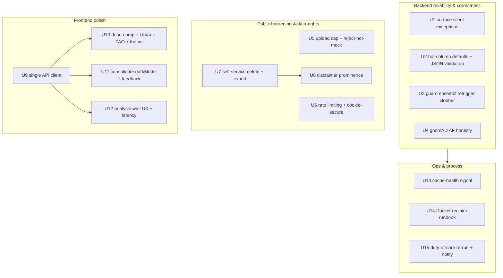
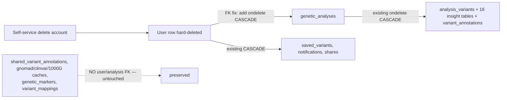

# Public Release Readiness - Plan

## Goal Capsule

- **Objective:** Take the genetic-health toolkit from a working 3-user internal tool to a public *educational* product for tens of users — reliable, honestly-presented, minimally hardened against public abuse, and polished — without paying for the maintainability refactor or backend scaling that deliver no value at this size.
- **Product authority:** This plan governs the public-release scope. It re-scopes the broader refactor plan (`docs/plans/2026-07-03-001-refactor-full-app-refactor-plan.md`) against a launch goal that plan explicitly deferred; it does not supersede that plan's correctness units, which already shipped on `refactor/analysis-correctness` (U1 snapshot + U2–U5). Verified production facts (`docs/data_sources_consumption_audit.md`) override any stale scale/coverage claim.
- **Open blockers:** None blocking planning. Production accounts are a mix of test and real users, so the shipped correctness deltas changed real people's verdicts — that duty-of-care is captured as release work (R15 / U15), not an open question.
- **Execution profile:** Reliability-first. Backend correctness/hardening (U1–U8) lands before frontend polish (U9–U12). U13 (cache-health) is shipped admin code; the remaining ops/process units (U14–U15) produce scripts and runbooks only — production execution is a manual, out-of-band step this pipeline does not perform.
- **Stop conditions:** Stop and surface if (a) a schema migration would run against production without a verified backup, (b) the gnomAD build fix (U4) proves larger than "collapse + document," (c) the account-deletion cascade (U7) cannot be proven to leave shared caches intact, or (d) any unit needs to write to, restart, or migrate production directly.

---

## Product Contract

**Product Contract preservation:** Requirements R1–R15 unchanged. Two clarifications from code verification, neither a scope change:
- **R3** — the `ensembl` / `ensembl_vep` shared-column design is intentional and documented (`annotation_constants.py:30-36`); the analysis path is single-writer. The only real silent-overwrite surface is the admin double-retrigger. U3 targets that surface and preserves the intentional share; a separate `ensembl_vep` column is deferred.
- **R10 (LitVar)** — the misalignment is backend-internal, not the frontend rendering key. The detail dialog already reads `details.publications` correctly; the builder reads `litvar_data["publications"]` (a list) while the LitVar service only stores `total_publications` (a count). U10 fixes the backend so the list is populated end-to-end.

### Summary

Ship a release-readiness slice: make failures loud instead of silent, present gnomAD frequency and annotation data honestly, add the public-exposure basics the internal build never needed (upload cap, rate limit, GDPR data-rights, prominent disclaimers), and polish the user-facing surface (single API client, FAQ, LitVar, theme consistency). Defer the god-file/DI/DRY structural refactor and all backend scaling until real load or more contributors justify them.

### Problem Frame

The existing refactor plan is a good *maintainability* spec, but it was written for a 2-user internal app and its own Open Question flags that ~13 of its 22 units deliver no user-visible value at that scale. Production confirms the premise: 3 users, 3 analyses, a box idle at 0.3% CPU / 573 MB, on a 61 GB database whose large tables are already index-served. "Public release" is not "finish that plan" — it is a different, smaller goal that overlaps the plan in some places and adds work the plan deliberately excluded in others.

Two forces reshape scope. First, positioning is **educational/informational**, so the correctness bar is "self-consistent and honest," which the shipped correctness fixes already meet — no clinical validation or medical-device path is needed. Second, the launch target is **tens of users**, so backend throughput, storage growth, and query optimization are premature (YAGNI). What is left is the gap between "works for us" and "safe to hand strangers": failures currently swallowed silently, a gnomAD path presented as a frequency source when it returns nothing, no upload/rate limits on soon-to-be-public endpoints, no self-service data deletion for special-category genetic data under EU law, and a UI with dead components, a broken literature link, and inconsistent theming.

The re-scope against the refactor plan's units:

| Concern | Kept from refactor plan | New (not in that plan) | Deferred |
|---|---|---|---|
| Reliability / correctness | U6 (ensembl clobber), U7 (gnomAD collapse), U9 (hot-column defaults), U12 (silent exceptions) | — | — |
| Public hardening | — | upload cap, rate limit, data-rights, disclaimer prominence | — |
| User-facing polish | U17 (API client), U20 pattern consolidation, U21 (FAQ, LitVar, dead-component removal, theme) | analysis-wait UX / latency check | U18, U19, U20 splits |
| Structure / maintainability | — | — | U10, U11, U13, U14, U15, U16 |
| Ops | — | Docker cruft reclaim, cache-health signal | — |
| Docs | U22 (reconcile after) | — | — |

### Key Decisions

- **Release-readiness over structural refactor.** The god-file splits (`admin_routes.py` 2482 lines, `AdminPanel.tsx` 3631, etc.), DI-container removal, dead-annotation-layer merge, and DRY consolidation are behavior-preserving maintainability work with no user-visible payoff at tens of users. They are deferred, not cancelled — revisit when contributor count or load changes the math.
- **"Fast" targets perceived speed, not throughput.** With the box idle at current scale, backend scaling and query optimization are premature. Effort goes to the analysis-wait experience and UI responsiveness; backend latency is measured and optimized only if it crosses a threshold set in planning.
- **Keep the API client (U17) as reliability, not structure.** Unlike the pure splits, a single fetch client centralizes error handling so backend failures surface to users instead of silent `undefined` — it earns its place on the reliability line, not the deferred structural line.
- **GDPR data-rights are in scope despite educational positioning.** Genetic data is special-category personal data under EU law regardless of how results are framed, and the operator is EU-based. Self-service account deletion and data export are release-blocking, not optional.
- **gnomAD honesty over gnomAD completeness.** The CADD cache is empty due to a GRCh37/GRCh38 build mismatch. Fixing the build (re-ETL) is deferred; the release requirement is that the UI and scoring stop presenting a dead path as a frequency source — collapse-and-document is acceptable per the refactor plan's U7 stop condition.

### Requirements

**Reliability & correctness**

- R1. The dangerous silent exception sites (the ~8 the refactor plan's U12 enumerates) must log and surface failures instead of dropping writes or corrupting state; intentional best-effort swallows may remain but must be marked as such. Log lines carry no PII — variant IDs/hashes and error types only, never raw genotype, allele, or rsid values.
- R2. Generator-critical columns (`alt_alleles`, `genotype`, `info`) must have safe non-null defaults with existing NULLs backfilled, and insight-table JSON writes must be validated so a malformed shape fails at write with a clear error rather than at read.
- R3. The `ensembl` and `ensembl_vep` annotation sources must not write the same column; one source must not be able to silently overwrite the other's stored annotation.
- R4. The gnomAD path must present allele frequency honestly: AF is fed only by the live per-population source, the build-mismatched CADD path is either fixed or documented as conservation-only and no longer surfaced as an AF source, and the near-dead BigQuery fallback is removed from the analysis flow.

**Public hardening & data-rights**

- R5. File uploads must enforce a maximum size and reject oversized or unparseable files with a clear user-facing error before any processing begins.
- R6. Public-facing endpoints (auth, upload, variant lookup) must have basic rate limiting so a single actor cannot exhaust the analysis worker or hammer lookups.
- R7. A user must be able to delete their account together with all their personal genetic data, and export their own data, through self-service — satisfying EU data-rights for special-category data. Shared reference/annotation caches are not personal data and are out of this deletion path.
- R8. The not-medical-advice / educational disclaimer must appear, consistently worded, at every point where a user reads results — upload, dashboard, each category panel, and shared views — prominently enough that an educational reading is unambiguous.

**User-facing polish**

- R9. A single frontend API client must replace the raw `fetch()` call sites, centralizing cookie-based auth and error handling so a 4xx/5xx surfaces a handleable error to the user instead of a silent `undefined`, with 401 handled in one place.
- R10. Dead exported-but-unused components must be removed; the LitVar literature must reach the variant dialog (the backend key and the dialog's rendering key aligned end-to-end so citations appear); a FAQ page must be added matching the existing marketing pages; and theme must be applied from one source consistently across light and dark.
- R11. Repeated inline UI patterns (dark-mode persistence, per-tab feedback state) must be consolidated into single shared utilities. Splitting the large settings/overview/admin/dialog components is deferred (see Scope Boundaries).
- R12. The analysis-wait experience must give clear, honest progress feedback for the multi-minute, ~600K-variant analysis so perceived speed is acceptable. Actual analysis latency (p50/p95) must be measured; backend optimization is warranted only if it exceeds the threshold set in planning.

**Ops & observability**

- R13. The ~117 GB of reclaimable Docker image and build-cache cruft on production must be reclaimed (active images verified first). The large PostgreSQL tables stay — they are index-served at runtime and are not dead weight.
- R14. A per-source cache-health signal (found-rate plus cache file size and row count) must be exposed to the admin surface so a stale cache — like the empty gnomAD CADD build — is visible rather than silent.

**Existing-user duty of care**

- R15. Production holds a mix of test and real accounts, and the shipped correctness fixes changed real users' health-risk and drug-response verdicts. Before public launch, decide and execute a plan for the real accounts: re-run their analyses against corrected logic and, where a verdict materially changed, communicate the change responsibly.

### Acceptance Examples

- AE1. **Covers R4.** Given a variant with only conservation/CADD data and no live AF, when it is scored, then AF is reported as absent — not fabricated from the dead cache — and the frequency dimension does not contribute a fake value.
- AE2. **Covers R5.** Given an upload exceeding the size cap or failing to parse, when submitted, then it is rejected before processing with a clear error and no partial analysis row is created — and no mock/placeholder variants are generated.
- AE3. **Covers R7.** Given a user requests account deletion, when it completes, then their analyses and all per-analysis genetic data are gone, while shared reference/annotation caches are untouched.
- AE4. **Covers R9.** Given an API call returns a 4xx/5xx, when the client receives it, then the calling UI shows an error state rather than rendering as though the call returned empty data.

### Scope Boundaries

**Deferred for later** (justified by scale or contributor count, not rejected):
- Backend structural refactor: god-file splits (`admin_routes.py`, `gnomad_local.py`, `base.py`, `models.py`, `multi_source_categorizer.py`, `scoring_engine.py`, `variant_routes.py`), DI-container removal, dead-annotation-layer merge and loader consolidation, DRY consolidation, `insights_service` rename.
- Frontend god-component splits: `AdminPanel.tsx`, `VariantDetailDialog.tsx`, `VariantSearch.tsx`, `SettingsPanel.tsx`, `DashboardOverview.tsx`.
- Backend scaling: worker throughput beyond the current 2 parallel jobs, query optimization on the large tables, storage-growth strategy for per-analysis variant rows.
- Full gnomAD re-ETL to a consistent genome build (R4 is collapse-and-document).
- A separate `ensembl_vep` annotation column (R3 guards the shared column's only overwrite surface instead).
- `shared_variant_annotations` bloat work — the audit measured it at 1.9 GB, not the 4.5 GB the refactor plan assumed, so it is not a release concern.
- Demo/sample report (no-upload preview) — parked as an optional launch booster.

**Deferred to Follow-Up Work** (release-adjacent, out of this PR set):
- Consolidating the two parallel progress mechanisms (SSE loader vs. status-poll hook) into one — U12 measures and improves perceived wait but does not unify the transports.
- A frontend test harness — frontend units are verified by build/lint + manual smoke only.
- Fixing the `chunked_db_write` signature/`col_name` latent bug if U1/U4 verification confirms the path is reachable (see Open Questions).

**Outside this product's identity:**
- Medical-device certification or clinical validation — the product is positioned as educational/informational.
- New analysis categories or product features.

### Dependencies / Assumptions

- Correctness units U2–U5 are shipped on `refactor/analysis-correctness`; this plan builds on that branch's results, not the pre-fix behavior. This plan's work continues on that branch (current checkout).
- Schema-touching changes (U2, U7, U12) run against a database backup or staging first; production is not migrated blind. This pipeline authors migrations but does not apply them to production.
- Production accounts are a confirmed mix of test and real users; real users' shipped correctness deltas changed their verdicts, which is why R15/U15 exists.
- Analysis latency is currently unmeasured here (there is no clean completion timestamp on `genetic_analyses`); U12 assumes measurement is a first step, and the app already has a `progress_percentage` field, an SSE stream, and `AnalysisProgressLoader.tsx` to build on.
- The full observability stack (OpenTelemetry, Jaeger, Prometheus, Grafana, cAdvisor) is already deployed in production and is the source for U12's latency measurement and U14's signals — no new infrastructure is required.
- No public self-service registration endpoint is wired today (account creation is Google-OAuth-only; `auth_routes.py:109` `register` is defined but has no route decorator). Rate-limiting (U6) covers the OAuth/login surface accordingly.

---

## Planning Contract

### Key Technical Decisions

- KTD1. **Reliability-first sequencing.** Backend correctness/honesty and hardening (U1–U8) land before frontend polish (U9–U12); ops/process come last — U14 (runbook) and U15 (script+plan) are artifact-only deliverables, while U13 (cache-health) is a shipped admin code change. Rationale: the highest-stakes changes (silent failures, honest AF, data-rights deletion) are where public exposure creates real harm, so they ship while attention is highest and can be reviewed independently.
- KTD2. **Migrations authored, not applied.** U2, U7, and U12 add Alembic migrations (NULL backfills, cascade changes, and a completion timestamp). They must apply cleanly against a backup/staging DB; production application is a manual, out-of-band step. The pipeline never runs migrations against `204.168.200.44`.
- KTD3. **gnomAD collapse-and-document (R4).** AF reaches scoring only from the live `gnomad_v2_local` per-population source; `gnomad_local` is documented as CADD/conservation-only and stops being surfaced as an AF source; the creds-gated BigQuery fallback (`gnomad_local.py:855-856,881-882`) is removed from the analysis lookup path. Full re-ETL to a consistent build is deferred (matches refactor plan U7 stop condition).
- KTD4. **Preserve the intentional ensembl column share; guard the one overwrite surface (R3).** The analysis path is single-writer into `ensembl_data` by design. The admin double-retrigger (`admin_routes.py:781-785`, resolving both source names via `SOURCE_TO_COLUMN` to `ensembl_data`) is the only path that can silently overwrite. Guard it so retriggering one source cannot clobber the other's stored annotation; document the shared-column contract. A dedicated `ensembl_vep` column is deferred.
- KTD5. **Reject, never fabricate (R5).** Oversized or unparseable uploads fail loudly with a user-facing error before any processing. The silent 50-mock-variant fallback (`vcf_parser.py:64-67`) is removed — a parse failure must never yield a fake analysis. Cap default: 100 MB (covers consumer 23andMe/AncestryDNA raw exports and SNP-array VCFs with headroom); accepted types unchanged (`.vcf`, `.csv`, `.txt`). Cap is config-driven and tunable.
- KTD6. **Rate limiting via `slowapi` (R6), per-IP, config-driven thresholds.** `slowapi` is the standard FastAPI-native limiter (wraps `limits`), in-memory by default (fine at this scale — the box is single-instance). Proposed defaults: auth/login + OAuth callback 10/min, upload 5/hour, variant lookup/search + annotation 30/min. Thresholds live in `core/config.py`. Also set `COOKIE_SECURE=true` in the production environment as part of public hardening (cookies currently default insecure, `core/auth.py:21`).
- KTD7. **GDPR delete = hard delete via DB cascade; export = machine-readable JSON (R7).** Self-service account deletion hard-deletes the `User` row and lets the existing per-analysis `ondelete=CASCADE` chain remove all personal genetic data; the missing `User → genetic_analyses` cascade (`models.py:103`, no `ondelete`) is fixed by migration so deletion actually completes (this also fixes the admin-delete error path). Shared reference/annotation caches carry no user/analysis FK and are untouched. Export returns a scoped JSON dump of the user's profile, analyses, and insight rows.
- KTD8. **Single fetch client as reliability (R9).** Extend the existing `lib/api.ts` `apiFetch` (currently 0 call sites) into the real client: `credentials:'include'`, response-body error parsing that throws a typed error, and one 401 handler. Migrate all ~53 raw `fetch(apiUrl(...))` sites. This is the reliability lever, not a structural split.
- KTD9. **LitVar fix is backend-deep (R10).** The frontend already reads `details.publications` correctly. Fix the backend so the LitVar service stores a `publications` list of `{pmid,title,journal,year}` in `litvar_data` (or realign the builder to consume the stored `total_publications` shape) so `variant_detail_builder.extract_publications` produces a non-empty list. Frontend rendering is unchanged.
- KTD10. **One theme source (R10/R11).** Consolidate dark-mode persistence into a single `useDarkMode` hook (replacing the 5 duplicated `localStorage 'darkMode'` read/write/class-toggle sites) and add a pre-hydration `dark`-class script in the root layout to kill the flash-of-wrong-theme. Keep the existing `utils/theme.ts` / `shared.tsx` helper as the single class source; do not introduce a new abstraction. Splitting components is deferred.
- KTD11. **Ops units deliver artifacts, not production changes (R13/R15).** U14 ships a documented reclaim runbook (and optional Makefile/`just` target); U15 ships a re-run script plus a duty-of-care comms plan doc. Actually reclaiming disk on prod and re-running/notifying real users are manual steps performed out-of-band by the operator — explicitly not part of this pipeline.

### High-Level Technical Design

**Unit dependency graph.**

**Account-deletion scope (U7).** The delete path must remove personal data and stop cleanly at the shared caches.

### Assumptions

- The backend test suite (baseline ~1721 tests per the refactor plan) passes on the current branch before work starts.
- `slowapi` is an acceptable new dependency (pure-Python, FastAPI-native). If the operator prefers no new dependency, a minimal custom in-memory limiter is the fallback (noted in U6).
- The disclaimer's current presence/wording is unverified per-surface; U8 begins with a quick grep to find existing disclaimer text before standardizing it.
- Export scope is the requesting user's own data only; admin/global export is out of scope.

### Sequencing

U1–U4 (backend reliability) are independent of each other and can land in any order, but before ops. U5, U6, U8 are independent; U7 precedes U8 only because the disclaimer/data-rights surfaces are naturally reviewed together (soft dependency — can parallelize). U9 (API client) lands before U10–U12 so frontend polish is written against the client. U13 depends on nothing new. U14/U15 are documentation/scripts, last. Within backend, migrations (U2, U7) should be reviewed together so a single backup/staging apply covers both.

---

## Implementation Units

### Unit Index

| U-ID | Title | Key files | Depends on |
|------|-------|-----------|------------|
| U1 | Surface dangerous silent exceptions | annotation_coordinator.py, shared_annotation_service.py, insight_dispatcher.py, annotation_loader.py, analysis_service.py, gnomad_local.py | — |
| U2 | Hot-column defaults + insight JSON validation | db/models.py, alembic, insight_generators/base.py, db/annotation_schemas.py | — |
| U3 | Guard ensembl/ensembl_vep retrigger clobber | api/admin_routes.py, services/annotation_constants.py | — |
| U4 | gnomAD AF honesty (collapse + document) | services/gnomad_local.py, local_annotation.py, scoring_engine.py, variant_detail_builder/UI AF surfacing | — |
| U5 | Upload size cap + reject-not-mock | api/upload_routes.py, utils/vcf_parser.py, core/config.py | — |
| U6 | Rate limiting + cookie-secure | main.py, pyproject.toml, core/config.py, auth_routes.py, upload_routes.py, variant_routes.py, annotation_routes.py, core/auth.py | — |
| U7 | Self-service account deletion + data export | db/models.py, alembic, api/auth_routes.py or upload_routes.py, services/user_service.py | — |
| U8 | Disclaimer prominence | frontend/src/components/*, marketing pages, category panels, shared views | U7 (soft) |
| U9 | Single API client | frontend/src/lib/api.ts + ~53 fetch sites | — |
| U10 | Dead components + LitVar + FAQ + theme source | frontend components, app/faq, backend LitVar service + builder | U9 |
| U11 | Consolidate darkMode + feedback-state | frontend hooks + components | U9 |
| U12 | Analysis-wait UX + latency measurement | AnalysisProgressLoader.tsx, analysis_service.py, db/models.py, alembic | U9 |
| U13 | Per-source cache-health signal | api/admin_routes.py, frontend admin | — |
| U14 | Docker cruft reclaim runbook | docs/runbooks (new), Makefile/justfile | — |
| U15 | Duty-of-care re-run + notify | backend/scripts (new), docs (new) | — |

---

### U1. Surface dangerous silent exceptions

- **Goal:** Make the ~8 dangerous swallow sites log and surface failures instead of silently dropping writes or corrupting state.
- **Requirements:** R1
- **Dependencies:** none
- **Files:** `backend/services/annotation_coordinator.py` (~514, ~877, ~912), `backend/services/shared_annotation_service.py` (~169), `backend/services/insight_dispatcher.py` (~164, ~298), `backend/services/annotation_loader.py` (~159), `backend/services/analysis_service.py` (~387, ~402), `backend/services/gnomad_local.py` (~1427); tests under `backend/tests/`
- **Approach:** Replace each dangerous swallow with `logger.warning/error` plus appropriate handling — re-raise where a failed write must not be silent, record a status/counter where the audit needs visibility. The per-generator swallow in `insight_dispatcher` (`:164`) must at minimum record which panel failed so a missing insight category is visible, not silent. Leave acceptable best-effort swallows (cache open, telemetry, shutdown) intentional and commented where non-obvious. Log lines carry only non-PII context (variant IDs/hashes, error type, counters) — never raw genotype/allele/rsid values (host journald is persistent per `docs/security.md`).
- **Patterns to follow:** existing `logger` usage in the same modules; the refactor plan's U12 site list.
- **Test scenarios:**
  - Happy path: successful writes and annotations behave unchanged.
  - Error path: a forced DB failure in `shared_annotation_service.save_annotation` logs and returns a signal the caller can act on (not a silent `False` that callers ignore).
  - Error path: a generator raising inside `insight_dispatcher` is logged with the panel name and does not silently drop the panel without a trace.
  - Edge: acceptable best-effort paths (cache invalidation, `job_logs` write) still degrade gracefully but log at warning.
  - Integration: a fault-injection test proves at least the annotation-save and dispatcher-generator sites surface the failure.
- **Verification:** Dangerous sites log on failure; fault-injection test passes; no new PII in log lines (grep review).

### U2. Hot-column defaults + insight JSON validation

- **Goal:** Give generator-critical columns safe non-null defaults with NULL backfill, and validate insight-table JSON writes so malformed shapes fail at write.
- **Requirements:** R2
- **Dependencies:** none
- **Files:** `backend/db/models.py` (`GeneticMarker.alt_alleles` ~142, `AnalysisVariant.genotype` ~166, `AnalysisVariant.info` ~169), `backend/alembic/versions/` (new migration), `backend/services/insight_generators/base.py` (~1157 build/persist), `backend/db/annotation_schemas.py` (validation)
- **Approach:** Set `alt_alleles` default `''`, `genotype` default `'./.'` (VCF no-call), `info` server-default `'{}'`; backfill existing NULLs in the migration. Add lightweight structural validation on insight-table JSON payloads before `session.add` (reuse `annotation_schemas.py` TypedDicts / a small validator) so a malformed shape raises a clear error at write instead of surfacing at read.
- **Execution note:** Backfill NULLs in the migration; verify on a DB backup before production apply (KTD2).
- **Patterns to follow:** existing column defaults in `db/models.py`; TypedDicts in `db/annotation_schemas.py`.
- **Test scenarios:**
  - Happy path: inserting a variant without explicit genotype stores `'./.'`, not NULL; `variant.info` is `{}` not NULL.
  - Edge: reading a legacy row backfilled from NULL returns the default without `AttributeError` on `.info.get(...)`.
  - Error path: a malformed insight JSON payload (wrong shape) is rejected at write with a clear error.
  - Integration: migration applies cleanly on a backup and is reversible.
- **Verification:** Migration applies on backup; generators no longer risk `AttributeError` on NULL hot columns; bad shapes rejected at write.

### U3. Guard ensembl/ensembl_vep retrigger clobber

- **Goal:** Ensure retriggering one annotation source cannot silently overwrite the other's stored annotation in the shared `ensembl_data` column, preserving the intentional shared-column design.
- **Requirements:** R3
- **Dependencies:** none
- **Files:** `backend/api/admin_routes.py` (~781-785, and the other `SOURCE_TO_COLUMN` resolution sites ~670, ~722, ~1005, ~1040), `backend/services/annotation_constants.py` (~22, ~37, doc comment ~30-36)
- **Approach:** In the admin retrigger/backfill path, when the target column is the shared `ensembl_data`, do not blind-overwrite an existing populated annotation from the other source — skip or merge when the other source's data is already present (confirm authoritative source: `ensembl_vep` is the analysis-time writer). Strengthen the `annotation_constants.py` comment to state the contract explicitly. Do not add a new column (deferred).
- **Patterns to follow:** the existing `SOURCE_TO_COLUMN` resolution and per-source retrigger loop in `admin_routes.py`.
- **Test scenarios:**
  - Happy path: analysis-time single-writer path is unchanged (writes `ensembl_data` from `ensembl_vep`).
  - Integration: admin retrigger of `ensembl` when `ensembl_vep` data is already present does not silently blow it away (skips/merges per decision).
  - Edge: retrigger with an empty/absent existing value writes normally.
- **Verification:** Dual-retrigger no longer clobbers; the shared-column contract is documented; analysis path behavior-preserved.

### U4. gnomAD AF honesty (collapse + document)

- **Goal:** Present allele frequency honestly — AF only from the live source, CADD path documented as conservation-only, BigQuery fallback removed from the analysis flow.
- **Requirements:** R4
- **Dependencies:** none
- **Files:** `backend/services/gnomad_local.py` (BigQuery calls ~855-856, ~881-882; defs ~1337-1372; cache-write ~1427), `backend/services/local_annotation.py` (AF path ~349-413), `backend/services/scoring_engine.py` (`_score_gnomad`), `backend/services/variant_detail_builder.py` and the variant dialog AF-surfacing (frontend `VariantDetailDialog.tsx`)
- **Approach:** Remove the creds-gated BigQuery fallback from the analysis lookup path so it is no longer reachable during analysis (leave admin-only ETL untouched). Ensure `scoring_engine._score_gnomad` receives AF only from the live `gnomad_v2_local` source; where only CADD/conservation exists, AF is absent (not fabricated). Update UI/detail surfacing so the CADD/`gnomad_local` path is not labeled as an AF source. Document `gnomad_local` as conservation-only in `docs/data_sources_schema.md`.
- **Execution note:** If the full build-translation fix exceeds "collapse + document," stop at collapse-and-document and raise re-ETL as follow-up (Goal Capsule stop condition b).
- **Patterns to follow:** existing `_format_variant` AF assembly (`gnomad_local.py:1434-1453`), v2 fallback overwrite (`local_annotation.py:369-413`).
- **Test scenarios:**
  - Covers AE1. Happy path: a variant with v2 exome AF returns that AF through the live reader.
  - Covers AE1. Edge: a variant with only CADD/conservation returns those with AF absent (not fabricated), and the frequency dimension contributes no fake value.
  - Integration: `_score_gnomad` receives AF only from the live source; the BigQuery fallback is not reachable from the analysis lookup path.
  - Regression: analysis output unchanged for variants that never had AF.
- **Verification:** AF-bearing variants score with real frequency; BigQuery path unreachable from analysis; UI/docs no longer present the dead path as an AF source.

### U5. Upload size cap + reject-not-mock

- **Goal:** Enforce a max upload size and reject oversized/unparseable files with a clear error before processing — and never fabricate mock variants on failure.
- **Requirements:** R5
- **Dependencies:** none
- **Files:** `backend/api/upload_routes.py` (`_handle_upload` ~110, read ~124, extension check ~118), `backend/utils/vcf_parser.py` (parse entry ~25, mock fallback ~64-67, `_generate_mock_variants` ~434), `backend/core/config.py` (new `MAX_UPLOAD_BYTES`)
- **Approach:** Enforce a size cap (default 100 MB via `core/config.py`) before reading the whole body — reject with a clear 413/400 and a user-facing message. Remove the silent mock-variant fallback in `vcf_parser.py` so a parse failure raises a clear error that `_handle_upload` returns to the user; no partial analysis row is created. Keep the existing extension allowlist; optionally add a light content sniff.
- **Patterns to follow:** existing FastAPI `UploadFile` handling in `upload_routes.py`; error-response shape used elsewhere in the module.
- **Test scenarios:**
  - Covers AE2. Happy path: a valid in-cap file parses and creates an analysis as before.
  - Covers AE2. Error path: a file over the cap is rejected before full read with a clear error; no analysis row created.
  - Covers AE2. Error path: an unparseable file is rejected with a clear error and produces zero mock variants and no analysis row.
  - Edge: an empty file is rejected cleanly.
- **Verification:** Oversized/unparseable uploads rejected pre-processing; `_generate_mock_variants` no longer reachable from the upload path; cap is config-driven.

### U6. Rate limiting + cookie-secure

- **Goal:** Add basic per-IP rate limiting to public-facing endpoints and close the insecure-cookie default for production.
- **Requirements:** R6
- **Dependencies:** none
- **Files:** `backend/pyproject.toml` (add `slowapi`), `backend/main.py` (limiter init + middleware ~252-281), `backend/core/config.py` (thresholds), `backend/api/auth_routes.py` (login ~132, OAuth callback ~547, forgot/reset ~497/~512), `backend/api/upload_routes.py` (~150, ~166), `backend/api/variant_routes.py` (lookup ~69, search ~759), `backend/api/annotation_routes.py` (~52, ~79, ~140), `backend/core/auth.py` (`COOKIE_SECURE` ~21)
- **Approach:** Add `slowapi`, register the limiter and exception handler in `main.py`, and decorate the public endpoints with per-IP limits from `core/config.py` (defaults: auth/OAuth 10/min, upload 5/hour, lookup/search/annotation 30/min). Document setting `COOKIE_SECURE=true` in the production environment (the default is insecure at `core/auth.py:21`); wire the env read so production cookies are `Secure`. If a new dependency is undesirable, fall back to a minimal in-memory per-IP limiter (noted here, decided at implementation).
- **Patterns to follow:** `main.py` middleware registration (CORS ~263); FastAPI dependency/decorator patterns already in the routers.
- **Test scenarios:**
  - Happy path: a normal request rate passes unthrottled.
  - Error path: exceeding the login limit returns 429 with a clear message; the limit is per-IP.
  - Error path: exceeding the upload limit returns 429 without starting an analysis.
  - Edge: limits are read from config (changing config changes behavior).
- **Verification:** Public endpoints return 429 past their limit; limits config-driven; production cookie config sets `Secure`.

### U7. Self-service account deletion + data export

- **Goal:** Let a user delete their account with all personal genetic data, and export their own data, via self-service — without touching shared caches.
- **Requirements:** R7
- **Dependencies:** none
- **Files:** `backend/db/models.py` (`User.genetic_analyses` ~27, `GeneticAnalysis.user_id` FK ~103), `backend/alembic/versions/` (new migration for `ondelete=CASCADE`), `backend/api/auth_routes.py` or `backend/api/upload_routes.py` (new delete-account + export endpoints), `backend/services/user_service.py`
- **Approach:** Add `ondelete=CASCADE` (and ORM `cascade`) to the `User → genetic_analyses` relationship via migration so a `User` hard-delete cascades through the existing per-analysis `ondelete=CASCADE` chain (this also fixes the current admin-delete FK error). Add an authenticated self-service `DELETE /account` endpoint that hard-deletes the current user and their data (distinct from the existing soft-delete `DELETE /upload/data`). Add an authenticated `GET /account/export` returning a scoped JSON dump of the user's profile, analyses, and insight rows. Explicitly exclude shared caches (`shared_variant_annotations`, `genetic_markers`, source tables) from both.
- **Execution note:** Prove the cascade scope on a backup before production apply (KTD2); this is irreversible data deletion.
- **Patterns to follow:** existing soft-delete endpoints in `upload_routes.py` (~182, ~273); `get_current_user` auth dependency; existing cascade declarations on `saved_variants`/`notifications`.
- **Test scenarios:**
  - Covers AE3. Happy path: deleting an account removes the user, their analyses, and all 16 per-analysis insight tables + variant rows.
  - Covers AE3. Integration: after deletion, shared reference/annotation caches (`shared_variant_annotations`, `genetic_markers`, gnomad/clinvar tables) are untouched.
  - Happy path: export returns the user's own analyses and insights as JSON; another user's data is never included.
  - Error path: unauthenticated delete/export is rejected (401); a user cannot delete/export another user's account.
  - Edge: deleting a user with zero analyses succeeds (regression on the current FK bug).
- **Verification:** Cascade proven on backup; self-service delete removes all personal data and no shared cache rows; export scoped to the requesting user; admin-delete FK error gone.

### U8. Disclaimer prominence

- **Goal:** Show a consistent educational / not-medical-advice disclaimer at every surface where a user reads results.
- **Requirements:** R8
- **Dependencies:** U7 (soft — reviewed with data-rights surfaces)
- **Files:** `frontend/src/components/` (a shared `Disclaimer` component), upload (`FileUpload.tsx`), dashboard (`Dashboard.tsx` / `dashboard/`), each category panel (`categories/*`), shared/public views (`sharing`-rendered views), marketing pages as relevant
- **Approach:** Begin with a grep for existing disclaimer text to find current wording and placement. Introduce one shared `Disclaimer` component with a single canonical string, and place it prominently at upload, dashboard, each category panel, and any shared/public result view. Wire once through the layout/shared surfaces where possible rather than pasting per panel.
- **Patterns to follow:** existing shared components under `frontend/src/components/`; the marketing pages' text-block styling.
- **Test scenarios:**
  - Test expectation: none new (no FE test harness) — verify via `pnpm build`, `pnpm lint`, and manual smoke that the disclaimer appears on upload, dashboard, a category panel, and a shared view with identical wording.
- **Verification:** One canonical disclaimer string; visible at all four surface classes; build/lint pass.

### U9. Single API client

- **Goal:** Replace the ~53 raw `fetch()` sites with the extended `apiFetch` client, centralizing cookie auth, error handling, and 401.
- **Requirements:** R9
- **Dependencies:** none
- **Files:** `frontend/src/lib/api.ts` (`apiUrl` ~3, `apiFetch` ~11), the ~15 files with raw `fetch()` (heaviest: `SettingsPanel.tsx`, `VariantSearch.tsx`, `hooks/useNotifications.ts`, `hooks/useAnalysisControls.ts`, `app/app/page.tsx`, `Dashboard.tsx`, `categories/VariantDetailDialog.tsx`)
- **Approach:** Extend `apiFetch` with `credentials:'include'`, response-body error parsing that throws a typed error on non-2xx, and a single 401 handler (redirect/clear-session in one place — today only `app/app/page.tsx:103` handles 401). Migrate all raw `fetch(apiUrl(...))` sites to the client; remove the ~50 inline `credentials:'include'` repetitions. Fix the one relative-URL call (`GeneticAnnotation.tsx:66`) — though that component is deleted in U10.
- **Patterns to follow:** existing `apiUrl()`/`apiFetch()` in `lib/api.ts`; existing hook fetch patterns.
- **Test scenarios:**
  - Covers AE4. Happy path: an authenticated GET/POST via the client sends cookies and returns typed data.
  - Covers AE4. Error path: a 4xx/5xx surfaces a typed error the caller can handle, not a silent `undefined`.
  - Edge: a 401 is handled in one place across panels.
  - Test expectation: no FE harness — verify via `pnpm build`, `pnpm lint`, grep confirming no raw `fetch(` remains outside `api.ts`, and manual smoke (login + dashboard load).
- **Verification:** No raw `fetch(` outside `api.ts`; 401 centralized; build/lint pass; manual login + dashboard smoke.

### U10. Dead components + LitVar + FAQ + theme source

- **Goal:** Remove dead components, make LitVar literature reach the dialog, add a FAQ page, and apply theme from one source.
- **Requirements:** R10
- **Dependencies:** U9
- **Files:** `frontend/src/components/GeneticAnnotation.tsx` (delete), `frontend/src/components/ThemeHelper.tsx` (delete — orphaned), `frontend/src/components/categories/ResearchLinks.tsx` (delete — redundant with `shared.tsx:722`), `backend/services/genetic_api_service.py` (LitVar `_get_litvar_annotation` ~583-605), `backend/services/variant_detail_builder.py` (`extract_publications` ~151-160), `frontend/src/app/faq/page.tsx` (new), `frontend/src/utils/theme.ts` + `categories/shared.tsx` (single theme source)
- **Approach:** Delete the three dead/unimported components (confirm zero imports via grep). LitVar: make the backend store a `publications` list of `{pmid,title,journal,year}` in `litvar_data` so `extract_publications` yields a non-empty list (or realign the builder to the stored `total_publications` shape); frontend already reads `details.publications`. Add a FAQ static page matching the marketing pages (repeat the Navbar/Footer wrapper pattern, or introduce a light `MarketingLayout`). Consolidate theme usage on one source (`utils/theme.ts` or the `shared.tsx` helper — pick one) and remove competing inline theme blocks where they duplicate tokens.
- **Patterns to follow:** existing marketing pages (`about/page.tsx`, `privacy/page.tsx`) for FAQ layout; `variant_detail_builder.extract_publications` output shape.
- **Test scenarios:**
  - Happy path: a variant with LitVar publications shows its citations in the dialog.
  - Edge: a variant without literature shows the empty state, no error.
  - Test expectation for deletions/FAQ/theme: none — verify via `pnpm build`, `pnpm lint`, grep confirming no imports of deleted components, and manual smoke (FAQ renders; theme consistent light/dark).
- **Verification:** Dead components gone with no dangling imports; LitVar citations visible; FAQ reachable; theme from one source.

### U11. Consolidate darkMode + feedback-state

- **Goal:** Replace the duplicated dark-mode persistence and per-section feedback state with single shared utilities.
- **Requirements:** R11
- **Dependencies:** U9
- **Files:** a new `frontend/src/hooks/useDarkMode.ts`; the 5 duplicated dark-mode sites (`app/app/page.tsx` ~39/57/59, `Dashboard.tsx` ~123/183/184, `AuthForm.tsx` ~46/53, `marketing/Navbar.tsx` ~21/25/31/32, `AnalysisProgressLoader.tsx` ~42); a shared feedback-state hook/component modeled on `Dashboard.tsx:134` `showNotification`; the ~10 feedback-state sites (`SettingsPanel.tsx` ~51/52/82, `admin/AdminPanel.tsx` ~308-386, `FileUpload.tsx` ~22)
- **Approach:** Introduce one `useDarkMode` hook owning the `localStorage 'darkMode'` read/write and the `document.documentElement` class toggle; migrate the 5 sites to it. Add a pre-hydration `dark`-class script in the root `layout.tsx` to remove the flash-of-wrong-theme. Fold the scattered `{message,type}` feedback states into a shared hook/component modeled on the existing `showNotification`/`NotificationToast`. Do not split the large components (deferred).
- **Patterns to follow:** existing `showNotification` + `dashboard/NotificationToast.tsx`.
- **Test scenarios:**
  - Test expectation: none (no FE harness) — verify via `pnpm build`, `pnpm lint`, and manual smoke (dark mode persists across reload with no flash; per-section success/error feedback still shows in settings and admin).
- **Verification:** Dark mode handled in one hook; no FOUC on load; feedback state consolidated; build/lint pass.

### U12. Analysis-wait UX + latency measurement

- **Goal:** Give honest progress feedback during the multi-minute analysis and measure real latency so any backend optimization is evidence-driven.
- **Requirements:** R12
- **Dependencies:** U9
- **Files:** `frontend/src/components/AnalysisProgressLoader.tsx` (SSE consumer ~52-90, progress render ~274-305), `backend/services/analysis_service.py` (completion timestamp write), `backend/db/models.py` (`GeneticAnalysis` — add `completed_at`), `backend/alembic/versions/` (new migration)
- **Approach:** Add a `completed_at` timestamp to `genetic_analyses`, set on completion in `analysis_service`, and derive p50/p95 latency from it (surfaced via the existing observability stack / an admin read). Tighten the progress UX in `AnalysisProgressLoader.tsx` so the step/percentage/ETA feedback is honest for the real ~600K-variant run (no stalled 99% or fabricated ETAs). Set a latency threshold (proposed: optimize only if p95 > 5 min) above which backend work is warranted; below it, no backend optimization ships. Consolidating the two progress transports is deferred.
- **Execution note:** Measurement first — do not optimize backend latency before `completed_at` data exists.
- **Patterns to follow:** existing `progress_percentage`/`current_step` handling in `AnalysisProgressLoader.tsx`; `STEP_MAP` step model.
- **Test scenarios:**
  - Happy path: on completion, `completed_at` is set and duration is derivable.
  - Edge: a failed/cancelled analysis does not set `completed_at`; the loader shows the failure state (regression on existing `failed`/`error` handling).
  - Test expectation (frontend): none — verify via `pnpm build`, `pnpm lint`, manual smoke of the progress loader against a real analysis.
  - Integration: migration for `completed_at` applies cleanly on backup.
- **Verification:** `completed_at` populated; p50/p95 derivable; progress UX honest; threshold documented; migration applies on backup.

### U13. Per-source cache-health signal

- **Goal:** Expose per-source cache health (true found-rate + row count + cache file size) on the admin surface so a stale cache is visible.
- **Requirements:** R14
- **Dependencies:** none
- **Files:** `backend/api/admin_routes.py` (`AnnotationSourceResponse` ~632, `get_annotation_sources` ~656, found-rate loop ~669-690, `source_status` ~1143-1155, ETL `get_import_status` endpoints), frontend admin data-sources tab
- **Approach:** Extend `AnnotationSourceResponse`/`get_annotation_sources` to report a true found-rate using `source_status()` (which distinguishes `found`/`missing`/`no_data`) instead of the non-NULL count that conflates `{"found": false}` as annotated. Merge in per-source row count (from `get_import_status()`) and a new on-disk cache file-size probe for file/hybrid sources (e.g. `gnomad_cache.db` — currently 180K/stale). Surface the combined signal in the admin data-sources tab so the empty gnomAD CADD build is visibly stale.
- **Patterns to follow:** existing `get_annotation_sources` structure and the ETL status endpoints' `get_import_status()`.
- **Test scenarios:**
  - Happy path: a healthy source reports a found-rate matching its real annotated ratio (not inflated by `{"found": false}`).
  - Edge: a stale/empty cache (gnomAD CADD) reports a low found-rate + small file size, flagged as stale.
  - Error path: a source whose cache file is missing reports absent rather than erroring.
- **Verification:** Admin surface shows true found-rate + row count + file size per source; stale gnomAD CADD is visibly flagged.

### U14. Docker cruft reclaim runbook

- **Goal:** Provide a safe, documented procedure to reclaim the ~117 GB of Docker image/build-cache cruft on production.
- **Requirements:** R13
- **Dependencies:** none
- **Files:** `docs/runbooks/reclaim-docker-cruft.md` (new), optional `Makefile`/`justfile` target
- **Approach:** Document the verify-then-prune runbook: confirm active images first, then `docker image prune -a` + `docker builder prune`, with the explicit note that the large PG tables and raw `data_sources/` are actively used and must not be touched. Provide an optional convenience target that runs the verify + prune with confirmation. **Execution against production is a manual operator step — this unit ships the runbook only; the pipeline does not SSH to or modify production.**
- **Patterns to follow:** existing `docs/` runbook/ops docs if present; `docs/data_sources_consumption_audit.md` P1 recommendation.
- **Test scenarios:**
  - Test expectation: none — documentation/script. Verify the runbook commands are syntactically correct and the "do not drop PG tables / raw data" guardrail is explicit.
- **Verification:** Runbook exists, is accurate, and clearly scopes the reclaim to Docker cruft only; no production action taken by the pipeline.

### U15. Duty-of-care re-run + notify

- **Goal:** Provide the tooling and plan to responsibly handle real users whose verdicts changed under the shipped correctness fixes.
- **Requirements:** R15
- **Dependencies:** none
- **Files:** `backend/scripts/rerun_corrected_analyses.py` (new), `docs/duty-of-care-rerun-plan.md` (new)
- **Approach:** Ship a script that re-runs a given user's/analysis's insight generation against the corrected logic and diffs the health-risk and drug-response verdicts against stored results, producing a report of material changes (per-user, no PII in logs). Write a comms plan doc: how to identify real vs test accounts, what constitutes a material verdict change, and responsible-notification wording/channel. **Actually re-running against production and notifying real users are manual operator steps performed out-of-band — this unit ships the script and plan only.**
- **Patterns to follow:** existing `backend/scripts/rerun_ancestry.py` for the re-run harness shape; the insight snapshot fixtures (`test_insight_snapshot.py`) for the diff approach.
- **Test scenarios:**
  - Happy path: the script re-runs a fixture analysis and reports verdict diffs correctly (test against the snapshot fixtures, not production).
  - Edge: an analysis with no verdict change reports "no material change."
  - Test expectation: no production execution in the test — the script is exercised against fixtures only.
- **Verification:** Re-run script works against fixtures and reports material verdict diffs; comms plan doc exists; no production execution by the pipeline.

---

## Verification Contract

| Gate | Command | Applies to |
|------|---------|-----------|
| Backend tests | `uv run pytest backend/tests/ -q` | U1–U7, U10, U12, U13, U15; must stay green |
| Backend tests + coverage | `uv run pytest backend/tests/ --cov=backend --cov-report=term-missing -q` | correctness-adjacent units (U1, U4) |
| Characterization snapshot | `uv run pytest backend/tests/test_insight_snapshot.py -q` | U1, U4 (no unintended insight deltas) |
| Frontend build | `cd frontend && pnpm build` | U8–U12 |
| Frontend lint | `cd frontend && pnpm lint` | U8–U12 |
| Migration safety | apply new migrations against a DB backup/staging before production | U2, U7, U12 |

Behavioral checks that mocks won't prove — account-deletion cascade scope (U7), AF-absent-not-fabricated (U4), LitVar end-to-end (U10), rate-limit 429 behavior (U6) — are called out in their unit test scenarios and verified by targeted tests or manual smoke. Frontend units (U8–U12) have no test harness and are verified by build/lint + manual smoke.

---

## Definition of Done

**Global**
- Every unit's verification passes; backend suite green at or above baseline.
- No new silent `except: pass`; the ~8 dangerous sites log/surface (U1).
- Uploads reject oversized/unparseable input and never produce mock variants (U5).
- Public endpoints are rate-limited; production cookie config is `Secure` (U6).
- Self-service account deletion removes all personal genetic data and leaves shared caches intact, proven on a backup; export is scoped to the requesting user (U7).
- gnomAD never fabricates AF; the BigQuery fallback is unreachable from analysis (U4).
- No raw `fetch(` outside `lib/api.ts`; 401 centralized (U9).
- Migrations (U2, U7, U12) apply cleanly on a backup; none are applied to production by the pipeline.
- Ops/process units (U14 runbook, U15 script+plan) exist as artifacts; no production mutation performed by the pipeline.
- Abandoned/experimental code from the work is removed, not left in the diff.

**Per-unit:** each unit is done when its listed verification holds.

---

## System-Wide Impact

- **User-facing results:** U4 changes gnomAD-scored variants (AF now honestly absent for CADD-only variants). U10 makes LitVar citations appear. Existing users' verdicts already shifted under U2–U5 (shipped) — U15 owns the duty-of-care response.
- **Database schema:** U2 (hot-column defaults + backfill), U7 (`User→analyses` cascade), U12 (`completed_at`) add migrations; all must run against a backup first (KTD2). U7's cascade change enables irreversible deletion — prove scope on a backup.
- **Auth / cookies:** U6 sets production cookies `Secure`; the mechanism (HttpOnly cookies) is otherwise unchanged. U9 centralizes cookie handling client-side without changing the mechanism.
- **API contract:** new self-service `DELETE /account` and `GET /account/export` endpoints (U7); new/extended admin cache-health fields (U13); rate-limit 429 responses added to public endpoints (U6). Existing route paths unchanged.
- **New dependency:** `slowapi` (U6), pure-Python; fallback is a minimal custom limiter.
- **Production operations:** U14 (Docker reclaim) and U15 (re-run + notify) are manual operator steps; the pipeline produces only the runbook/script/plan.

---

## Risks & Dependencies

- **Irreversible deletion (U7).** A wrong cascade could delete shared caches or fail to delete personal data. Mitigation: prove cascade scope on a backup; explicit test that shared caches are untouched; stop condition (c).
- **Migrations against production data (U2, U7, U12).** Large-table backfill/lock risk. Mitigation: backup-first, staging validation, off-peak manual apply; pipeline never auto-applies.
- **Large autonomous scope.** Fifteen units spanning backend correctness, migrations, new auth-adjacent endpoints, a new dependency, and a 53-site frontend migration is a large change set. Mitigation: atomic per-unit commits, reliability-first ordering, code-review + CI gates before merge; ops/process units are artifact-only.
- **gnomAD build fix depth (U4).** The GRCh38/GRCh37 mismatch may need re-ETL. Mitigation: stop at collapse-and-document; defer re-ETL.
- **No frontend test harness.** U8–U12 verified by build/lint + manual smoke only. Mitigation: keep exported names stable; small per-unit changes; API client (U9) first so polish is written against it.
- **Rate-limit tuning.** Defaults may be too tight/loose for real traffic. Mitigation: config-driven thresholds, adjustable without code change.

---

## Outstanding Questions

**Resolved in planning (recorded as KTDs/Assumptions):** upload cap (100 MB, config) and file types (unchanged); rate-limit thresholds (KTD6 defaults, config); gnomAD R4 (collapse-and-document); export format (scoped JSON); latency threshold (p95 > 5 min, tunable after measurement).

**Deferred to implementation:**
- Exact current disclaimer wording/placement (U8 begins with a grep to find and standardize existing text).
- Whether the `chunked_db_write` signature/`col_name` latent bug (`local_annotation.py:582-585` vs call at `annotation_coordinator.py:432`) is on a reachable path — verify during U1/U4; fix in follow-up if reachable (Scope Boundaries → Deferred to Follow-Up Work).
- `slowapi` vs. a minimal custom limiter — decided at U6 implementation based on operator preference on new dependencies.

---

## Sources / Research

- `docs/plans/2026-07-03-001-refactor-full-app-refactor-plan.md` — the maintainability refactor this plan re-scopes; its U6, U7, U9, U12, U17, U20, U21, U22 units are the kept work, its structural units the deferred work.
- `docs/data_sources_consumption_audit.md` — verified production facts (1.9 GB annotation table, ClinVar healthy, ~117 GB reclaimable Docker cruft, gnomAD CADD cache stale); overrides stale scale claims.
- `docs/data_sources_schema.md` — root cause of the gnomAD CADD build mismatch (GRCh37 markers vs GRCh38 CADD file) behind R4 and R14.
- Backend code surfaces verified 2026-07-09: silent-exception sites (`annotation_coordinator.py`, `shared_annotation_service.py:169`, `insight_dispatcher.py:164`, `analysis_service.py:387/402`, `gnomad_local.py:1427`); upload path (`upload_routes.py:110/118/124`, mock fallback `vcf_parser.py:64-67`); no rate-limit library (`pyproject.toml`, `main.py`); auth/cookies (`core/auth.py:21` insecure default); deletion cascade gap (`db/models.py:27/103`); admin found-rate conflation (`admin_routes.py:674-677` vs `source_status` `:1143`); ensembl shared column (`annotation_constants.py:22/30-36/37`, admin retrigger `admin_routes.py:781-785`).
- Frontend code surfaces verified 2026-07-09: `apiFetch` unused with ~53 raw `fetch()` sites; dead `GeneticAnnotation.tsx`/`ThemeHelper.tsx`/`ResearchLinks.tsx`; LitVar backend misalignment (`variant_detail_builder.py:151-160` reads `litvar_data["publications"]`, `genetic_api_service.py:583-605` stores only `total_publications`); no FAQ page; two theme systems + 5 duplicated darkMode sites; `AnalysisProgressLoader.tsx` SSE + `useAnalysisControls.ts` poll.
- Correctness path already shipped: `backend/services/insight_generators/` (`health.py`, `cognitive.py`, `base.py`), snapshot `backend/tests/test_insight_snapshot.py`.
