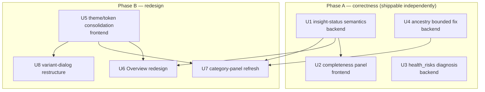

# feat: Dashboard redesign + analysis-accuracy fixes

## Summary

Two independently-shippable phases. **Phase A (correctness)** fixes the "Analysis
completeness" panel — which mislabels legitimately-empty categories and the
non-category `gwas_enrichment` pass as failures — plus a bounded diagnosis of why
`health_risks` reports 0, and a bounded fix for the ancestry estimate collapsing to
a single population ("Balkan 39.5 %"). **Phase B (redesign)** restructures how the
dashboard presents information — Overview, category panels, and the 2345-line variant
detail dialog — within the existing Next.js / Tailwind v4 / shadcn stack, and
consolidates the two divergent theme helpers into one token layer.

Phase A restores trust in the numbers; Phase B presents the (now-correct) data more
legibly. Phase A can ship before Phase B starts.

**Product Contract preservation:** Solo plan (`ce-plan-bootstrap`), no upstream
brainstorm. Scope confirmed with the user: refresh-and-restructure redesign (not a
ground-up rebrand); bounded ancestry fix on the existing AIMs panel (no data rebuild).

---

## Problem Frame

The dashboard is being prepared for public release. Three problems undermine it:

1. **Completeness panel lies.** It shows "13 of 14 insight categories generated · 96 %"
   and "2 categories could not be generated: health_risks, gwas_enrichment." Neither is
   a real failure: `health_risks` produced 0 insights (a legitimate "no findings"
   outcome), and `gwas_enrichment` is an *enrichment pass* that augments other panels,
   not a 15th category. The backend status model
   (`backend/services/insight_dispatcher.py`) conflates three distinct outcomes —
   generated / no-findings / failed — and the frontend
   (`frontend/src/components/dashboard/DashboardOverview.tsx`) renders any non-generated
   category with an alarming amber warning. The current dev-branch math is *also* wrong
   in a new way (`generators_succeeded` counts `gwas_enrichment`, yielding "15 of 14").

2. **`health_risks` may genuinely be under-reporting.** `0` health risks alongside 60
   drug interactions and 2 carrier conditions is suspicious for a real genome. The health
   generator is registry-driven (`ctx.get_maps('health')` over `variant_mappings`); the
   `health` category may be thin, or its `filter_benign` / `max_population_af=0.05` gates
   too aggressive. This needs diagnosis before it can be called a display bug or a real gap.

3. **Ancestry is inaccurate.** The estimate collapses to one population at low confidence
   ("Balkan 39.5 %, 1 population identified"). The genotype-likelihood model over the AIMs
   panel (`backend/services/insight_generators/ancestry.py`) plus the composition-assembly
   thresholds and softmax temperature are dropping all but the dominant entry, producing an
   implausible single-population result.

Separately, the **information presentation** across the Overview, the category panels, and
the variant detail dialog is dense and inconsistent (the dialog stacks ~18 evidence
sections in one scroll), and two theme systems have diverged.

---

## Requirements

| ID | Requirement |
|----|-------------|
| R1 | Completeness must distinguish **generated** (>0 insights), **no findings** (0, legitimate), and **failed** (exception). A category producing 0 insights must never be reported as a failure. |
| R2 | `gwas_enrichment` must not count as an insight category in completeness or coverage; its contribution is surfaced as enrichment metadata, separate from the 14 categories. |
| R3 | The "N of M generated" count, the "could not be generated" list, and the coverage % must be internally consistent and correct for exactly 14 categories. |
| R4 | Diagnose the root cause of `health_risks = 0`. If a clear gap exists (thin registry or over-aggressive filter), apply a bounded fix so real risks surface; otherwise document that zero is legitimate for this genome. |
| R5 | Ancestry must produce a plausible multi-population composition (not collapse to one) with calibrated confidence, using the existing AIMs panel. |
| R6 | The Overview presents information in a clearer hierarchy (grouped metrics, compact completeness, consistent category cards) within the current design system. |
| R7 | Category panels share a consistent, refreshed presentation: primary finding prominent, evidence secondary, and a friendly "no findings" empty state tied to R1. |
| R8 | The variant detail dialog is restructured for lower density and clearer grouping via progressive disclosure, preserving every existing evidence section and external link. |
| R9 | A single consolidated theme/token layer replaces the two divergent theme helpers (`utils/theme.ts` nested shape vs `shared.tsx` `useThemeClasses` flat shape). |

**Acceptance (cross-cutting):** no data loss; migration-free (`insight_status` is an
existing JSON column); backend suite stays green (baseline ~1915); frontend `pnpm build`
+ `pnpm lint` pass; visual QA via browser for each frontend surface.

---

## Scope Boundaries

**In scope:** the three fixes above and a refresh-and-restructure redesign of the Overview,
the shared category-panel presentation (with Food & Nutrition + Ancestry as the reference
implementations), and the variant detail dialog.

### Deferred to Follow-Up Work

- Rebuilding / expanding the AIMs reference panel and validating ancestry against reference
  samples (only if U4 diagnosis proves the panel *data* is the root cause).
- gnomAD genome-build detection (already tracked as a separate large item).
- Introducing a frontend unit-test runner (Vitest/Playwright); today there is none.
- Full structural refactor of `VariantDetailDialog.tsx` beyond the presentation-driven
  component extraction in U8.
- `#7` auto-dirty-detection + admin category-edit regeneration trigger.

### Out of scope (product identity)

- Acquiring new ancestry reference datasets or third-party ancestry providers.
- Changes to the annotation / scoring pipeline beyond the health-registry gap in U4.
- Maternal / paternal haplogroup features (types exist in `types.ts` but are unpopulated).

---

## High-Level Technical Design

### Category status: three-state model (R1–R3)

The single source of truth is the backend `insight_status` JSON. Every one of the 14
categories resolves to exactly one state; `gwas_enrichment` is metadata, not a category.

```
per category (14 total):
  count > 0            -> "generated"     (green, contributes to succeeded)
  count == 0, no error -> "no_findings"   (neutral, contributes to succeeded)
  raised exception     -> "failed"        (amber, the ONLY "could not be generated")

succeeded = generated + no_findings          (out of 14)
failed    = exceptions only
enrichment = { gwas_enrichment: {status, count} }   # separate key, never a category
coverage.category_rate = (14 - |failed|) / 14
```

The frontend renders this model directly (thin renderer): "no findings" is neutral text,
the amber `AlertTriangle` banner appears only when `failed` is non-empty.

### Unit dependency graph



### Variant dialog: current vs target IA (R8)

```
CURRENT (one long scroll, ~18 stacked sections)      TARGET (progressive disclosure)
┌──────────────────────────────────────┐            ┌──────────────────────────────────────┐
│ Location & Alleles                    │            │ SUMMARY HEADER (always visible)        │
│ Genotype interpretation               │            │  identity · genotype tiles ·           │
│ Description                           │            │  composite score + classification ·    │
│ Composite Pathogenicity Score         │            │  sources strip                         │
│ Data Source Availability              │            ├──────────────────────────────────────┤
│ Clinical Significance                 │            │ ▸ Clinical evidence   (collapsible)    │
│ Ensembl VEP                           │    ──▶     │ ▸ Population frequency (collapsible)    │
│ Transcript Consequences               │            │ ▸ Protein & functional (collapsible)   │
│ Pharmacogenomics                      │            │ ▸ Pharmacogenomics & drugs (collapsible)│
│ AlphaMissense / gnomAD / 1000G /      │            └──────────────────────────────────────┘
│ ChEMBL / FDA / AlphaFold …            │            every existing section preserved, grouped
└──────────────────────────────────────┘            into a few domains + one persistent header
```

*Directional guidance for review — not an implementation specification.*

---

## Key Technical Decisions

- **KTD1 — Fix the status model at the source, not in the UI.** The conflation of
  empty/failed is computed in `_build_insight_status`; the frontend must be a thin
  renderer of a correct model. Rationale: keeps the testable logic in the backend (which
  has pytest coverage, and no frontend runner exists) and prevents each consumer from
  re-deriving state. (R1–R3)
- **KTD2 — `gwas_enrichment` is enrichment metadata.** It augments existing category
  panels; modeling it as a 15th category distorts every denominator. Move it to a separate
  `enrichment` key. (R2)
- **KTD3 — Ancestry fix is in-place calibration on the existing panel.** Diagnose and
  adjust composition-assembly thresholds, softmax temperature, and confidence banding in
  `ancestry.py`; no AIMs data rebuild. Rationale: user-confirmed bounded scope; validate
  the algorithm before touching data. (R5)
- **KTD4 — Redesign stays within the current stack.** Next.js / Tailwind v4 (`@theme
  inline` in `globals.css`) / shadcn / Lucide. Consolidate the two theme helpers into one
  token layer rather than introducing a new system. Rationale: user chose
  refresh-and-restructure, not a rebrand. (R6, R9)
- **KTD5 — Dialog restructure via progressive disclosure + presentation-driven extraction.**
  Group the ~18 sections into a persistent summary header plus a few collapsible evidence
  domains, extracting each section into a subcomponent to tame the 2345-line file — without
  altering the data each section shows. Rationale: cuts density and file size while keeping
  the diff reviewable and lossless. (R8)
- **KTD6 — Phase A before Phase B.** Correctness ships first and independently; the
  redesign then presents correct data. Rationale: the redesign should not encode wrong
  numbers, and the fixes restore trust on their own.

---

## Implementation Units

### U1. Correct the insight-status three-state model

**Goal:** Backend produces an honest `insight_status` distinguishing generated /
no-findings / failed, with `gwas_enrichment` as separate enrichment metadata and coverage
consistent for 14 categories.

**Requirements:** R1, R2, R3.
**Dependencies:** none.
**Files:**
- `backend/services/insight_dispatcher.py` (`_build_insight_status`, `category_status` accounting, `gwas_enrichment` handling)
- `backend/services/dashboard_service.py` (`_analysis_coverage` category_rate)
- `backend/tests/test_insight_dispatcher.py`

**Approach:** In `_build_insight_status`, compute over the 14 categories only: `generated`
(status `generated`), `no_findings` (status `empty`), `failed` (status `failed`);
`generators_succeeded = |generated| + |no_findings|`, `generators_total = 14`. Move the
`gwas_enrichment` entry out of `category_status` into a top-level `enrichment` key so it is
never counted. Keep the existing `generated` / `failed` keys for backward compatibility and
add `no_findings` + `enrichment`. In `_analysis_coverage`, set
`category_rate = (generators_total - |failed|) / generators_total` so no-findings counts as
success. Preserve `only_categories` targeted-run behavior (targeted runs still persist
status only for the selected categories).

**Patterns to follow:** existing `_build_insight_status` shape and the `category_status`
dict already assembled in `generate_comprehensive_insights`.

**Test scenarios** (`backend/tests/test_insight_dispatcher.py`):
- Covers R1: a genome where one generator returns 0 → that category is in `no_findings`, absent from `failed`, and included in `generators_succeeded`.
- Covers R2: `gwas_enrichment` returns 0 → absent from `failed`, `generators_total` stays 14, and it appears under `enrichment`.
- Covers R3: all 14 generate, `gwas_enrichment` empty → `generators_succeeded == 14`, `generators_total == 14`, `failed == []`, `category_rate == 1.0`.
- A generator raising an exception → present in `failed`, `generators_succeeded == 13`, coverage reflects 13/14.
- Targeted `only_categories` run persists status for the selected categories without corrupting others.

**Verification:** `uv run pytest backend/tests/test_insight_dispatcher.py` green; a
regenerated analysis's `insight_status` shows the three-state split with `generators_total == 14`.

---

### U2. Render completeness honestly (frontend)

**Goal:** The completeness panel presents "no findings" neutrally and reserves the amber
"could not be generated" strictly for real failures.

**Requirements:** R1, R3.
**Dependencies:** U1.
**Files:**
- `frontend/src/components/dashboard/DashboardOverview.tsx` (completeness `section`, lines ~132–190)
- `frontend/src/components/categories/types.ts` (`insight_status` shape)

**Approach:** Extend the `insight_status` type with `no_findings?: string[]` and
`enrichment?`. Render "N of M generated" from the corrected `generators_succeeded` /
`generators_total`. Show any `no_findings` categories in neutral muted text (e.g., "No
findings in: …") with no warning icon. Show the amber `AlertTriangle` banner only when
`failed.length > 0`.

**Patterns to follow:** the existing IIFE panel block and `theme` usage in
`DashboardOverview.tsx`.

**Test scenarios** (no frontend runner → browser QA via Playwright MCP, snapshot +
screenshot; logic verified in U1):
- Input: analysis with `no_findings=[health_risks]`, `failed=[]`. Action: load Overview. Expected: no amber banner; a neutral "no findings" line; count reads "14 of 14".
- Input: analysis with `failed=[cognitive_profiles]`. Action: load Overview. Expected: amber banner lists exactly the failed category; count reads "13 of 14".

**Verification:** `pnpm build` + `pnpm lint` pass; both browser-QA scenarios confirmed by screenshot.

---

### U3. Diagnose (and bound-fix) `health_risks = 0`

**Goal:** Determine whether zero health risks is legitimate or a registry/filter gap, and
apply a bounded fix if the cause is clear.

**Requirements:** R4.
**Dependencies:** none.
**Files:**
- `backend/services/insight_generators/health.py` (only if a filter change is warranted)
- `backend/tests/test_golden_genome.py` (characterization + regression)
- (data) `variant_mappings` health rows — surfaced as a finding; any seed change goes through the existing admin/migration path, not ad-hoc edits.

**Approach:** Diagnose first — count `variant_mappings` rows for `category='health'` vs
`category='drug'`; inspect whether `filter_benign=True` + `max_population_af=0.05` in
`generate_from_maps` drop legitimate risk variants; check the golden-genome fixture's health
output. If the registry is thin → document as a data gap and (bounded) seed a small set of
well-established health mappings via the admin/migration path. If a filter is too aggressive
→ adjust with justification. If neither → document that zero is legitimate for this genome.

**Execution note:** Characterize `generate_health_risks` against the existing golden genome
*before* changing any filter, so the diagnosis is evidence-driven and the fix is provably
non-regressive.

**Test scenarios** (`backend/tests/test_golden_genome.py`):
- Characterization: assert the current `generate_health_risks` output count for the golden-genome fixture (locks today's behavior before any change).
- If the fix is a filter change: a non-benign pathogenic variant with population AF < 0.05 mapped to a health condition yields a `HealthRisk` (input rsid + genotype + expected condition).
- If the fix is a registry seed: the golden genome (or a targeted fixture) with a seeded health mapping produces ≥1 `HealthRisk`.

**Verification:** `uv run pytest backend/tests/test_golden_genome.py` green; the diagnosis
(and any fix) is written into the plan's follow-up notes or a short finding in the PR.

---

### U4. Bounded ancestry accuracy fix

**Goal:** Ancestry yields a plausible multi-population composition with calibrated
confidence, using the existing AIMs panel.

**Requirements:** R5.
**Dependencies:** none.
**Files:**
- `backend/services/insight_generators/ancestry.py` (`_build_full_composition`, `_build_subpop_composition`, `_compute_super_pop`, `_compute_eur_subpop`, confidence banding)
- `backend/tests/test_ancestry_helpers.py`

**Approach:** Diagnose the collapse to one population. Likely culprits: composition
thresholds (`pct < 0.3`, `scaled_pct < 0.5`, super-pop `>= 0.5`) dropping all but the top
entry; softmax temperature (`informative/500`, `informative/300`) over-sharpening;
`_build_full_composition` discarding non-EUR super-pops below the sub-pop entries. Fix:
relax/retune the thresholds and temperature so a realistic breakdown surfaces, ensure
super-populations below the dominant one are retained, and recalibrate confidence banding
so a 39.5 % dominant is not overstated. Keep the existing AIMs panel unchanged.

**Test scenarios** (`backend/tests/test_ancestry_helpers.py`, pure functions):
- `_build_full_composition` with `super_pcts` = {eur 70, sas 12, afr 10, eas 5, amr 3} and no sub-pops → returns all populations above the retained threshold, sorted descending (≥2 entries, not 1).
- `_build_subpop_composition` with a realistic `eur_pcts` scaled to a EUR total → retains ≥2 European sub-populations.
- `_compute_super_pop` over a synthetic informative panel → percentages sum ~100 with the expected dominant and a non-trivial secondary.
- Confidence banding: `primary_pct` 40 → "moderate"; 65 → "high"; 30 → "low".
- Covers R5 regression: golden-genome ancestry snapshot changes from a single "Balkan" entry to a multi-entry composition.

**Verification:** `uv run pytest backend/tests/test_ancestry_helpers.py backend/tests/test_golden_genome.py` green; a regenerated real analysis shows >1 population.

---

### U5. Consolidate the theme/token layer

**Goal:** One theme object shape and one token source consumed by both the Overview and the
category panels.

**Requirements:** R9 (foundation for R6–R8).
**Dependencies:** none.
**Files:**
- `frontend/src/utils/theme.ts` (canonical `getTheme` / `getThemeClass`)
- `frontend/src/components/categories/shared.tsx` (`useThemeClasses` re-shape → align to canonical)
- `frontend/src/app/globals.css` (`@theme inline` tokens — extend spacing/elevation/type scale if the refresh needs them)

**Approach:** Pick the nested `getTheme()` shape (`theme.glass`, `theme.glassBorder`,
`theme.text.primary`) as canonical and have `useThemeClasses` return that shape (or replace
its call sites), removing the flat/nested divergence. Add any refreshed design tokens
(elevation, spacing, semantic colors, type scale) to `@theme inline` so components reference
tokens, never raw values (per the project frontend rules).

**Execution note:** Pure design tokens / theme plumbing — prefer `pnpm build` + `pnpm lint`
+ a visual smoke over unit coverage.

**Test expectation:** none — token/config consolidation with no behavioral logic; verified
by build, lint, and visual parity check (no unintended visual regression across panels).

**Verification:** `pnpm build` + `pnpm lint` pass; a spot-check of Overview + one category
panel + the dialog shows unchanged-or-improved styling with a single theme source.

---

### U6. Overview redesign

**Goal:** Restructure the Overview into a clearer hierarchy where "0 Health Risks" reads as
"no findings," metrics are grouped, and category cards are consistent.

**Requirements:** R6.
**Dependencies:** U1, U5.
**Files:**
- `frontend/src/components/dashboard/DashboardOverview.tsx`

**Approach:** Compact the completeness panel into an inline chip near the header. Group the
key-metrics row so a zero-value metric (Health Risks) reads neutrally rather than as an
alarm. Give "Category Highlights" a consistent bento-grid card shape (one primary stat + one
supporting line + a consistent "explore" affordance). Remove or unify the second, ad-hoc
coverage figure computed at ~line 960 (`withRsId / variants`) with the authoritative
completeness/coverage from U1.

**Patterns to follow:** existing card + `theme` usage; CSS Grid with `gap` per the frontend
layout rules; keep click-through navigation to category views.

**Test scenarios** (browser QA):
- Load Overview for the real analysis. Expected: Health Risks shows neutral "no findings" treatment; completeness chip compact and correct; a single coverage figure.
- Click a category card. Expected: navigates to that category view.
- Narrow to mobile width. Expected: metrics/cards reflow without overflow (44px touch targets).

**Verification:** `pnpm build` + `pnpm lint` pass; scenarios confirmed by screenshot at desktop + mobile widths.

---

### U7. Category-panel presentation refresh

**Goal:** Consistent, refreshed presentation across category panels, with Food & Nutrition
and Ancestry as reference implementations and a friendly no-findings empty state.

**Requirements:** R7 (consumes R1 states and R4 ancestry data).
**Dependencies:** U1, U4, U5.
**Files:**
- `frontend/src/components/categories/shared.tsx` (`CategoryHeader`, `SectionCard`, `EmptyState`, `ScoreBar`)
- `frontend/src/components/categories/FoodNutritionPanel.tsx`
- `frontend/src/components/categories/AncestryPanel.tsx`

**Approach:** Refine the shared primitives for a consistent hierarchy (primary finding
prominent, evidence/links secondary). Make `EmptyState` express "no findings in this
category" positively (tying to the R1 state). Apply the refreshed primitives to Food &
Nutrition and to Ancestry — and update `AncestryPanel` to render the new multi-population
composition + confidence from U4.

**Patterns to follow:** existing `shared.tsx` exports; `MasonryLayout` / grouping helpers
already present; consume the consolidated theme from U5.

**Test scenarios** (browser QA):
- Load Food & Nutrition. Expected: consistent card hierarchy; primary finding prominent; links secondary.
- Load Ancestry. Expected: multi-population composition (>1 region) + Neanderthal block; calibrated confidence label.
- Load a category with zero results. Expected: friendly no-findings empty state, no error styling.

**Verification:** `pnpm build` + `pnpm lint` pass; scenarios confirmed by screenshot.

---

### U8. Variant detail dialog restructure

**Goal:** Lower the dialog's density via a persistent summary header + collapsible evidence
groups, extracting sections into subcomponents, with zero data loss.

**Requirements:** R8.
**Dependencies:** U5.
**Files:**
- `frontend/src/components/categories/VariantDetailDialog.tsx`
- `frontend/src/components/categories/variant-detail/` (new subcomponents for the extracted sections)

**Approach:** Keep a persistent summary header (identity, genotype tiles, composite score +
classification, sources strip). Group the ~18 sections into a few collapsible domains —
Clinical evidence (ClinVar, ClinGen, VEP, transcripts), Population frequency (gnomAD, 1000
Genomes), Protein & functional (AlphaMissense, AlphaFold, CADD/SIFT/PolyPhen/SpliceAI),
Pharmacogenomics & drugs (PharmGKB, ChEMBL, FDA). Extract each section into a subcomponent
under `variant-detail/` to reduce the 2345-line file, preserving every data field, external
link, and the conflicting-evidence guidance.

**Patterns to follow:** existing section markup and the `shared.tsx` primitives
(`SectionCard`, `PathogenicityBar`, `VariantLinks`); shadcn collapsible/accordion primitives
if present, else a controlled `useState` disclosure.

**Test scenarios** (browser QA):
- Open the dialog for `rs4846034`. Expected: summary header (genotype tiles, composite 64 %, "Likely Pathogenic", sources strip) visible without scrolling.
- Expand/collapse each evidence group. Expected: all previously-shown data present under the correct group; external links intact.
- Variant with conflicting evidence. Expected: the conflicting-evidence guidance still renders.

**Verification:** `pnpm build` + `pnpm lint` pass; a before/after section inventory confirms
no evidence section or link was dropped; scenarios confirmed by screenshot.

---

## Risks & Dependencies

- **U3/U4 are diagnosis-first with uncertain fixes.** Both carry a characterization step so
  the fix is evidence-driven; if diagnosis shows the root cause is *data* (thin registry /
  weak AIMs panel), the bounded code fix is limited and the data rebuild is explicitly
  deferred — surface that finding rather than expanding scope silently.
- **No frontend test runner.** Frontend correctness rests on `pnpm build` + `pnpm lint` +
  browser QA. Keep testable logic in the backend (U1) so it has real coverage.
- **U8 lossless-extraction risk.** The dialog is 2345 lines; a section could be dropped in
  extraction. Mitigate with a before/after section+link inventory as a verification gate.
- **`insight_status` shape change (U1) is additive.** Keep `generated` / `failed` keys and
  add `no_findings` / `enrichment` so older analyses and cached dashboards degrade gracefully;
  no migration (JSON column).
- **Regeneration needed to see fixes.** U1/U3/U4 change generated output; a regenerated
  analysis (or `regenerate_insights`) is required to observe the corrected data.

---

## Open Questions

- **U3 outcome branch:** is `health_risks = 0` a thin `health` registry, an over-aggressive
  filter, or legitimately zero? Resolved by the U3 diagnosis step; the fix path depends on it.
- **U4 threshold values:** exact retuned thresholds / temperature are execution-time
  discoveries driven by the golden-genome snapshot and the real analysis — not fixed here.
- **Dialog disclosure primitive (U8):** accordion vs controlled collapsibles depends on
  what shadcn primitives are already vendored; decide at implementation.

---

## Verification Contract

- **Backend:** `uv run pytest backend/tests/test_insight_dispatcher.py backend/tests/test_ancestry_helpers.py backend/tests/test_golden_genome.py` green; full suite (`uv run pytest backend/tests/`) stays at/above baseline (~1915).
- **Frontend:** `cd frontend && pnpm lint` (0 errors) + `pnpm build` (pass) after each frontend unit.
- **Browser QA:** for U2, U6, U7, U8, capture Playwright-MCP snapshot + screenshot proving each unit's scenarios (canvas/visual state is not visible from the DOM snapshot alone).
- **Data integrity:** a regenerated real analysis shows `generators_total == 14`, no false failures, >1 ancestry population, and (per U3 outcome) either surfaced health risks or a documented legitimate zero.

## Definition of Done

Phase A: U1–U4 merged; completeness reads honestly; ancestry shows a plausible
multi-population composition; the `health_risks` question is answered (fixed or documented);
backend suite green. Phase B: U5–U8 merged; Overview, reference category panels, and the
variant dialog restructured within the current stack; one theme layer; `pnpm build` +
`pnpm lint` pass; browser QA captured. Phase A may ship (PR to `dev`) before Phase B begins.

---

## Sources & Research

- Codebase (dev branch): `backend/services/insight_dispatcher.py`,
  `backend/services/dashboard_service.py`,
  `backend/services/insight_generators/{health,gwas_enrichment,ancestry}.py`,
  `backend/services/insight_generators/__init__.py` (`ALL_GENERATORS`),
  `frontend/src/components/dashboard/DashboardOverview.tsx`,
  `frontend/src/components/categories/{types.ts,shared.tsx,VariantDetailDialog.tsx,FoodNutritionPanel.tsx,AncestryPanel.tsx}`,
  `frontend/src/utils/theme.ts`, `frontend/src/app/globals.css`.
- User-provided screenshots: Overview (completeness "13 of 14 · 96 %"), variant dialog
  (rs4846034, ~18 stacked sections), Food & Nutrition panel.
- Scope confirmed with user: refresh-and-restructure redesign; bounded ancestry fix on the
  existing AIMs panel.
- No external research — internal bug-fix + IA restructure on a known stack with strong
  local patterns.
