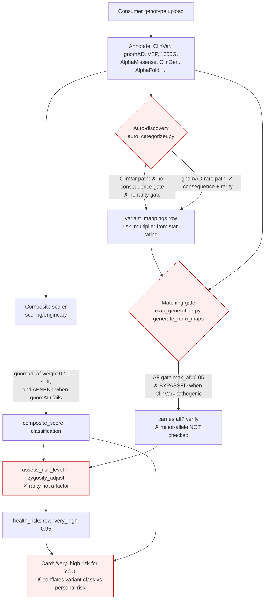

# fix: Eliminate pathogenicity false positives + full dashboard-production audit

## Goal Capsule

The dashboard presents rare-disease pathogenic risks a user does not have. The
seed case: **rs397518480 / ATP6AP2 / c.345C>T (p.Ser115=)** — a **synonymous**
variant (no amino-acid change) whose flagged allele has **~79% population
frequency** (i.e. it is the *common/normal* allele) — surfaced as **"very_high
risk (0.95) for X-linked parkinsonism-spasticity syndrome"**. This is a false
positive, alarming to first-time users and corrosive to trust.

Root cause is architectural, not a single bug: **rarity (allele frequency) is
never a hard safeguard** anywhere in the annotate → auto-map → match → score →
card pipeline. A single ClinVar "pathogenic" submission (the heaviest signal in
the system) overrides or bypasses every rarity check, so a common, silent allele
propagates to very-high personal risk.

This plan (1) makes rarity a first-class, consistent, **hard veto** across the
pipeline, (2) closes the auto-discovery gaps that mint such mappings, (3)
remediates existing bad mappings, (4) reframes cards to separate *variant
classification* from *personal risk*, and (5) delivers the exhaustive
component-by-component correctness audit the user asked for — every annotation
source, every generator, every card type — locked by a regression suite built
from real false-positive fixtures.

**Scope confirmed with user: exhaustive all-component audit** (not just the
matching gates).

---

## Problem Frame

A consumer uploads genotype data. The pipeline annotates each variant from
multiple sources, auto-discovers category mappings, runs 14 insight generators
that match the user's genotype against those mappings, scores variant
pathogenicity, and renders dashboard cards. Four independent weaknesses compound
into the false positive:

1. **Auto-discovery (`auto_categorizer.py`)** — the ClinVar categorizer path
   creates a `health` mapping for any ClinVar "pathogenic" hit whose review
   status is asserted. It applies **no consequence gate** (synonymous/intron/UTR
   are only excluded on the separate gnomAD-rare path, `auto_categorizer.py:685-690`)
   and **no allele-frequency gate**. `risk_multiplier` is derived purely from
   ClinVar star rating (`_risk_multiplier_from_review_status`, 1★=1.2 … 4★=3.0).
   Result: rs397518480 (synonymous, common) becomes a mapping with
   `risk_multiplier=2.3`, `clinical_significance=pathogenic`.

2. **Matching gate (`map_generation.py:93-109`)** — the population-frequency gate
   (`max_population_af=0.05` for health) is **bypassed when ClinVar says
   pathogenic** (`_has_clinvar_path` → no `continue`). A 79%-AF allele therefore
   passes. Allele verification (`map_generation.py:129-156`) confirms the user
   *carries* the alt allele but never checks it is the **minor** allele — carrying
   the 79% major allele means carrying the *normal* population allele.

3. **Composite scorer (`backend/services/scoring/`)** — has a `gnomad_af` source
   that scores common alleles low (AF>5% → 0.10) but it is **weight 0.10 vs
   ClinVar's 0.30**, and it was **entirely absent** for the seed variant (dialog
   footer shows "✗ gnomAD"), so rarity contributed nothing. Even present, it
   cannot overcome a 0.95×0.30 ClinVar term. Rarity is a nudge, not a veto.

4. **Risk assessment + card production (`zygosity.py`, generators, panels)** —
   `assess_risk_level` escalates to `high` when composite ≥ 0.80, then
   `zygosity_adjust` escalates hom/hemizygous-alt to `very_high`. Rarity is not a
   factor. The health card then asserts "very_high risk for you" — conflating the
   *variant's* ClinVar classification with the *user's* personal risk.

**The rarity signal exists in the system** (the health card even renders an "AF
79%" badge from `gene_stats`/frequency maps) but is not consistently or
authoritatively used to suppress contradictions.

### Requirements

- **R1** — A variant whose user-carried allele is common in the population (AF
  above the clinical ceiling) must never surface as `high`/`very_high` personal
  health/carrier/rare-disease risk, regardless of ClinVar classification.
- **R2** — Population allele frequency must be a single, reliable signal available
  to the matching gate, the composite scorer, and risk assessment. Missing gnomAD
  must fall back to VEP-colocated / 1000G AF rather than silently disabling rarity
  checks.
- **R3** — The carried allele must be verified as the **minor** allele (population
  frequency < 0.5, and below the clinical ceiling) to count as a risk allele.
- **R4** — Auto-discovered **clinical** mappings must apply the same consequence
  gate (exclude synonymous/intron/UTR) and a rarity gate on the ClinVar path that
  the gnomAD-rare path already applies.
- **R5** — Existing false-positive mappings (synonymous, common-AF, or
  thin-evidence high-severity) must be identified and remediated, not left to seed
  future analyses.
- **R6** — Cards must distinguish variant-level classification (ClinVar/composite
  pathogenicity) from personal risk, and present contradictory evidence
  (pathogenic label + common/silent allele) as uncertainty rather than alarming
  certainty.
- **R7** — Every card type's production path and every annotation source must be
  audited for correctness, with documented failure modes (e.g. absent gnomAD).
- **R8** — A regression suite must lock the fixes with real false-positive
  fixtures (rs397518480 + a curated class) and confirm true-positive findings are
  preserved (no over-suppression).

### Scope Boundaries

**In scope:** rarity safeguards across matching/scoring/risk; auto-discovery
consequence+rarity gates; existing-mapping remediation; card reframing for
clinical categories; exhaustive audit of all 14 generators, all annotation
sources, and all card production paths; regression fixtures + re-analysis
verification.

**Out of scope (this product's identity):** changing ClinVar/gnomAD source data
itself; re-deriving pathogenicity from primary literature; ML re-scoring;
clinical-grade diagnostic claims (the product stays educational).

#### Deferred to Follow-Up Work
- The frontend descriptive-trait badge coloring + fabricated-precision fields
  already tracked separately (personality bucketed `%`, wellness hardcoded
  confidence) — not part of the false-positive audit.
- Populating a real `risk_allele` column on `variant_mappings` (referenced as U5
  in a prior plan) — orthogonal; the minor-allele check here reads annotation
  allele parts + frequency instead.

---

## High-Level Technical Design

Where rarity does / does not gate today (✗ = no hard rarity safeguard):

**Target:** a shared rarity safeguard evaluated once and enforced as a **hard
veto** at the matching gate and risk assessment, fed by a single frequency
resolver with fallbacks, mirrored in auto-discovery, and surfaced honestly in the
card. Directional guidance, not implementation spec.

### Key Technical Decisions

- **KTD1 — Rarity is a hard veto, not a soft weight.** A single ClinVar submission
  (0.95 × 0.30) will always dominate a 0.10-weight `gnomad_af` nudge, so soft
  scoring cannot prevent common-allele false positives. Enforce an AF ceiling that
  ClinVar cannot override for the clinical categories.
- **KTD2 — Minor-allele requirement.** Carrying the population-major allele (AF
  ≥ ~0.5) is carrying the *normal* allele; it must not be a "risk allele" even
  when the site has a pathogenic annotation. Verify carried allele is the minor
  allele.
- **KTD3 — Remediate data, not only match-time gating.** `variant_mappings` is
  admin-visible and seeds every future analysis; deactivating bad rows is
  defense-in-depth beyond the runtime gate. Reversible (soft `is_active=false` +
  reason), never hard delete.
- **KTD4 — Preserve conservative true positives.** Genuine pathogenic
  rare-disease alleles are <1% AF; a 5% clinical ceiling is far above them, so the
  veto cannot suppress real findings. The regression suite proves this both ways.
- **KTD5 — Reframe, don't silently hide.** For contradictory evidence (pathogenic
  label + common/silent allele) prefer downgrading + a "common in population —
  uncertain personal significance" caveat over deleting the card, preserving
  transparency and avoiding under-reporting.
- **KTD6 — Cap the composite classification by rarity.** A variant with AF above
  the clinical ceiling cannot be labeled "Pathogenic" in the composite regardless
  of ClinVar, and missing gnomAD must fall back to the same frequency resolver the
  rest of the pipeline uses rather than dropping the rarity term.

---

## Implementation Units

Phased delivery. Phase A stops the clinical harm; B–C prevent recurrence + fix
framing; D is the exhaustive audit; E locks it.

### Phase A — Rarity as a first-class safeguard

### U1. Single frequency resolver with fallbacks, exposed everywhere
**Goal:** one authoritative population-AF value per variant, populated from VEP →
gnomAD-local → 1000G, available to the matching gate, composite scorer, and risk
assessment; never silently None when any source has it.
**Requirements:** R2.
**Dependencies:** none.
**Files:** `backend/services/insight_generators/base/frequency.py`,
`backend/services/insight_generators/base/__init__.py` (`build_variant_profiles`),
`backend/services/scoring/source_scorers.py` (`_score_gnomad` AF branch),
`backend/services/scoring/engine.py`, `backend/tests/test_frequency_resolver.py`.
**Approach:** confirm `extract_frequency()` already prioritizes VEP → gnomAD →
1000G; make the composite scorer's `gnomad_af` source consume the same resolver
so a missing gnomAD annotation falls back instead of dropping the rarity term.
Surface `population_frequency` on the variant profile consistently. Do not change
matching behavior yet (U2) — this unit only guarantees the signal exists.
**Execution note:** characterize current `extract_frequency` outputs on the seed
variant first (what AF each source returns for rs397518480) before wiring it into
the scorer.
**Test scenarios:**
- rs397518480 with gnomAD absent but VEP/1000G present → resolver returns ~0.79,
  not None.
- Variant with only gnomAD-local AF → returns that value.
- Variant with no frequency in any source → returns None (documented; downstream
  treats None conservatively per U2/U3).
- Composite scorer given a variant with absent gnomAD but resolver AF 0.79 →
  `gnomad_af` source contributes (score ~0.10), not skipped.
**Verification:** unit tests green; a scoring run on the seed variant shows the
`gnomad_af` source present with a low score.

### U2. Rarity hard-veto + minor-allele check in the matching gate
**Goal:** a common or major-allele-carried variant cannot be emitted as a clinical
(health) finding, even with a ClinVar-pathogenic label.
**Requirements:** R1, R3.
**Dependencies:** U1.
**Files:** `backend/services/insight_generators/base/map_generation.py`
(the `max_population_af` gate at lines ~93-109 and allele verification ~129-156),
`backend/tests/test_generator_runners.py`.
**Approach:** replace the unconditional `_has_clinvar_path` bypass with a bounded
rule: ClinVar-pathogenic may bypass the *soft* ceiling only up to a hard rarity
cap (e.g. AF ≤ 0.10); above the hard cap the finding is suppressed regardless of
ClinVar. Add a minor-allele check: when annotation frequency indicates the carried
allele is the population-major allele (AF ≥ 0.5), skip. Keep behavior unchanged
for rare pathogenic variants and for lifestyle panels (`max_population_af=0.20`,
unaffected direction).
**Execution note:** start from a failing test that feeds the seed variant
(genotype TT, ref C alt T, AF 0.79, ClinVar pathogenic) and asserts health emits
0 findings; watch it fail on current code, then implement.
**Test scenarios:**
- Seed variant (AF 0.79, ClinVar pathogenic, hom-alt) → health emits **no**
  finding. (Covers R1.)
- Genuine rare pathogenic (AF 0.0005, ClinVar pathogenic, het) → still emitted.
  (Covers KTD4 — no over-suppression.)
- Variant AF 0.03 (below soft ceiling) ClinVar pathogenic → still emitted.
- Variant where carried allele is the major allele (AF 0.8) but ClinVar benign →
  already skipped by benign filter; assert unchanged.
- Missing AF entirely + ClinVar pathogenic → conservative: emitted but flagged
  low-confidence (document the chosen direction; no crash).
**Verification:** new + existing generator tests green; re-run health generator on
the seed genome fixture → 0 parkinsonism finding.

### U3. Rarity in risk-level assessment
**Goal:** a common-allele finding can never reach `high`/`very_high`; it caps at
`moderate`/`low` with a "common variant" qualifier.
**Requirements:** R1, R6.
**Dependencies:** U1.
**Files:** `backend/services/insight_generators/base/zygosity.py`
(`assess_risk_level`, `zygosity_adjust`, `boost_if_pathogenic`),
`backend/services/insight_generators/health.py`,
`backend/tests/test_zygosity.py`.
**Approach:** thread `population_frequency` into `assess_risk_level`; when AF is
above the clinical ceiling, cap the base level before zygosity escalation and stop
`zygosity_adjust`/`boost_if_pathogenic` from escalating past `moderate`.
**Test scenarios:**
- composite ≥ 0.80 + hom-alt + AF 0.79 → level capped at `moderate` (not
  `very_high`). (Covers R1.)
- composite ≥ 0.80 + hom-alt + AF 0.0005 → `very_high` preserved.
- AF unknown → conservative cap at `moderate` when composite is the only signal.
**Verification:** `risk_level_to_score` for the seed case yields ≤ 0.5, not 0.95.

### U4. Rarity cap in the composite pathogenicity classification
**Goal:** the composite cannot be labeled "Pathogenic" when the variant is common;
missing gnomAD does not drop the rarity term.
**Requirements:** R2, R6.
**Dependencies:** U1.
**Files:** `backend/services/scoring/engine.py` (classification thresholds
~15-19, 263-273), `backend/services/scoring/source_scorers.py`,
`backend/tests/test_scoring_engine.py`.
**Approach:** after computing `composite_score`, apply a rarity cap on the
*classification label* (not necessarily the raw score) — AF above the clinical
ceiling downgrades "Pathogenic"→ at most "Uncertain / conflicting", and adds a
`conflicts` note ("common in population; pathogenic classification may reflect an
outdated or allele-orientation-specific ClinVar entry"). Keep the numeric bar for
the source breakdown so the dialog stays transparent.
**Test scenarios:**
- Seed variant with resolver AF 0.79 → classification not "Pathogenic"; a conflict
  note is present.
- Rare pathogenic AF 0.0005 → classification "Pathogenic" unchanged.
- gnomAD absent but resolver AF 0.79 → same downgrade (Covers R2).
**Verification:** dialog for the seed variant shows a downgraded/qualified label +
conflict note.

### Phase B — Auto-discovery mapping data quality

### U5. Consequence + rarity gates on the ClinVar categorizer path
**Goal:** auto-discovery stops minting clinical mappings for synonymous/intron/UTR
or common-AF variants on the ClinVar path (parity with the gnomAD-rare path).
**Requirements:** R4.
**Dependencies:** U1.
**Files:** `backend/services/auto_categorizer.py` (ClinVar categorizer path
~248,426-437,450-459; the existing consequence gate ~685-690 to mirror),
`backend/services/categorizer/engine.py` (`consequence`/`impact` at ~231-233),
`backend/services/analysis_service.py` (`_enrich_mappings_from_annotations` ~495),
`backend/tests/test_auto_categorizer.py`.
**Approach:** extract the consequence/rarity predicate used by the gnomAD path
into a shared helper and apply it to the ClinVar path for the `health`/clinical
categories. Exclude synonymous/intron/UTR; exclude AF above the clinical ceiling
(read from the same resolver / annotation). Leave lifestyle categories on their
looser threshold.
**Test scenarios:**
- Synonymous ClinVar-pathogenic variant (seed class) → no `health` mapping
  created. (Covers R4.)
- Missense ClinVar-pathogenic rare variant → mapping still created.
- Common-AF (>ceiling) ClinVar-pathogenic missense → no clinical mapping.
- Lifestyle-category mapping with common AF → unaffected.
**Verification:** running the categorizer over a fixture set including the seed
variant creates 0 clinical mappings for it.

### U6. Remediate existing false-positive mappings
**Goal:** deactivate (soft, with reason) already-persisted auto-discovered
clinical mappings that are synonymous / common-AF / thin-evidence for high-severity
conditions, so they stop seeding analyses.
**Requirements:** R5.
**Dependencies:** U5.
**Files:** `backend/scripts/` (new one-off remediation script following existing
script conventions), `backend/db/models` (read `variant_mappings`),
`backend/tests/test_mapping_remediation.py`.
**Approach:** query auto-discovered clinical mappings; for each, re-evaluate
against the U5 predicate (consequence + rarity + review evidence); set
`is_active=false` with a recorded reason for those that fail. Report a summary
(count, examples). Idempotent, dry-run first. Admins can re-review via the existing
discoveries admin UI.
**Execution note:** run dry-run against prod data (read-only) first; surface the
list for review before any write.
**Test scenarios:**
- Fixture with the seed mapping → flagged inactive with reason "common allele
  (AF 0.79)".
- Fixture with a legitimate rare pathogenic mapping → left active.
- Re-run (idempotent) → no additional changes.
**Verification:** dry-run report lists rs397518480; after apply, the seed mapping
`is_active=false`.

### Phase C — Card production semantics + framing

### U7. Separate variant classification from personal risk in clinical cards
**Goal:** cards no longer assert "very_high risk for you" off a variant-level
ClinVar label; contradictory evidence reads as uncertainty.
**Requirements:** R6.
**Dependencies:** U2, U3, U4.
**Files:** `frontend/src/components/categories/VariantDetailDialog.tsx`
(composite section ~758-838, clinical-significance section),
`frontend/src/components/categories/HealthPanel.tsx`,
`frontend/src/components/categories/CarrierStatusPanel.tsx`,
`frontend/src/components/categories/RareMutationsPanel.tsx`,
`frontend/src/components/categories/shared.tsx`.
**Approach:** in the dialog, label the composite as *variant* classification and,
when a rarity conflict exists, render the conflict note prominently (reuse the
existing `conflicts` guidance block). In the health/carrier/rare cards, present the
ClinVar classification as a variant property distinct from the (now rarity-capped)
personal risk level; add a "common in population" chip when AF is high. No new
severity color semantics — reuse existing helpers.
**Test expectation:** none automated (no frontend test runner) — verify via
`pnpm build` + `pnpm lint` + browser QA on prod after deploy. Manual scenarios:
seed variant dialog shows qualified label + conflict note; health card shows
"common variant" context; a genuine rare pathogenic still reads as high risk.
**Verification:** browser QA on the seed variant post-deploy; build+lint clean.

### U8. Card-production audit map (all 14 card types)
**Goal:** deliver the "how every card is produced" documentation the user asked
for — a per-card-type data-flow + correctness checklist.
**Requirements:** R7.
**Dependencies:** none (documentation; can run parallel to A–C).
**Files:** `docs/audit/card-production-audit.md` (new).
**Approach:** for each of the 14 categories, document annotation source(s) →
mapping/bespoke matcher → generator (map-driven vs bespoke, AF ceiling) →
serializer (`dashboard_serializers.py`) → panel; note the correctness risks and
whether rarity/allele/consequence gating applies. Cross-link to the code.
**Test expectation:** none — documentation artifact; reviewed against code in U11.
**Verification:** doc covers all 14 categories; each row cites real file paths.

### Phase D — Exhaustive component audit

### U9. Annotation-source correctness audit
**Goal:** verify each annotation source's lookup, orientation, freshness, and
missing-data handling; document failure modes.
**Requirements:** R7.
**Dependencies:** none.
**Files:** `docs/audit/annotation-source-audit.md` (new); read
`backend/services/shared_annotation_service.py`,
`backend/services/clinvar_local.py`, `backend/services/gnomad/cache.py`,
`backend/services/local_annotation.py`, `backend/services/scoring/source_scorers.py`.
**Approach:** per source (ClinVar, gnomAD, VEP, 1000G, AlphaMissense, ClinGen,
AlphaFold, gnomAD-tx, SNPedia) document tier (raw/PG/SQLite), what it feeds, and
the failure mode when absent (e.g. "✗ gnomAD → composite loses rarity term" — the
seed case, fixed by U1). Confirm strand normalization coverage
(`map_generation.py:148-154`, `rare_mutations.py`).
**Test expectation:** none — documentation; findings that reveal code bugs spawn
follow-up units.
**Verification:** doc enumerates every source with a documented absent-source
behavior.

### U10. Bespoke-generator gate audit + fixes
**Goal:** verify the 5 bespoke generators (rare, uncommon, carrier, drug,
ancestry) apply appropriate rarity/allele/consequence gates; fix gaps found.
**Requirements:** R1, R7.
**Dependencies:** U1.
**Files:** `backend/services/insight_generators/rare_mutations.py`,
`uncommon_mutations.py`, `carrier.py`, `drug_response.py`, `ancestry.py`,
`backend/tests/test_generator_runners.py`.
**Approach:** confirm `rare_mutations` requires actual rarity (it is the "rare"
panel — a common allele must not appear); confirm `carrier` verifies the carrier
allele and applies the minor-allele logic; confirm `drug_response` verifies the
pharmacogene allele. Apply the U2 rarity/minor-allele helper where a gap exists.
Ancestry (AIM panel) audited for correctness but exempt from rarity veto (AIMs are
intentionally common).
**Test scenarios:**
- Common-allele ClinVar-pathogenic variant → does **not** appear in rare_mutations.
- Carrier finding requires the carrier allele actually present.
- Drug response requires the pharmacogene alt allele present.
**Verification:** bespoke-generator tests green; seed-class variants absent from
rare/carrier.

### U11. Matching-engine full gate audit
**Goal:** enumerate and verify every gate in `generate_from_maps` and the bespoke
matchers against the audit docs; confirm no other bypass exists.
**Requirements:** R7.
**Dependencies:** U2, U8, U9, U10.
**Files:** `docs/audit/matching-engine-audit.md` (new); read
`backend/services/insight_generators/base/map_generation.py`.
**Approach:** document each gate (no-call, hom-ref, AF ceiling + veto, benign
exclusion, sex-linked filter, allele/minor-allele verification, indel D/I, zygosity)
with the value/threshold and the false-positive it prevents. Verify the AF-bypass
fix (U2) removed the last unconditional ClinVar override.
**Test expectation:** none — documentation; any newly found bypass spawns a fix.
**Verification:** doc lists every gate; a reviewer can trace the seed variant to
its suppression point.

### Phase E — Lock it

### U12. Regression fixtures for the false-positive class
**Goal:** a durable test set of real common-allele/synonymous ClinVar-pathogenic
variants that must NOT produce high/very_high findings, plus true-positive rares
that MUST.
**Requirements:** R8.
**Dependencies:** U2, U3, U4, U5.
**Files:** `backend/tests/fixtures/false_positive_variants.py` (new),
`backend/tests/test_false_positive_regression.py` (new); extend the golden-genome
fixture used by `test_generator_runners.py`.
**Approach:** encode rs397518480 + a curated handful (common-AF pathogenic,
synonymous pathogenic, single-submission high-severity) with their annotations;
assert the full pipeline yields 0 clinical findings for them and preserves a set of
known true rare pathogenic findings.
**Test scenarios:**
- Each false-positive fixture → 0 clinical (health/carrier/rare) findings.
- Each true-positive fixture → finding preserved at expected level.
- Golden genome still produces its expected baseline counts.
**Verification:** suite green; deliberately reverting U2 turns the suite red.

### U13. Re-analysis + prod verification
**Goal:** confirm the seed false positive and its class disappear from a real
analysis while true findings remain.
**Requirements:** R8.
**Dependencies:** U1-U7, U12.
**Files:** none (operational); uses `deploy.sh` + admin regen.
**Approach:** after merge + deploy, run U6 remediation, regenerate analysis 7,
verify the parkinsonism/ATP6AP2 finding is gone (or downgraded + qualified),
completeness unchanged, and spot-check that true health findings persist.
**Test expectation:** none automated — operational verification against prod.
**Verification:** prod DB query on analysis 7 shows no `very_high` row for
`X-linked parkinsonism-spasticity syndrome`; dashboard QA confirms.

---

## Verification Contract

- **Unit:** `uv run pytest backend/tests/` — new suites (frequency resolver,
  generator rarity veto, zygosity cap, scoring rarity cap, auto_categorizer gates,
  mapping remediation, false-positive regression) green; full suite does not
  regress.
- **Frontend:** `pnpm build` + `pnpm lint` clean (no frontend test runner).
- **Regression proof:** reverting U2 (the rarity veto) turns
  `test_false_positive_regression.py` red — proves the test binds the fix.
- **Operational:** analysis 7 regenerated post-deploy shows no `very_high` row for
  the seed condition; true rare pathogenic findings preserved; completeness 14/14
  unchanged.
- **Audit deliverables:** `docs/audit/{card-production,annotation-source,matching-engine}-audit.md`
  exist and cover all 14 cards + all sources + all gates with real file cites.

## Definition of Done

- R1–R8 satisfied; rarity is a hard veto at the matching gate and risk assessment,
  fed by a single frequency resolver, mirrored in auto-discovery, capping the
  composite classification.
- Seed case rs397518480 no longer surfaces as very_high personal risk anywhere
  (matching, DB, card); its class is covered by regression fixtures.
- Existing false-positive mappings remediated (soft-deactivated with reason).
- Clinical cards separate variant classification from personal risk and show
  rarity conflicts honestly.
- The three audit docs delivered; true positives proven preserved.

---

## Sources & Research

Grounded on live prod data (analysis 7) and code, this session:
- Seed variant confirmed in DB: `health_risks` row
  `X-linked parkinsonism-spasticity syndrome | ATP6AP2 | very_high | 0.95`;
  mapping `variant_mappings` `is_auto_discovered=true, risk_multiplier=2.3,
  clinical_significance=pathogenic, avg_pathogenicity=0.875`.
- Matching gate + ClinVar-bypass: `map_generation.py:93-109`; allele verification
  `:129-156`; strand handling `:148-154`.
- Risk derivation: `zygosity.py` `assess_risk_level:129-165`, `boost_if_pathogenic`,
  `zygosity_adjust`.
- Composite scorer: `scoring/engine.py` (weights/normalization/thresholds),
  `scoring/source_scorers.py` (`_score_gnomad` AF branch `:119-135`, `gnomad_af`
  weight 0.10; `gnomad_tx` = LoF/expression, not frequency).
- Auto-discovery: `auto_categorizer.py` (ClinVar path `:248,426-437,450-459`;
  gnomAD consequence/rarity gate `:685-690`; `_risk_multiplier_from_review_status`
  `:376-401`).
- Annotation tiers/resolver: `frequency.py:64-112` (VEP→gnomAD→1000G),
  `shared_annotation_service.py`, `local_annotation.py`, `clinvar_local.py`,
  `gnomad/cache.py`.
- Generator registry: `insight_generators/__init__.py:26-41` (9 map-driven, 5
  bespoke; health AF 0.05, lifestyle 0.20).
