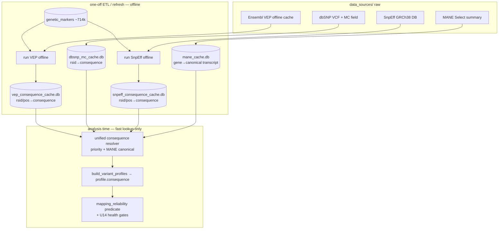

# feat: Offline consequence sources (MANE, dbSNP, VEP, SnpEff)

## Goal Capsule

Molecular-consequence coverage at analysis time is thin — it depends on the
Ensembl VEP local subset + ClinVar's `molecular_consequence` (~33% of rows). In
the credibility investigation, **26 of 56 health findings had no consequence
data at runtime**, so the consequence-based safeguards (the
`mapping_reliability` predicate used by U5/U6/U14 in the false-positive fix)
cannot fire on them — synonymous/intron/UTR "pathogenic" variants slip through.

Integrate four **free, offline** sources as lookup caches so nearly every
consumer-array variant has a molecular consequence, and multi-transcript
ambiguity is resolved to one canonical call:

- **MANE Select** — one canonical transcript per gene (kills the "missense on
  one transcript, intron on another" ambiguity).
- **dbSNP** — `MC` (molecular consequence, SO terms) keyed by rsid — the direct
  rsid→consequence fill for consumer arrays.
- **Ensembl VEP** (offline cache + tool) — gold-standard position-based
  consequence, pre-computed once over the marker set.
- **SnpEff** (offline, GRCh38 DB) — commercial-safe cross-check / fallback
  annotator.

**Architecture (confirmed):** VEP + SnpEff are **offline batch annotators run
once over the fixed consumer-array marker set** (`genetic_markers`, ~714k
positions) → SQLite consequence caches. Analysis time stays a fast lookup —
no Perl/Java in the per-analysis hot path. MANE + dbSNP are plain data-file →
SQLite caches. All four feed a unified consequence resolver that extends the
current `extract_gene_and_consequence` fallback chain.

**Not in scope:** the actual ~70 GB download (the setup script is a deliverable
the user runs on the worker box); per-analysis subprocess annotation;
non-consequence enrichment (dbNSFP/CADD — excluded, non-commercial license).

---

## Problem Frame

Consumer arrays report **rsids** at ~714k fixed positions. The pipeline resolves
consequence via `extract_gene_and_consequence` (`insight_generators/base/frequency.py`):
Ensembl VEP local → ClinVar local `molecular_consequence` → gnomAD. Coverage is
sparse: VEP local is an rsid-keyed subset with a position fallback, and ClinVar
consequence exists only on vcf-sourced rows. When consequence is absent, the
reliability predicate (`mapping_reliability.is_non_damaging_consequence`, used by
U5 auto-discovery, U6 remediation, U14 health gating) treats it as *unknown* and
does not filter — so synonymous/intron/UTR pathogenic entries surface as health
risks. Better consequence coverage is the lever that makes those already-shipped
gates effective.

Existing annotation architecture is a 3-tier pattern (raw `data_sources/` →
PostgreSQL ETL → SQLite runtime cache); ClinVar (`.clinvar_cache/clinvar_direct.db`)
and gnomAD (`.gnomad_cache/gnomad_cache.db`) already follow it. The new sources
slot into the same pattern.

### Requirements

- **R1** — A molecular consequence is available at analysis time for the large
  majority of the ~714k consumer-array markers.
- **R2** — Multi-transcript ambiguity is resolved to a single canonical
  consequence via the MANE Select transcript.
- **R3** — Each source is a SQLite runtime cache following the existing 3-tier
  pattern, queried through one unified consequence resolver (extending
  `extract_gene_and_consequence`).
- **R4** — VEP and SnpEff run **offline, once, over the marker set** (not
  per-analysis); a refresh step re-runs them when the marker set grows.
- **R5** — A setup/download script provides exact sources, sizes, checksums,
  install steps, and cache-build invocations for the user to run on the worker box.
- **R6** — The enriched consequence flows into the `mapping_reliability`
  predicate and the U14 health gates so the false-positive safeguards fire.
- **R7** — Verification shows consequence coverage rises sharply and the seed
  `rs397518480` resolves as `synonymous_variant` (then dropped by the health gate).

### Scope Boundaries

**In scope:** the four sources as consequence caches; a unified resolver;
MANE canonical-transcript disambiguation; the setup/download script; worker-image
+ disk/ops changes for the offline annotators; a cache-refresh CLI; verification.

**Out of scope (this product's identity):** per-analysis subprocess annotation;
modifying variant calling; non-consequence functional predictors requiring
non-commercial licenses (dbNSFP, CADD whole-genome).

#### Deferred to Follow-Up Work
- Using VEP/SnpEff output to also enrich the **pathogenicity composite scorer**
  (extra predictors) — valuable but separate from consequence coverage.
- Regenerating existing analyses to pick up the richer consequence — an
  operational follow-up once the caches are built + deployed.

---

## High-Level Technical Design



Resolution priority (KTD2): existing Ensembl-VEP-local → new VEP marker cache →
dbSNP MC → SnpEff cache → ClinVar `molecular_consequence` → gnomAD. When several
transcript consequences exist, prefer the MANE Select transcript's term.

### Key Technical Decisions

- **KTD1 — VEP/SnpEff pre-annotate the marker set offline.** The consumer-array
  marker set is fixed (~714k), so annotate it once into a cache rather than
  shelling out to Perl/Java per analysis. Keeps the analysis hot path a pure
  lookup and matches the existing ClinVar/gnomAD cache pattern. Refresh only when
  markers grow.
- **KTD2 — One unified consequence resolver with a priority order + MANE
  canonical-transcript preference.** Removes the multi-transcript ambiguity that
  made the reliability predicate mis-flag real damaging variants (a variant with
  missense on the canonical transcript is damaging even if intronic on another).
- **KTD3 — SQLite runtime caches per source** (`.mane_cache/`, `.dbsnp_cache/`,
  `.vep_cache/`, `.snpeff_cache/`), mirroring `clinvar_direct.db` — no PG bloat,
  fast keyed lookup, rebuilt from raw.
- **KTD4 — dbSNP first for coverage, VEP for authority, SnpEff for cross-check.**
  dbSNP MC is the cheapest high-coverage rsid→consequence win; VEP is the
  gold-standard position-based call; SnpEff (LGPL, commercial-safe) is a
  second opinion — agreement raises confidence, disagreement flags review.
- **KTD5 — The setup/download script is a deliverable the user runs on the
  worker box.** ~70 GB + tool installs can't run through the dev session; the
  plan ships an idempotent, checksum-verified script.
- **KTD6 — License-safe sources only.** dbSNP (public domain), Ensembl VEP +
  cache (open), MANE (free), SnpEff (LGPL) — all commercial-safe. dbNSFP and
  CADD (non-commercial) are excluded.

---

## Output Structure

```
backend/services/annotation_sources/
  mane_cache.py            # U1  build + lookup MANE canonical transcripts
  dbsnp_mc_cache.py        # U2  build + lookup dbSNP MC by rsid
  vep_offline_cache.py     # U3  run VEP over markers → cache; lookup
  snpeff_offline_cache.py  # U4  run SnpEff over markers → cache; lookup
  consequence_resolver.py  # U5  unified priority resolver + MANE preference
backend/scripts/
  setup_consequence_sources.sh   # U6  download + install + build caches
  refresh_consequence_caches.py  # U6  re-annotate marker set on demand
backend/tests/
  test_mane_cache.py test_dbsnp_mc_cache.py test_vep_offline_cache.py
  test_snpeff_offline_cache.py test_consequence_resolver.py
```

---

## Implementation Units

Phased: A = data-file caches (no external tools, testable immediately);
B = offline annotator caches (need VEP/SnpEff installed); C = resolver + wiring;
D = setup script + ops + verification.

### Phase A — Data-file caches

### U1. MANE Select canonical-transcript cache
**Goal:** ingest MANE Select → a lookup of gene → canonical transcript (+ the
transcript's RefSeq/Ensembl IDs), used to pick the canonical consequence.
**Requirements:** R2, R3.
**Dependencies:** none.
**Files:** `backend/services/annotation_sources/mane_cache.py`,
`backend/tests/test_mane_cache.py`. Reads `data_sources/mane/` (raw summary),
writes `.mane_cache/mane.db`.
**Approach:** parse the MANE Select summary (small TSV/GFF); build a SQLite table
`gene_symbol → mane_transcript_id, ensembl_transcript_id`. Provide
`canonical_transcript(gene)` + `is_mane_transcript(transcript_id)`. Mirror the
build/lookup shape of `clinvar_local.py`.
**Execution note:** proof-first on the parser with a small fixture summary.
**Test scenarios:**
- Parse a fixture MANE summary → gene→transcript rows persisted.
- `canonical_transcript('ATP6AP2')` returns the MANE transcript id.
- `is_mane_transcript` true for a MANE id, false otherwise.
- Missing gene → returns None (not an error).
**Verification:** cache builds from the fixture; lookups return expected ids.

### U2. dbSNP MC (molecular consequence) cache
**Goal:** rsid → molecular-consequence SO terms from dbSNP's `MC` field.
**Requirements:** R1, R3.
**Dependencies:** none.
**Files:** `backend/services/annotation_sources/dbsnp_mc_cache.py`,
`backend/tests/test_dbsnp_mc_cache.py`. Reads `data_sources/dbsnp/` (tabix VCF),
writes `.dbsnp_cache/dbsnp_mc.db`.
**Approach:** stream the dbSNP VCF, extract `RS` + `MC` (SO consequence terms),
persist `rsid → consequence_terms` to SQLite (batch insert). Provide
`consequence_for_rsid(rsid) -> list[str]`. Handle both GRCh37 + GRCh38 builds
(assembly column). Mirror the streaming-build pattern of the gnomAD cache.
**Execution note:** proof-first on the VCF `MC`-field parser with a few fixture
records (incl. multi-consequence).
**Test scenarios:**
- Parse fixture VCF records → rsid→[consequence] rows persisted.
- `consequence_for_rsid` returns the SO terms for a known rsid.
- Multi-consequence `MC` (comma/pipe list) parsed into a list.
- Unknown rsid → empty list.
- Malformed/absent `MC` on a record → skipped, no crash.
**Verification:** cache builds from the fixture; a sample rsid resolves to its MC.

### Phase B — Offline annotator caches

### U3. VEP offline runner + consequence cache
**Goal:** run Ensembl VEP offline over the marker set once → rsid/position →
consequence cache (canonical-transcript aware).
**Requirements:** R1, R4, R3.
**Dependencies:** U1 (MANE for canonical selection).
**Files:** `backend/services/annotation_sources/vep_offline_cache.py`,
`backend/tests/test_vep_offline_cache.py`. Reads `data_sources/ensembl/vep_cache/`
+ the VEP tool, writes `.vep_cache/vep_consequence.db`.
**Approach:** export the marker set (`genetic_markers` chrom/pos/ref/alt/rsid) to
a VCF; invoke VEP in `--offline --cache` mode (subprocess, ETL step only); parse
VEP output (consequence + transcript + impact); when multiple transcript
consequences exist, select the MANE transcript's (U1) else the most severe;
persist `rsid/pos → consequence, impact, transcript`. Provide
`consequence_for(rsid|pos)`. The VEP invocation lives behind a small runner so
the parser is unit-testable without VEP installed.
**Execution note:** characterize VEP output parsing on a captured fixture output
file (no live VEP needed for the parser tests); the actual VEP run is an
integration/ops step verified in U7.
**Test scenarios:**
- Parse a fixture VEP output → per-variant consequence rows persisted.
- Multi-transcript variant → the MANE transcript's consequence chosen (Covers R2).
- No MANE transcript → most-severe consequence chosen.
- Marker with no VEP result → absent from cache (lookup returns None).
- `consequence_for` returns the stored consequence for a known marker.
**Verification:** parser tests green on the fixture; ops run (U7) shows the cache
populated for the marker set.

### U4. SnpEff offline runner + consequence cache
**Goal:** run SnpEff offline over the marker set → consequence cache used as a
cross-check / fallback when VEP+dbSNP miss.
**Requirements:** R1, R4, R3.
**Dependencies:** none (independent annotator).
**Files:** `backend/services/annotation_sources/snpeff_offline_cache.py`,
`backend/tests/test_snpeff_offline_cache.py`. Reads `data_sources/snpeff/` (DB +
jar), writes `.snpeff_cache/snpeff_consequence.db`.
**Approach:** same marker VCF as U3; invoke SnpEff (`-canon` / GRCh38 db)
subprocess (ETL only); parse the `ANN` field (effect/consequence + impact);
persist `rsid/pos → consequence, impact`. Parser behind a runner for testability.
**Execution note:** characterize `ANN`-field parsing on a captured fixture output.
**Test scenarios:**
- Parse a fixture SnpEff `ANN` output → consequence rows persisted.
- Multi-effect `ANN` → most-severe (or canonical) effect chosen.
- Marker with no result → absent.
- `consequence_for` returns the stored consequence.
**Verification:** parser tests green; ops run populates the cache.

### Phase C — Unified resolver + wiring

### U5. Unified consequence resolver + pipeline wiring
**Goal:** one resolver that consults all sources in priority order with MANE
canonical preference, wired into `extract_gene_and_consequence` /
`build_variant_profiles` so `profile.consequence` is populated far more often.
**Requirements:** R1, R2, R3, R6.
**Dependencies:** U1, U2, U3, U4.
**Files:** `backend/services/annotation_sources/consequence_resolver.py`,
`backend/services/insight_generators/base/frequency.py`
(`extract_gene_and_consequence`), `backend/services/insight_generators/base/__init__.py`
(`build_variant_profiles`), `backend/tests/test_consequence_resolver.py`.
**Approach:** `resolve_consequence(rsid, position, annotation_result)` tries, in
order: current annotation VEP-local → VEP marker cache (U3) → dbSNP MC (U2) →
SnpEff cache (U4) → ClinVar `molecular_consequence` → gnomAD; returns the SO
consequence term(s), preferring the MANE transcript when the source exposes
per-transcript data. `extract_gene_and_consequence` delegates its consequence
leg to this resolver (gene extraction unchanged). No change to the reliability
predicate or health gates — they already consume `profile.consequence`; this
unit just makes that field populated.
**Execution note:** proof-first — assert the priority order + MANE preference with
mocked caches before wiring into the pipeline.
**Test scenarios:**
- VEP-cache hit wins over dbSNP/SnpEff/ClinVar.
- dbSNP MC used when VEP absent.
- SnpEff used when VEP + dbSNP absent.
- ClinVar/gnomAD fallback when the new caches all miss (back-compat).
- Multi-transcript source → MANE canonical consequence returned (Covers R2).
- All sources miss → None (unknown, not disqualifying downstream).
- Integration: a variant that previously had no consequence now yields one →
  `build_variant_profiles` sets `profile.consequence`.
**Verification:** resolver tests green; a profile built for a formerly-unannotated
marker now carries a consequence.

### Phase D — Setup, ops, verification

### U6. Setup/download script + cache-refresh CLI + worker-image/disk ops
**Goal:** an idempotent script to download all sources, install VEP + SnpEff,
and build the four caches on the worker box; a refresh CLI to re-annotate when
markers grow; documented image/disk changes.
**Requirements:** R4, R5.
**Dependencies:** U1, U2, U3, U4.
**Files:** `backend/scripts/setup_consequence_sources.sh`,
`backend/scripts/refresh_consequence_caches.py`, `docs/security.md` or a new
`docs/ops/consequence-sources.md` (disk/image notes). Never edits `data_sources/`
contents in code — the script downloads there at runtime.
**Approach:** the shell script pins exact URLs + sizes + checksums for MANE,
dbSNP (GRCh37+GRCh38), the Ensembl VEP indexed cache, and the SnpEff GRCh38 db;
verifies checksums; installs VEP (Perl deps) + SnpEff (Java); then calls the
cache builders (U1-U4). `refresh_consequence_caches.py` re-runs VEP/SnpEff over
the current marker set + rebuilds the affected caches. Document the ~70 GB disk
need + the worker Docker image additions (Perl/Java) as an ETL/refresh image,
kept out of the analysis hot path.
**Execution note:** this is packaging/ops — prefer a dry-run/checksum smoke check
over unit coverage; make the script idempotent and re-runnable.
**Test scenarios:** `Test expectation: none -- packaging/ops. Replacement
verification: run the script with a `--dry-run`/`--check` flag on the worker box
and confirm URLs resolve + checksums are declared; U7 verifies the built caches.`
**Verification:** script runs idempotently on the worker box; the four caches
exist and are non-empty.

### U7. Coverage + credibility verification
**Goal:** prove the integration raised consequence coverage and that it fixes the
credibility case end to end.
**Requirements:** R1, R6, R7.
**Dependencies:** U5, U6.
**Files:** `backend/scripts/report_consequence_coverage.py` (a read-only report),
`backend/tests/test_false_positive_regression.py` (extend).
**Approach:** report the % of `genetic_markers` with a resolved consequence
before/after; confirm `rs397518480` resolves `synonymous_variant` via the resolver
and is therefore dropped by the U14 health gate; spot-check that true damaging
findings are preserved. Extend the regression suite with a fixture asserting the
resolver yields the synonymous consequence for the seed (so the health gate binds
to real data, not just a hand-set `profile.consequence`).
**Test scenarios:**
- Coverage report shows a large increase in markers-with-consequence.
- Resolver returns `synonymous_variant` for the seed rsid from the dbSNP/VEP cache.
- Regression: seed → 0 health findings via the *resolved* consequence.
- A known damaging (missense) marker still resolves damaging → preserved.
**Verification:** coverage report shows the jump; regression green; on a
regenerated analysis 7 the synonymous/non-damaging health findings drop out.

---

## Verification Contract

- **Unit:** `uv run pytest backend/tests/` — new cache-loader, resolver, and
  regression tests green; full suite does not regress. Parser tests run without
  VEP/SnpEff installed (fixtures).
- **Ops smoke:** `setup_consequence_sources.sh --check` resolves all URLs +
  declares checksums; a real run on the worker box builds four non-empty caches.
- **Coverage:** `report_consequence_coverage.py` shows a large rise in
  markers-with-consequence after cache build.
- **Credibility:** the resolver returns `synonymous_variant` for `rs397518480`;
  after a regen, the synonymous/non-damaging health findings are gone; true
  damaging findings preserved.

## Definition of Done

- R1–R7 satisfied: the four caches build from `data_sources/`, the unified
  resolver populates `profile.consequence` for the majority of markers with MANE
  canonical disambiguation, and the reliability/health gates now fire on real
  consequence data.
- Setup + refresh scripts exist and run idempotently on the worker box; disk/image
  needs documented.
- Coverage report proves the jump; the seed resolves synonymous and is dropped.

---

## Risks & Dependencies

- **Disk/bandwidth (~70 GB)** on the worker box — mitigated by KTD5 script +
  ops docs; dbSNP + VEP cache dominate size.
- **VEP/SnpEff tool install** (Perl/Java) heavies the image — mitigated by KTD1
  (offline ETL/refresh image, not the analysis hot path).
- **Marker-set drift** — new arrays add markers not in the caches; mitigated by
  the refresh CLI (U6) + the resolver's graceful None (unknown, not disqualifying).
- **Assembly mismatch** (GRCh37 vs GRCh38) — the marker set's build must match the
  VEP cache / dbSNP file used; the runner must key on the correct assembly.

## Sources & Research

- Existing consequence path: `insight_generators/base/frequency.py`
  `extract_gene_and_consequence` (Ensembl VEP local → ClinVar `molecular_consequence`
  → gnomAD); `local_annotation.py` / `ensembl_vep_local.py` (VEP local service).
- 3-tier cache pattern: `clinvar_local.py` (`.clinvar_cache/clinvar_direct.db`),
  `gnomad/cache.py` (`.gnomad_cache/gnomad_cache.db`).
- Consumers of consequence: `mapping_reliability.py`
  (`is_non_damaging_consequence`, damaging/non-damaging token sets),
  `insight_generators/health.py` (`_skip_strict_clinical`, U14),
  `auto_categorizer.py` (U5 gate).
- Scale: `genetic_markers` = 714,608 rows (bounded marker set → offline
  pre-annotation is tractable).
- Prior work: `docs/plans/2026-07-16-001-fix-pathogenicity-false-positives-audit-plan.md`
  (the false-positive fix whose consequence gates this plan makes effective).
- External (offline, commercial-safe): MANE Select (NCBI/EMBL-EBI), dbSNP VCF
  (NCBI, public domain, `MC` field), Ensembl VEP + offline cache, SnpEff (LGPL,
  GRCh38 db). Excluded (non-commercial): dbNSFP, CADD whole-genome.
