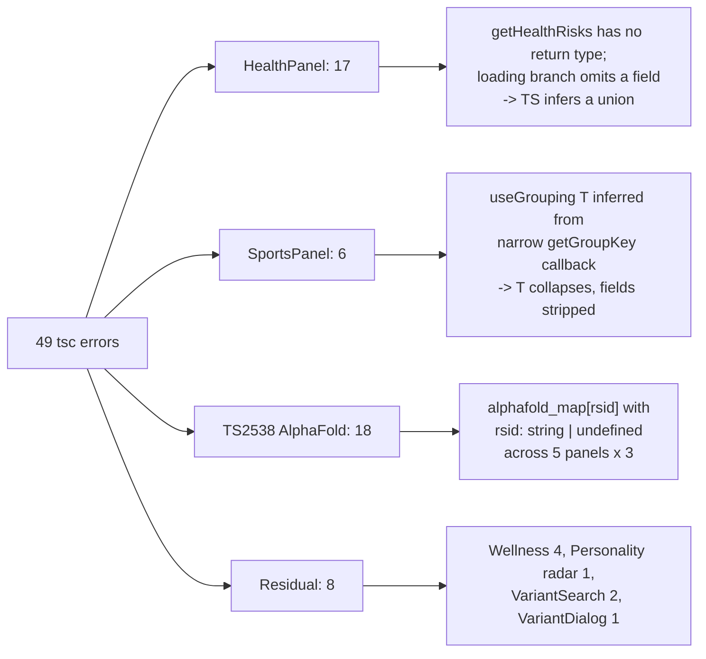
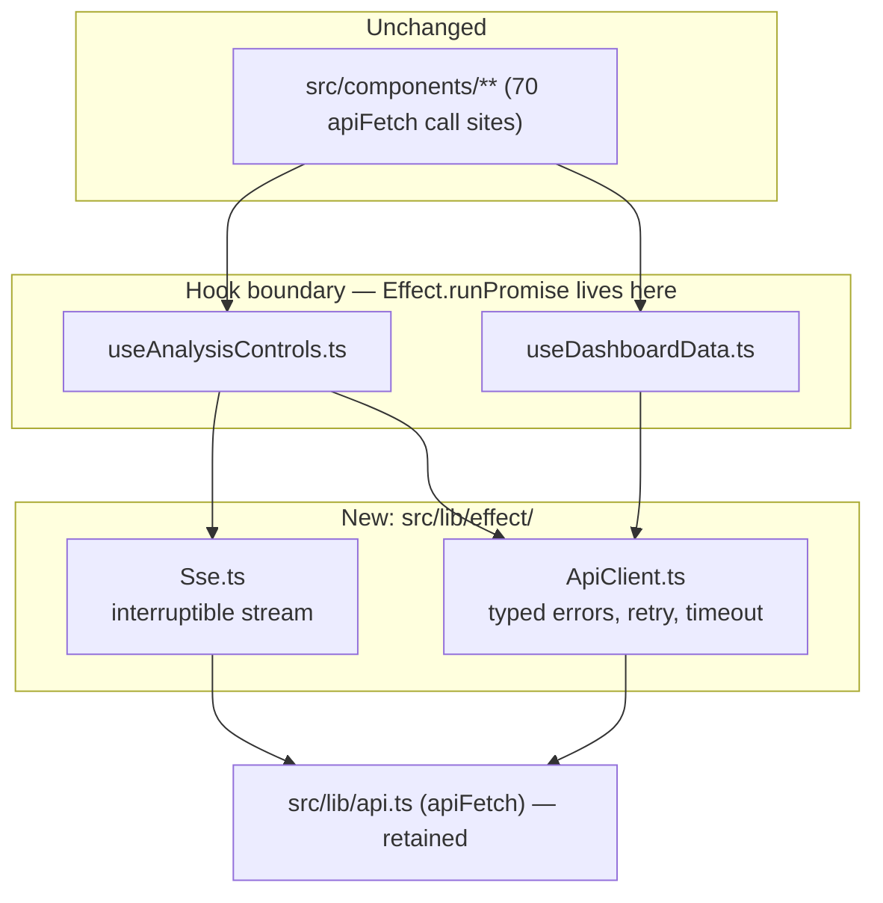
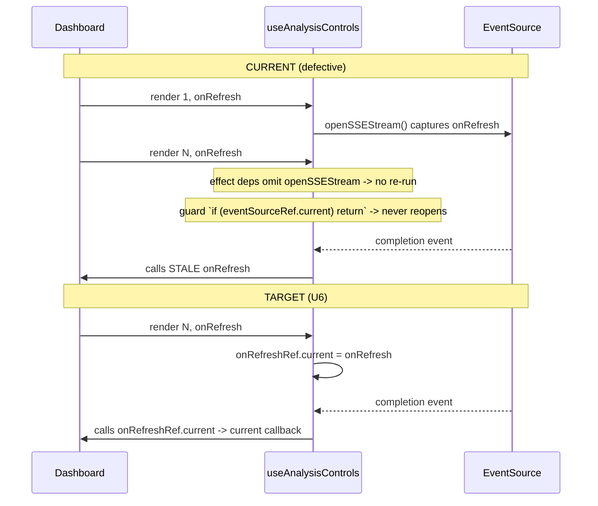

# fix: Frontend type-safety recovery, SSE lifecycle correctness, and narrow Effect 4 integration

## Summary

Investigation of the running app found the backend healthy (1949 tests pass) and the frontend carrying 49 TypeScript errors behind a **deliberately disabled build gate**, plus a P0 stale-closure bug in the analysis SSE stream. This plan removes all 49 errors -- 41 at three shared root causes plus 8 unrelated residuals -- re-arms the build gate and enforces it in CI so the class cannot silently recur, fixes the SSE lifecycle, integrates Effect 4 RC narrowly at the API seam, and clears backend deprecation/mock-hygiene warnings.

**Product Contract preservation:** N/A — solo `ce-plan` invocation, no upstream brainstorm. Scope confirmed with the user before writing (Effect narrow-seam-pinned-RC; fix-then-flip gate; all backend hygiene).

---

## Problem Frame

The project's recorded frontend verification ritual is "no frontend test runner — verify via `pnpm build` + `pnpm lint`". That ritual is **hollow on the type-safety half**: `frontend/next.config.ts` sets `typescript.ignoreBuildErrors: true` and `eslint.ignoreDuringBuilds: true`, so `pnpm build` typechecks nothing and lints nothing. A green build has been reported as proof of correctness while 49 type errors accumulated invisibly.

Three consequences:

1. **Type errors mask real render defects.** `AlphaFoldBadge` is rendered with a possibly-`undefined` rsid in five panels while its sibling badge on the same line *is* guarded — the badge silently renders empty instead of being omitted.
2. **A latent stale-closure defect survives in the analysis SSE stream.** `useAnalysisControls` pins the first-render `onRefresh` for the stream's entire lifetime. *Corrected during execution:* this does **not** misfire today -- the sole caller (`app/page.tsx`) passes `loadExistingData`, a `useCallback` with an empty dependency array, and `<Dashboard>` has exactly one render site, so `onRefresh` is referentially stable for the session. It becomes a live stale-callback bug the moment that memoization gains a dependency or a second render site appears. Originally recorded here as an observed P0; that framing was wrong.
3. **Memoization is defeated.** `getHealthRisks()` runs unmemoized on every render and feeds `useMemo` dependency arrays, so the filter/group memos downstream never memoize.

Separately, `backend/worker.py` swallows exceptions in three *failure-bookkeeping* paths. When a status write fails, the job is stranded in `processing` with no record — the same failure shape as the previously recorded "stuck at 90%" incident.

The user additionally asked to integrate `effect@rc`. That tag resolves to `4.0.0-rc.115` — a genuine pre-release, 115 iterations deep, with breaking changes still landing between RCs and **no React binding shipped**. Scoped narrowly it is a net win; scoped broadly it is an unforced risk on a first-public-release health app.

---

## Requirements

| ID | Requirement |
|----|-------------|
| R1 | `npx tsc --noEmit` reports **0 errors** in `frontend/` |
| R2 | `pnpm build` fails on type errors and lint errors, and CI runs that check on every PR — the gate is armed, not bypassed |
| R3 | The analysis SSE stream invokes the **current** `onRefresh`, not a first-render capture |
| R4 | `effect@4.0.0-rc.115` integrated at the `apiFetch` seam only; no Effect imports under `src/components/` |
| R5 | `backend/worker.py` failure-bookkeeping paths record their failure instead of swallowing it |
| R6 | Backend suite stays green at ≥1949 passing, with `utcnow` and never-awaited-coroutine warnings cleared |
| R7 | The new Effect layer has unit tests — a new async runtime in a health app is not shipped untested |

---

## Key Technical Decisions

**KTD1 — Fix the SSE bug *before* the Effect migration, not as part of it.**
The confirmed scope lets the Effect stream rewrite subsume the stale-closure fix. It should not. A P0 correctness fix must not be gated on adopting a pre-release dependency: if Effect is later reverted or the RC breaks, the bug must not come back with it. U6 fixes it with the latest-ref pattern (small, independently shippable); U10 then refactors already-correct code onto Effect.

**KTD2 — Run Effect at the hook boundary; components stay pure React.**
Effect 4 RC ships **no React binding** — `@effect/rx` does not exist on npm, `effect-react` is at `0.0.7`, and the only in-tree reactivity is `unstable/reactivity/Atom`, which is unstable *within* a pre-release. Components consume plain values; `Effect.runPromise` is called only inside hooks. This keeps the 70 existing `apiFetch` call sites untouched and makes the integration reversible by deleting one directory.

**KTD3 — Pin the RC exactly; do not use a range.**
`4.0.0-rc.115`, not `^4.0.0-rc.115` or `rc`. Breaking changes are landing between RC iterations (schema renames, JSON-schema tightening, HTTP body behavior). A range would let a breaking RC arrive on an unrelated `pnpm install`.

**KTD4 — Fix errors first, then flip the gate.**
Build stays green throughout; the flip in U5 is the *proof* the fixes are complete rather than a precondition for starting.

**KTD5 — Introduce Vitest scoped to `src/lib/effect/` only.**
The repo has no frontend test runner, and R7 requires the Effect layer be tested. `@effect/vitest@4.0.0-rc.115` is published in lockstep (peers `effect ^4.0.0-rc.115`, `vitest >=5.0.0 <6.0.0`). Scope the runner to the new directory — this is **not** a mandate to backfill component tests. See Open Questions Q1.

**KTD6 — Bundle risk is lower than the raw package size suggests.**
`effect@4.0.0-rc.115` unpacks to 48.7 MB / 2441 files, but declares `sideEffects: []` and has **zero runtime dependencies**. The bulk is `.d.ts`, sourcemaps, and `unstable/` subtrees that tree-shake out. U8 verifies this empirically rather than assuming it.

---

## Alternatives Considered

**Rewrite the backend in TypeScript — rejected.** Raised by the user mid-session. The backend does tabix-indexed seeks into CADD/gnomAD, ClinVar/dbSNP/MANE parsing, and VEP/SnpEff bridging; Python owns that ecosystem and TS has no equivalent, so a rewrite means reimplementing or shelling back into Python. It would also discard 1949 passing tests — the correctness net for a health app — at first public release. Decisively: every defect found in this investigation is in the TypeScript that already exists and is unchecked. More TS is not the fix; arming the gate is.

**Adopt Effect app-wide on the RC — rejected.** Couples a first-public-release health app to a 115-deep pre-release with no React story, across 70 call sites. Blast radius is the whole frontend and the revert cost is prohibitive.

**Adopt Effect on stable v3 instead — viable, not chosen.** Would deliver identical retry/timeout/interruption wins without pre-release risk. The user explicitly chose the pinned RC. Retained here as the documented fallback if the RC proves unstable (see Risks).

**Leave the build gate disabled — rejected.** It is the mechanism that produced this entire defect class.

---

## High-Level Technical Design

Error clustering — 41 of 49 errors trace to three root causes:



Effect integration boundary — what changes and what deliberately does not:



SSE lifecycle — current defect vs. target:



---

## Implementation Units

### Phase 1 — Frontend type-safety recovery

### U1. Annotate `getHealthRisks` and memoize it

**Goal:** Eliminate 17 errors in HealthPanel and restore downstream memoization.
**Requirements:** R1
**Dependencies:** none
**Files:** `frontend/src/components/categories/HealthPanel.tsx`

**Approach:** The loading-placeholder branch omits `pathogenicityClassification`, so TypeScript infers a union of two object shapes rather than `MappedHealthRisk[]`. Give the function an explicit `MappedHealthRisk[]` return type and add the missing field to the placeholder — the annotation turns every downstream union error into a single localized error at the placeholder, which the added field then resolves. Separately, wrap the call in `useMemo` keyed on `data`: it currently recomputes every render and feeds the `riskOptions` / `filteredRisks` dependency arrays, so those memos never hit.

**Patterns to follow:** `MappedHealthRisk` is already defined in this file and already used in the `.sort()` and `.filter()` callbacks — the annotation makes the existing intent explicit rather than introducing a new type.

**Test scenarios:**
- `tsc --noEmit` reports 0 errors for `HealthPanel.tsx` (down from 17).
- Browser QA: with a completed analysis, health risks render and the risk-level / evidence / pathogenicity filters each narrow the list.
- Browser QA: with `data` null, the loading placeholder renders without console errors.
- Referential stability: `filteredRisks` keeps its identity across a re-render that does not change `data`, `searchQuery`, `riskFilter`, `evidenceFilter`, or `pathFilter`.

**Verification:** HealthPanel error count is 0; filters behave identically to pre-change.

---

### U2. Fix `useGrouping` generic inference in SportsPanel

**Goal:** Eliminate 9 errors caused by a collapsed generic parameter.
**Requirements:** R1
**Dependencies:** none
**Files:** `frontend/src/components/categories/SportsPanel.tsx`

**Approach:** `useGrouping<T>(items, groupBy, getGroupKey, allLabel)` infers `T` from both `items` and `getGroupKey`. SportsPanel annotates the callback as `(trait: { result: string })`, so `T` collapses to that shape and `groups[].items` loses `gene`, `trait`, `description`, and `recommendation` — every later access is a TS2339. Type the callback parameter with the real athletic-trait type so `T` infers correctly. Do **not** widen `useGrouping` itself; the hook is correct and shared by other panels that infer properly.

**Patterns to follow:** The sibling panels pass correctly-typed `getGroupKey` callbacks — e.g. HealthPanel's `getGroupKey: (risk: MappedHealthRisk) => string`. Mirror that.

**Test scenarios:**
- `tsc --noEmit` reports 0 errors for `SportsPanel.tsx` (down from 9).
- Browser QA: grouping by "Genetic Advantage" produces correctly labeled groups.
- Browser QA: each trait card still renders gene, trait name, description, and recommendation.
- A trait with `result` absent falls into the `'moderate'` default group rather than throwing.

**Verification:** SportsPanel error count is 0; grouped and ungrouped views both render full card content.

---

### U3. Guard the rsid before indexing `alphafold_map` (6 panels)

**Goal:** Eliminate the 15 TS2538 errors and fix the latent render defect behind them.
**Requirements:** R1
**Dependencies:** none
**Files:** `frontend/src/components/categories/IntelligencePanel.tsx`, `frontend/src/components/categories/PersonalityPanel.tsx`, `frontend/src/components/categories/PhysicalTraitsPanel.tsx`, `frontend/src/components/categories/RareMutationsPanel.tsx`, `frontend/src/components/categories/FoodNutritionPanel.tsx`, `frontend/src/components/categories/SportsPanel.tsx`

**Approach:** Each panel renders `<AlphaFoldBadge confidence={data?.alphafold_map?.[rsid]?.confidence} ... />` where `rsid` is `string | undefined`. This is not merely a type complaint — the sibling `ClickableRsidBadge` on the adjacent line *is* guarded by `{rsid && ...}` while `AlphaFoldBadge` is not, so when `rsid` is undefined the lookup silently yields `undefined` and the badge renders empty instead of being omitted. Apply the same `{rsid && ...}` guard the sibling already uses. Three occurrences per panel, six panels (SportsPanel's were masked by U2's collapsed generic until it was fixed).

**Patterns to follow:** The existing `{rsid && <ClickableRsidBadge ... />}` guard on the immediately preceding line in each of these five files.

**Test scenarios:**
- `tsc --noEmit` reports 0 TS2538 errors across all five panels (down from 15).
- Browser QA: a trait **with** an rsid still shows the AlphaFold confidence badge with its values.
- Browser QA: a trait **without** an rsid omits the badge entirely rather than rendering an empty one.
- A trait whose rsid is present but absent from `alphafold_map` omits the badge rather than rendering undefined values.

**Verification:** Zero TS2538 errors; no empty AlphaFold badges in the rendered panels.

---

### U4. Clear the 8 residual type errors

**Goal:** Reach zero remaining frontend type errors.
**Requirements:** R1
**Dependencies:** none
**Files:** `frontend/src/components/categories/WellnessPanel.tsx`, `frontend/src/components/categories/PersonalityPanel.tsx`, `frontend/src/components/VariantSearch.tsx`, `frontend/src/components/categories/VariantDetailDialog.tsx`, `frontend/src/types/` (as needed)

**Approach:** Four unrelated residuals, each fixed at its source rather than cast away:
- `WellnessPanel.tsx:55` — `associated_variants` is read off `WellnessTrait` but not declared on it (×2), and `:233` has two implicitly-`any` callback params. Confirm against the backend payload whether the field is genuinely returned; if so add it to the type, if not remove the dead read.
- `PersonalityPanel.tsx:167` — radar chart data is `value: number | null` but the chart requires `number`. Decide the semantic: filter null-valued axes out, or coerce to 0. Prefer filtering — a 0 on a radar axis reads as a measured-zero score, which would be fabricated data.
- `VariantSearch.tsx:213` — `transcript_consequences: TranscriptConsequence[] | undefined` conflicts with the interface's `string` index signature typed `LookupAnnotationSource | undefined`. Narrow the index signature or lift the field out of the indexed type.
- `VariantSearch.tsx:1082` — `unknown` rendered as `ReactNode`; narrow before render. `VariantDetailDialog.tsx:2306` — unsound `VariantDetails` → `Record<string, unknown>` assertion; add an index signature to `VariantDetails` rather than double-casting through `unknown`.

**Execution note:** The PersonalityPanel radar decision is a data-truthfulness call, not a typing call — it is adjacent to the already-recorded concern about fabricated personality percentages. Choose filtering unless the backend genuinely means zero.

**Test scenarios:**
- `tsc --noEmit` reports **0 errors repo-wide** for `frontend/`.
- Browser QA: the Wellness panel renders associated variants when present and omits the section when absent.
- Browser QA: the personality radar renders with a null-valued trait present, with that axis absent rather than plotted at zero.
- Browser QA: variant search returns results and the detail dialog opens without console errors.

**Verification:** `npx tsc --noEmit` exits clean.

---

### U5. Arm the build gate

**Goal:** Make `pnpm build` enforce what it has been silently skipping.
**Requirements:** R2
**Dependencies:** U1, U2, U3, U4
**Files:** `frontend/next.config.ts`, `frontend/package.json`

**Approach:** Set `typescript.ignoreBuildErrors: false` and `eslint.ignoreDuringBuilds: false`. Add a `typecheck` script (`tsc --noEmit`) so the check is runnable independently of a full build. Lint currently reports 68 warnings and 0 errors — warnings do not fail a Next build, so enabling lint is safe without a warning cleanup; do not escalate warnings to errors in this unit.

**Execution note:** This is the unit that proves U1–U4 are complete. Run it last in Phase 1. If the build fails here, the failure is a real uncaught error, not a config problem.

**Test scenarios:**
- `pnpm build` succeeds with both flags set to `false`.
- `pnpm typecheck` exits 0.
- Negative control: temporarily introduce a deliberate type error and confirm `pnpm build` now **fails** — proving the gate is live rather than merely reconfigured. Revert the deliberate error.
- `pnpm lint` still reports 0 errors.

**Verification:** Build fails on an injected type error and passes once reverted.

---

### Phase 2 — Lifecycle and render correctness

### U6. Fix the SSE stale-closure bug

**Goal:** Ensure the SSE completion handler calls the current `onRefresh`.
**Requirements:** R3
**Dependencies:** none (independently shippable; deliberately not gated on Effect per KTD1)
**Files:** `frontend/src/hooks/useAnalysisControls.ts`, `frontend/src/components/Dashboard.tsx`

**Approach:** `openSSEStream` is a `useCallback` over `[analysisId, token, onRefresh]`, but the mount effect at `useAnalysisControls.ts:152-156` omits it from its dependency array (the source of the existing `react-hooks/exhaustive-deps` warning at `153:6`). The `EventSource` handler therefore closes over the first-render `onRefresh` permanently — and the `if (eventSourceRef.current) return` guard in `openSSEStream` means that even a re-run would not reopen the stream to pick up a fresh one. *Corrected during execution:* `onDataRefresh` is declared in the options type and destructured but **never read** in the hook body, so memoizing it would have been a no-op. It is dead code and is deleted instead; `onRefresh` is owned by `app/page.tsx` and cannot be memoized by `Dashboard`.

Apply the latest-ref pattern: hold `onRefresh` in a ref updated on every render, have the handler read `onRefreshRef.current`, and drop `onRefresh` from the `openSSEStream` dependency list. `openSSEStream` then has a stable identity and can legitimately be added to the effect's deps, clearing the suppression rather than hiding it. Also delete the dead `onDataRefresh` option and its call site.

**Execution note:** The defect is not reproducible against the app as it stands, because the parent memoization keeps `onRefresh` stable. Treat this as latent-fragility hardening; a repro would require temporarily removing that parent `useCallback`.

**Patterns to follow:** `closeSSEStream` in the same file is already a correctly-empty-dependency `useCallback` — the target shape for `openSSEStream`.

**Test scenarios:**
- Completion after re-renders invokes the **latest** `onRefresh`, not the first-render one.
- The dependency-array change does **not** cause stream reconnection on unrelated re-renders — the `EventSource` is constructed exactly once per `analysisId`.
- Unmounting mid-stream closes the `EventSource` (no leak, no post-unmount state update warning).
- Changing `analysisId` closes the previous stream and opens one for the new id.
- `eslint` no longer reports `react-hooks/exhaustive-deps` at `useAnalysisControls.ts:153`.

**Verification:** Run a real analysis to completion; the dashboard refreshes with current data and the eslint warning is gone without a suppression comment.

---

### U7. Render-stability pass on flagged hooks

**Goal:** Clear the remaining `exhaustive-deps` warnings that indicate real memo defeat.
**Requirements:** R2
**Dependencies:** U1, U6
**Files:** `frontend/src/components/categories/MethylationPanel.tsx`, plus any file still warning after U1/U6

**Approach:** `MethylationPanel.tsx:37` builds `profiles` via a logical expression consumed by three separate `useMemo` hooks (lines 52, 58, 75), so all three recompute every render — eslint flags it three times. Wrap `profiles` in its own `useMemo`. Then re-run lint and address only warnings that indicate genuine recomputation or stale capture.

**Scope boundary:** This is not a mandate to reach zero lint warnings. Unused-import and `no-img-element` warnings are cosmetic and out of scope — see Deferred.

**Test scenarios:**
- The three `exhaustive-deps` warnings at `MethylationPanel.tsx:37` are gone.
- Browser QA: the Methylation panel renders identical content before and after.
- The three downstream memos retain identity across a re-render that changes no input.

**Verification:** Lint warning count drops and the panel renders unchanged.

---

### Phase 3 — Narrow Effect 4 integration

### U8. Install `effect@4.0.0-rc.115` pinned, with a scoped test runner

**Goal:** Land the dependency and prove it is bundle-safe before any code depends on it.
**Requirements:** R4, R7
**Dependencies:** U5
**Files:** `frontend/package.json`, `frontend/vitest.config.ts`, `frontend/src/lib/effect/` (directory created)

**Approach:** Install with pnpm (project standard — **not** npm, despite the literal phrasing of the request), pinned exact: `pnpm add -E effect@4.0.0-rc.115` and `pnpm add -DE @effect/vitest@4.0.0-rc.115 vitest@^5`. Verify the pin lands as `"effect": "4.0.0-rc.115"` with no range prefix. Scope the Vitest config `include` to `src/lib/effect/**` per KTD5. Confirm TypeScript ≥5.4 is satisfied (repo is on 5.9.3).

The installation docs cite Node ≥22.18 while `frontend/Dockerfile:9` builds on `node:20-alpine`. This is **not** a blocker: the package declares no `engines` field, and the ≥22.18 figure applies to executing TypeScript directly, not to bundled Next output. Confirm empirically with a Docker build rather than on this reasoning alone. `effect` is pure ESM (`"type": "module"`), which Next 15 handles natively.

**Execution note:** This is packaging, not behavior. Prefer install/build smoke verification over unit coverage. Record the production bundle size before and after so KTD6's tree-shaking claim is measured rather than assumed.

**Test scenarios:**
- `Test expectation: smoke only` — no behavioral change in this unit.
- `pnpm build` succeeds with the dependency installed and unused.
- `package.json` records an exact version with no `^` or `~`, and the lockfile resolves to `4.0.0-rc.115`.
- Production bundle size grows by a negligible amount while `effect` is imported nowhere — the empirical check on `sideEffects: []`.
- `pnpm vitest run` executes against the empty scoped directory and exits cleanly.
- `docker build -f frontend/Dockerfile frontend/` succeeds on `node:20-alpine` with the dependency installed — proving the Node-version reasoning above rather than assuming it.

**Verification:** Build green, pin exact, Docker build green on Node 20, bundle delta recorded in the commit message.

---

### U9. Build the Effect `ApiClient` layer over `apiFetch`

**Goal:** Give the app typed errors, retry, and timeout at the API seam.
**Requirements:** R4, R7
**Dependencies:** U8
**Files:** `frontend/src/lib/effect/ApiClient.ts`, `frontend/src/lib/effect/ApiClient.test.ts`

**Approach:** Wrap the existing `apiFetch` rather than replacing it — `src/lib/api.ts` already owns cookie credentials, the 401 `UNAUTHORIZED_EVENT` dispatch, and `ApiError` construction, and all 70 call sites depend on that behavior unchanged. The Effect layer adds what is genuinely missing: a tagged error channel (`Data.TaggedError`) distinguishing transport failure from HTTP status failure from parse failure, `Effect.retry` with an exponential `Schedule` that retries only transport and 5xx failures, and `Effect.timeout`. Critically, **4xx must never be retried** — retrying a 401 would repeatedly fire the global unauthorized flow.

**Directional guidance, not implementation specification:**
```
ApiClient.request(path, options) : Effect<Response, TransportError | HttpError | TimeoutError>
  |- Effect.tryPromise -> apiFetch      (ApiError -> HttpError, network throw -> TransportError)
  |- Effect.timeout(configured duration)
  |- Effect.retry(Schedule.exponential x Schedule.recurs(n), while: transport or 5xx only)
```

**Patterns to follow:** `src/lib/api.ts` — preserve its auth-endpoint exemption semantics exactly. The WHY comments there explain why a 401 on `/auth/login` must not trigger the global flow; the retry predicate must not violate that.

**Test scenarios:**
- A 200 response resolves with the parsed body.
- A 500 retries the configured number of times, then fails with a tagged `HttpError` carrying status 500.
- A 401 fails **immediately with zero retries** and still dispatches `UNAUTHORIZED_EVENT` once.
- A 401 from `/auth/login` does **not** dispatch `UNAUTHORIZED_EVENT` (the exemption survives the wrapper).
- A network rejection surfaces as a tagged `TransportError`, distinguishable from `HttpError` by tag.
- A response exceeding the timeout fails with `TimeoutError` and the underlying request is aborted.
- An interrupted effect stops retrying and does not resolve afterward.
- Mock boundary: `fetch` only. Use the real `apiFetch`, real `ApiError`, real `Schedule`.

**Verification:** `pnpm vitest run src/lib/effect` green with all scenarios above; no component file imports `effect`.

---

### U10. Rebuild the SSE lifecycle as an interruptible Effect stream

**Goal:** Replace manual `EventSource` ref bookkeeping with scoped, interruptible resource management.
**Requirements:** R4, R7
**Dependencies:** U6, U9
**Files:** `frontend/src/lib/effect/Sse.ts`, `frontend/src/lib/effect/Sse.test.ts`, `frontend/src/hooks/useAnalysisControls.ts`

**Approach:** Model the stream as a scoped `Stream` whose acquire opens the `EventSource` and whose release closes it, so unmount/interruption closes the connection structurally rather than via the `eventSourceRef` + cleanup-effect pairing. The hook runs it through `Effect.runPromise` (or a fiber it interrupts on unmount) and pushes decoded progress into existing React state — component-facing state shape is unchanged.

**Execution note:** This is a refactor of code U6 already made correct. Behavior must be identical afterward; the stale-closure regression tests from U6 must still pass unchanged. If they cannot be kept passing, stop and keep the U6 implementation — the Effect rewrite is not worth reintroducing a P0.

**Test scenarios:**
- Progress events emit in order with correctly decoded payloads.
- Scope closure closes the underlying `EventSource` exactly once.
- Fiber interruption mid-stream closes the connection and emits nothing further.
- A malformed JSON payload fails into the typed error channel rather than throwing inside the handler (the current `try/catch` swallows it).
- Completion detection still fires for both `hasCompletedResults` and `shouldBeCompleted` conditions.
- **Regression:** the U6 stale-closure scenario — completion after re-renders invokes the current `onRefresh` — still passes.
- Mock boundary: `EventSource` only.

**Verification:** A real analysis run reaches completion and refreshes the dashboard; U6's regression scenario is green.

---

### U11. Move `useDashboardData` onto the Effect `ApiClient`

**Goal:** Give the dashboard's primary fetch retry and timeout behavior.
**Requirements:** R4
**Dependencies:** U9
**Files:** `frontend/src/hooks/useDashboardData.ts`

**Approach:** Route this hook's requests through `ApiClient`. It is the highest-value consumer — a transient failure here blanks the whole dashboard, and it is exactly the case retry was added for. Keep the hook's exported shape (`data`, `loading`, `error`, refresh function) byte-identical so `Dashboard.tsx` and every consuming panel need no change. This is the only hook migrated in this plan; the remaining hooks stay on plain `apiFetch` until the RC proves stable.

**Test scenarios:**
- A successful load populates `data` and clears `loading`.
- A transient 500 followed by a 200 resolves successfully and surfaces no error to the component.
- A persistent 500 sets `error` after retries are exhausted and leaves `data` unchanged.
- A 401 surfaces immediately and triggers the unauthorized flow without retrying.
- Unmount during an in-flight request performs no post-unmount state update.
- Browser QA: the dashboard loads and refreshes exactly as before.

**Verification:** Dashboard behavior unchanged; a simulated transient failure now self-heals instead of blanking.

---

### Phase 4 — Backend hygiene

### U12. Stop swallowing failures in `worker.py` bookkeeping paths

**Goal:** Prevent jobs stranded in `processing` with no diagnostic record.
**Requirements:** R5
**Dependencies:** none
**Files:** `backend/worker.py`, `backend/tests/test_worker.py` (or the existing worker test module)

**Approach:** Three `except Exception: pass` blocks at approximately lines 168, 300, and 551 guard the mark-job-failed, flush-job-logs, and job-completion status writes. This is the pattern `CLAUDE.md` explicitly prohibits, and the failure mode is the recorded "stuck at 90%" shape: the status write fails, nothing is recorded, the job never resolves. Replace each with a logged handler that records the exception. Keep the handlers non-raising — a bookkeeping failure must not crash the worker loop — but it must be *observable*. Audit the remaining 22 non-test occurrences and fix any others in analysis or annotation write paths; leave genuinely optional paths alone and note why.

**Execution note:** Characterize before changing. Add a test that forces the status write to fail and asserts on current behavior first, so the logging change is proven by a red→green transition.

**Test scenarios:**
- A failing mark-job-failed write logs at error level with the exception and does not raise.
- The worker loop continues processing subsequent jobs after a bookkeeping failure.
- A failing log-flush write logs and does not abort the job it belongs to.
- The happy path is unchanged: a successful status write logs nothing at error level.

**Verification:** New tests red before the change, green after; backend suite still ≥1949 passing.

---

### U13. Replace deprecated `datetime.utcnow()`

**Goal:** Remove 11 deprecation warnings and the naive-datetime hazard behind them.
**Requirements:** R6
**Dependencies:** none
**Files:** `backend/worker.py`, `backend/services/ai_insights_service.py`, `backend/services/job_logs.py`, `backend/services/analysis_queue.py`, `backend/scripts/build_alphafold_local.py`

**Approach:** Replace `datetime.utcnow()` with `datetime.now(UTC)` at all 11 non-test sites. This is not purely cosmetic: `utcnow()` returns a **naive** datetime, so any comparison against a timezone-aware value raises `TypeError`. Check each site for comparison or subtraction against aware datetimes or DB-returned timestamps, and confirm the column types the values are persisted into.

**Execution note:** Verify column awareness before converting. If a column is `TIMESTAMP WITHOUT TIME ZONE`, writing an aware datetime changes stored values — confirm per site rather than doing a blind find-and-replace.

**Test scenarios:**
- `analysis_queue` queued-at timestamps are timezone-aware and ordering across enqueues is preserved.
- Job-log timestamps round-trip through the DB with the same instant they were written.
- Comparing a converted timestamp against a DB-returned timestamp does not raise `TypeError`.
- The backend suite emits zero `datetime.utcnow()` DeprecationWarnings.

**Verification:** Suite green at ≥1949 with the deprecation warnings absent.

---

### U14. Fix async mock hygiene in tests

**Goal:** Eliminate 7 `coroutine ... never awaited` RuntimeWarnings.
**Requirements:** R6
**Dependencies:** none
**Files:** `backend/tests/test_extended_routes.py`, `backend/tests/test_golden_genome.py`, `backend/tests/test_gwas_sex_linked_clingen.py`, `backend/tests/test_service_utils.py`, `backend/tests/test_user_notification_queue.py`, `backend/tests/test_variant_routes_extra.py`

**Approach:** The warnings originate where sync code calls `result.scalar()` on an `AsyncMock` (e.g. `gwas_catalog_local.py:38`, `clingen_local.py:39`, `notification_service.py:115`). An `AsyncMock` attribute returns a coroutine that is never awaited, so the assertion under test may be passing against a coroutine object rather than a real value — these tests may be weaker than they appear. For each site, determine whether the production code path is genuinely sync (use `MagicMock`) or genuinely async (await it in the code under test). Fix the mock to match reality; if the mismatch reveals the test was not exercising its intended path, strengthen the assertion.

**Execution note:** Treat each warning as a possible false-green, not a cosmetic nit. If tightening a mock makes a test fail, that failure is the finding — fix the code or the assertion, do not loosen the mock back.

**Test scenarios:**
- Each of the 6 files runs with zero `never awaited` RuntimeWarnings.
- Each touched test still asserts on a concrete value, not a coroutine or a bare truthiness check.
- `gwas_catalog_local` and `clingen_local` row-count initialization asserts the actual integer count.
- Backend suite remains ≥1949 passing with no newly skipped tests.

**Verification:** `pytest backend/tests/ -W error::RuntimeWarning` passes for the six touched files.

---

### Phase 5 — Durable enforcement

### U15. Enforce the frontend gate in CI

**Goal:** Catch frontend type and lint errors on pull requests, not at deploy time.
**Requirements:** R2
**Dependencies:** U5, U9 (the CI job runs the Effect tests)
**Files:** `.github/workflows/sonarqube.yml` (or a new `.github/workflows/frontend.yml`)

**Approach:** The only CI today is `sonarqube.yml`, which runs `uv run pytest backend/tests/` and nothing else — **no frontend typecheck, lint, or build runs on any PR to `dev` or `main`.** Arming the build gate in U5 is therefore necessary but not sufficient: after U5 the sole enforcement point becomes `frontend/Dockerfile:16` (`RUN pnpm run build`), which executes during `./deploy.sh` against production. A type error would surface at deploy — the worst possible moment — instead of on the PR that introduced it.

Add a frontend job running `pnpm install --frozen-lockfile`, `pnpm typecheck`, `pnpm lint`, and `pnpm vitest run src/lib/effect`. Prefer a separate workflow file over extending the SonarQube job: the concerns are unrelated and a frontend failure should not mask coverage reporting. Match the Node version to `frontend/Dockerfile` so CI and the production image agree.

**Execution note:** This unit is what makes U5 durable. Without it the gate protects only whoever runs `pnpm build` locally, and the recorded verification ritual stays partly honor-system.

**Test scenarios:**
- The workflow triggers on pull requests targeting `dev` and `main`.
- A PR with a deliberate type error **fails** CI at the typecheck step. Revert the deliberate error.
- A PR with a deliberate lint error fails CI at the lint step.
- A clean PR passes all four steps.
- The existing backend pytest and SonarQube job still runs and is unaffected.
- CI Node version matches `frontend/Dockerfile`, so a CI pass implies the production image builds.

**Verification:** An intentionally broken PR is rejected by CI before review; a clean one passes.

---

## Scope Boundaries

**In scope:** the 49 frontend type errors; arming the frontend build gate; the SSE stale-closure bug; memo-defeat in HealthPanel and MethylationPanel; a narrow pinned Effect 4 RC integration at the API seam with tests; `worker.py` failure-bookkeeping; `utcnow` deprecations; async mock hygiene.

### Deferred to Follow-Up Work

**Deferred during execution (were in scope, not delivered):**

- **U10 (SSE lifecycle as an Effect stream).** Its own execution note gates it on U6's regression scenario staying green, but no such automated test can exist under this plan: the Vitest runner is scoped to `src/lib/effect/**` and hook testing needs React testing infrastructure that U8 deliberately did not introduce. Rewriting a working SSE lifecycle onto a pre-release with neither automated coverage nor available browser QA is risk without upside. U6 already hardened the same code.
- **U14 (async mock hygiene).** The 7 `never awaited` warnings trace to `backend/tests/conftest.py`'s `_AutoStubModule`, which returns a `MagicMock` for any attribute and stubs `async_session_factory` globally -- not to mocks written in the six test files individually. Fixing it properly means reworking that stub harness. Deferred as disproportionate for warnings with no production impact; the underlying concern (these tests may assert against coroutine objects) stands and is worth a dedicated pass.

- Migrating the remaining hooks (`useNotifications`, `useFeedback`, `useDarkMode`, `use-mobile`) onto Effect — gated on the RC proving stable in production.
- `useNotifications` reconnect/timer complexity (3 timers, manual backoff) — a strong Effect candidate, but a larger refactor than this plan should absorb.
- Backfilling component tests with the Vitest runner introduced in U8.
- The remaining ~60 cosmetic lint warnings (unused imports, `no-img-element`).

### Not in Scope

- **Backend rewrite to TypeScript** — rejected with rationale in Alternatives Considered.
- Phase B dashboard visual redesign (theme-token consolidation, Overview redesign, variant-dialog restructure) — previously deferred; unchanged by this plan.
- Loosening health or drug gating thresholds. Those gates are deliberately conservative and their conservatism is correct.
- The previously recorded truthfulness items: descriptive-trait coloring, fabricated personality percentages, hardcoded wellness confidence. U4 touches the personality radar for a *type* fix and should not opportunistically expand into that work.

---

## Risks & Dependencies

| Risk | Severity | Mitigation |
|------|----------|-----------|
| Effect 4 RC ships a breaking change on a future install | High | Exact pin (KTD3). Integration confined to `src/lib/effect/` + 2 hooks; revert = delete a directory and restore two hooks. Stable v3 documented as the fallback. |
| Arming the build gate blocks deploys on a pre-existing error | Medium | Fix-then-flip ordering (KTD4); U5 runs only after U1–U4 reach zero. |
| No frontend test runner today, so most frontend verification is manual browser QA | Medium | `tsc --noEmit` going 49→0 is objective proof for U1–U5. U8 adds a real runner for the genuinely new async code. |
| Effect adds meaningful bundle weight | Low | `sideEffects: []`, zero runtime deps; U8 measures the delta empirically rather than trusting the claim. |
| Frontend errors reach production because CI never builds the frontend | High | U15 adds typecheck/lint/test to CI. Until it lands, U5's gate is enforced only at Docker build during `./deploy.sh` — i.e. at deploy time. |
| `utcnow` → aware datetime shifts stored values | Medium | U13 verifies column awareness per site before converting. |
| U10 reintroduces the P0 that U6 fixed | High | U6 lands independently first; its regression scenario is a required gate on U10, with an explicit instruction to keep U6's implementation if it cannot stay green. |

---

## Open Questions

**Q1 — Is introducing Vitest acceptable scope?** KTD5 adds a test runner scoped to `src/lib/effect/` because shipping a new async runtime untested into a health app is not defensible. This is a genuine scope addition beyond the literal request. *Assumption taken: yes, scoped to the new directory only.* If not, U8 drops the runner and U9/U10 verification degrades to browser QA — state this explicitly rather than silently.

**Q2 — Does `WellnessTrait.associated_variants` actually exist in the backend payload?** (U4) Resolve by inspecting the response rather than assuming: add the field if returned, delete the dead read if not.

**Q3 — Null personality radar axes: filter or zero?** (U4) Recommendation is filter — plotting 0 presents absent data as a measured score, which is the fabrication class already being removed elsewhere.

**Q4 — Retry and timeout values for `ApiClient`?** (U9) Deferred to implementation; pick from observed latency. Non-negotiable regardless of values: 4xx is never retried.

---

## Verification Contract

| Gate | Command / check | Expected |
|------|-----------------|----------|
| Frontend types | `cd frontend && npx tsc --noEmit` | 0 errors (from 49) |
| Frontend build gate | `cd frontend && pnpm build` with both ignore flags `false` | passes; fails on an injected type error |
| Frontend lint | `cd frontend && pnpm lint` | 0 errors; `exhaustive-deps` cleared at `useAnalysisControls.ts:153` and `MethylationPanel.tsx:37` |
| Effect layer tests | `cd frontend && pnpm vitest run src/lib/effect` | all green |
| Backend suite | `uv run pytest backend/tests/` | ≥1949 passing |
| Backend warnings | `uv run pytest backend/tests/` warning summary | no `utcnow` deprecations, no `never awaited` RuntimeWarnings |
| Dependency pin | `frontend/package.json` | `"effect": "4.0.0-rc.115"` exact, no range prefix |
| Effect containment | `grep -rE "from ['\"]effect" frontend/src/components/` | no matches (quote-agnostic: the repo is majority single-quoted) |
| Worker bookkeeping | `uv run pytest backend/tests/test_worker_bookkeeping.py` | red before the change, green after |
| CI enforcement | PR with an injected frontend type error | CI fails at the typecheck step |
| Production image | `docker build -f frontend/Dockerfile frontend/` | succeeds on `node:20-alpine` |
| End-to-end | Run an analysis to completion in the browser | dashboard refreshes with current data |

---

## Definition of Done

1. `npx tsc --noEmit` reports 0 frontend errors; `pnpm build` fails on an injected type error, and CI rejects a PR carrying one (gate proven live, not merely reconfigured, and enforced before deploy rather than during it).
2. A completed analysis refreshes the dashboard via the current `onRefresh`; the U6 regression scenario is green and no `exhaustive-deps` suppression was added.
3. `effect@4.0.0-rc.115` is pinned exactly, imported only under `src/lib/effect/` and the two migrated hooks, with `pnpm vitest run src/lib/effect` green.
4. The backend suite is ≥1949 passing with zero `utcnow` deprecation and zero `never awaited` warnings.
5. `worker.py` bookkeeping failures are logged and observable, proven by a red→green test.
6. Deferred items and any unresolved Open Question are recorded rather than silently dropped.

---

## Sources & Research

- **Backend suite run** (this session): `1949 passed, 54 warnings in 22.97s`, exit 0.
- **Frontend typecheck** (this session): 49 errors — TS2339 ×16, TS2538 ×15, TS2322 ×8, TS2345 ×4, TS7006 ×2, TS2769 ×2, TS2411 ×1, TS2352 ×1.
- **Frontend lint** (this session): 68 warnings, 0 errors.
- **`frontend/next.config.ts`**: `typescript.ignoreBuildErrors: true`, `eslint.ignoreDuringBuilds: true` — the root enabler of the defect class.
- **npm registry** (this session): `effect` dist-tags — `rc: 4.0.0-rc.115`, `latest: 3.22.2`. RC published 11 Sep 2026.
- **`effect@4.0.0-rc.115` tarball inspection** (this session): `sideEffects: []`, zero runtime dependencies, no peer dependencies, 29 export entries, 2441 files / 48.7 MB unpacked. `Schema` is in core. React bindings absent; only `unstable/reactivity/{Atom,AsyncResult,AtomRegistry,...}`.
- **`@effect/vitest@rc`**: `4.0.0-rc.115`, peers `effect ^4.0.0-rc.115`, `vitest >=5.0.0 <6.0.0`.
- **Effect GitHub releases**: all 4.0.0 entries labeled Pre-release; breaking changes landing between RCs (Schema `Constraint`→`FilterConstraint` rename, JSON-schema import tightening, `HttpServerResponse.toWeb` 204/205/304 body omission).
- **Effect installation docs**: requires TS ≥5.4 (repo: 5.9.3 ✓); React guidance is `Effect.runSync` inside `useCallback` — no data-layer integration offered.
